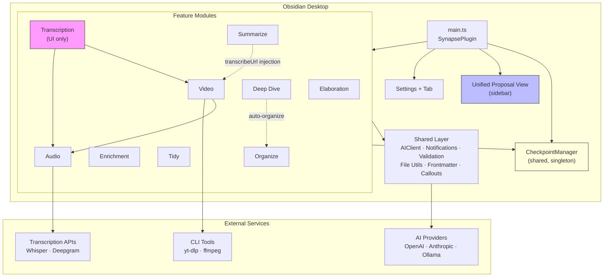
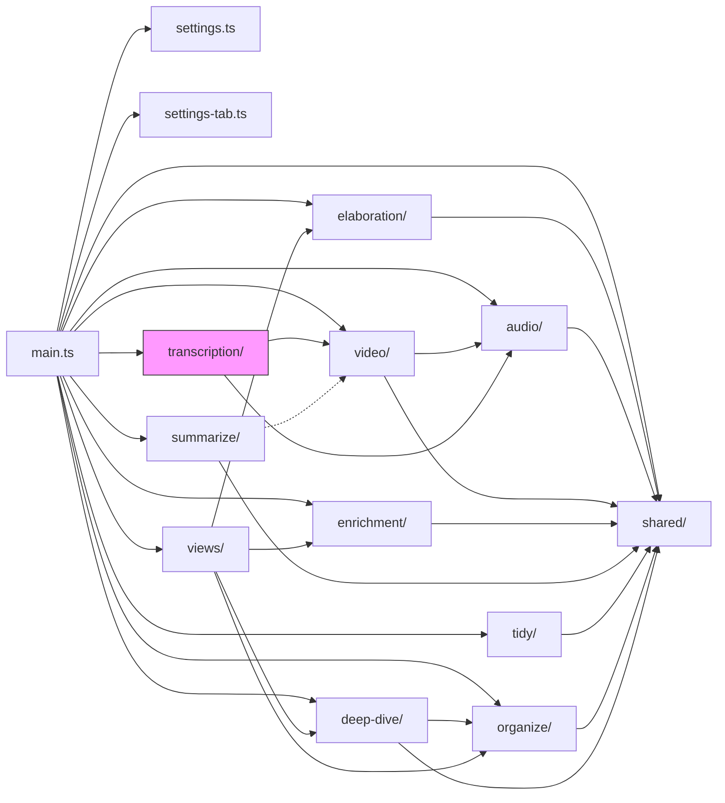
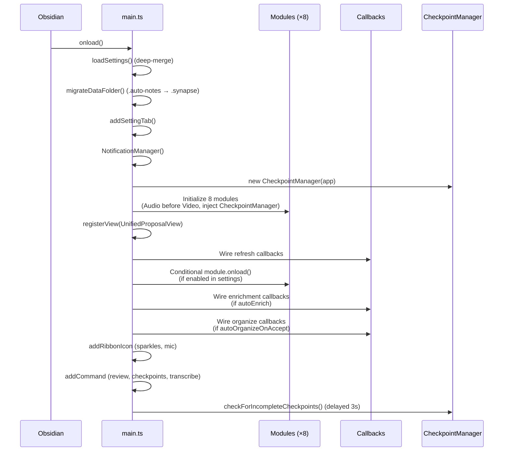
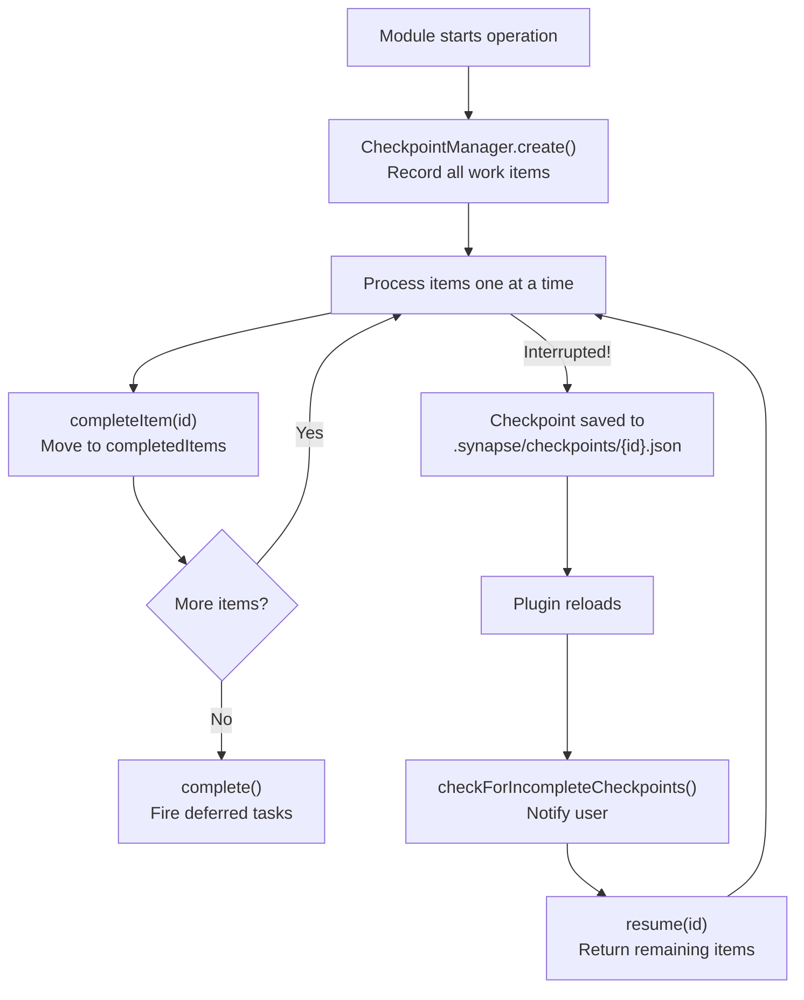
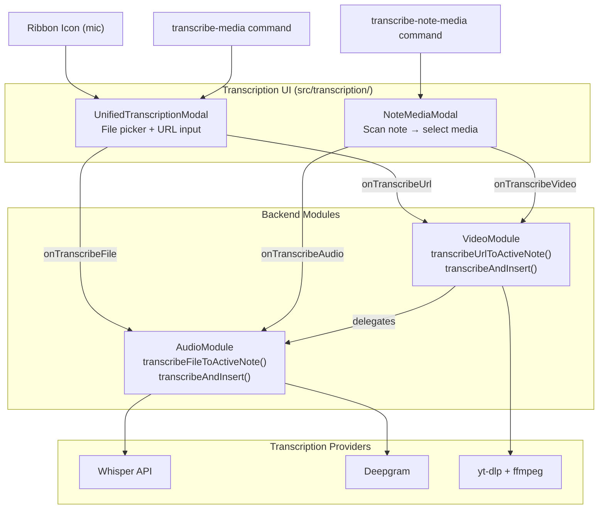
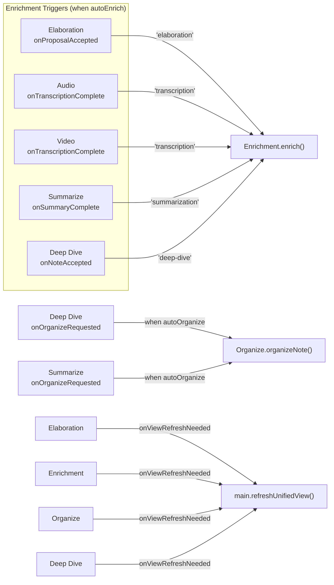
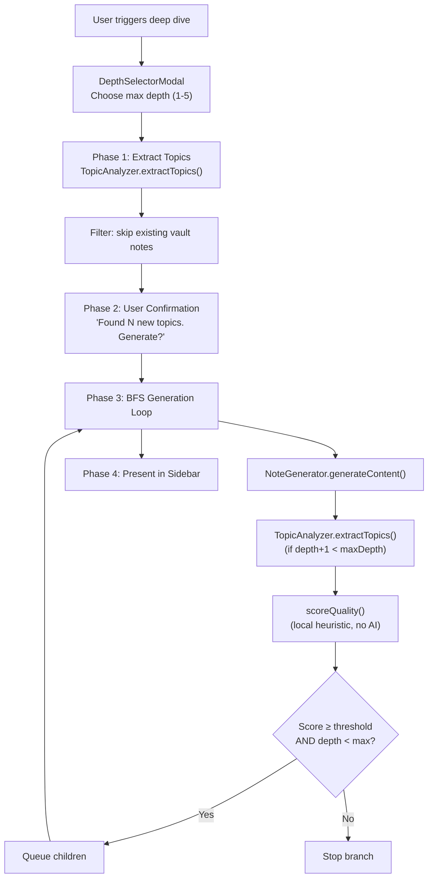
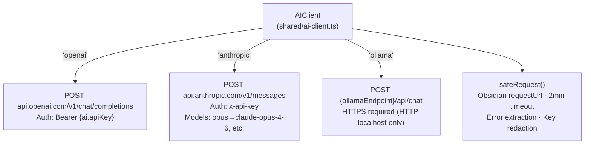

# Architecture Overview

Synapse is an Obsidian plugin that provides eight AI-powered features: note elaboration, audio transcription, video transcription, note enrichment, summarization, note tidying, semantic organization, and recursive deep-dive note generation. Desktop only (requires Node.js APIs for video processing).

> **Note**: This plugin was previously named "Auto Notes" and was rebranded to "Synapse" in March 2026. The data folder was renamed from `.auto-notes/` to `.synapse/`, with automatic one-time migration on load.

---

## System Diagram



---

## Module Map

```
src/
├── main.ts                 # Plugin entry, module orchestration, callback wiring
├── settings.ts             # Type definitions, defaults, model options
├── settings-tab.ts         # Obsidian settings UI
│
├── elaboration/            # Stub note detection + AI content proposals
│   ├── detector.ts         #   PlaceholderDetector (short notes, TODOs, empty sections)
│   ├── proposer.ts         #   ProposalGenerator (context gathering + AI generation)
│   ├── proposal-store.ts   #   JSON file persistence
│   └── index.ts            #   ElaborationModule orchestrator
│
├── audio/                  # Audio transcription
│   ├── transcriber.ts      #   Whisper API / Deepgram / local routing
│   ├── post-processor.ts   #   AI transcript cleanup
│   ├── note-scanner.ts     #   Find audio embeds in note content
│   └── index.ts            #   AudioModule orchestrator
│
├── video/                  # Video download + transcription
│   ├── url-detector.ts     #   YouTube/TikTok URL parsing
│   ├── audio-extractor.ts  #   yt-dlp + ffmpeg via execFile
│   ├── note-scanner.ts     #   Find video URLs in note content
│   └── index.ts            #   VideoModule orchestrator (delegates to Audio)
│
├── transcription/          # Unified transcription UI (issue #20)
│   ├── unified-modal.ts    #   File picker + URL input in a single modal
│   ├── note-media-modal.ts #   Selection modal for media in current note
│   └── index.ts            #   Barrel export
│
├── enrichment/             # Tags, links, refs, frontmatter
│   ├── metadata-classifier.ts  # AI tag classification against vocabulary
│   ├── topic-extractor.ts      # AI topic extraction -> link candidates
│   ├── link-resolver.ts        # Graph-based link resolution + merge
│   ├── vault-analyzer.ts       # Cached vault tag index + link graph
│   ├── weight-calculator.ts    # Proximity weight scoring (pure function)
│   ├── prompt-builder.ts       # External links + frontmatter suggestions
│   ├── enrichment-applier.ts   # Apply/undo enrichments with markers
│   ├── enrichment-store.ts     # JSON file persistence
│   └── index.ts                # EnrichmentModule orchestrator
│
├── summarize/              # URL + transcription summarization
│   ├── summarizer.ts       #   AI summarization (bullets/paragraph/key-points)
│   ├── content-fetcher.ts  #   HTTP fetch + HTML-to-text extraction
│   ├── note-scanner.ts     #   Find summarizable targets in notes
│   └── index.ts            #   SummarizeModule orchestrator
│
├── tidy/                   # Spelling + formatting correction
│   ├── tidy-store.ts       #   Snapshot storage for undo
│   └── index.ts            #   TidyModule orchestrator
│
├── organize/               # AI-powered directory structuring
│   ├── content-analyzer.ts #   AI topic extraction for organization
│   ├── directory-matcher.ts#   Match topics to directories
│   ├── organize-store.ts   #   Proposal + snapshot persistence
│   └── index.ts            #   OrganizeModule orchestrator
│
├── deep-dive/              # Recursive topic exploration
│   ├── topic-analyzer.ts   #   AI topic extraction from note content
│   ├── note-generator.ts   #   AI content generation for topics
│   ├── quality-scorer.ts   #   Local heuristic quality scoring
│   ├── syllabus-navigator.ts # Traversal ordering, syllabus index, navigation
│   ├── deep-dive-store.ts  #   Proposal + run persistence
│   └── index.ts            #   DeepDiveModule orchestrator
│
├── shared/                 # Cross-cutting utilities
│   ├── ai-client.ts        #   Multi-provider AI (OpenAI, Anthropic, Ollama)
│   ├── checkpoint-manager.ts #  Checkpoint/resume for long-running operations
│   ├── checkpoint-types.ts #   Checkpoint type definitions
│   ├── id-utils.ts         #   ID generation and validation
│   ├── notifications.ts    #   Centralized notification system
│   ├── validation.ts       #   URL, path, AI response sanitization
│   ├── file-utils.ts       #   Vault file operations
│   ├── frontmatter-utils.ts#   YAML frontmatter parsing/serialization
│   ├── callouts.ts         #   Callout type registry + builder
│   ├── diagram-generator.ts#   Mermaid diagram generation
│   ├── slider-helper.ts    #   Settings UI helper for range sliders
│   ├── folder-picker-modal.ts # Modal for folder selection
│   ├── api-utils.ts        #   Retry logic, error handling
│   └── index.ts            #   Barrel export
│
└── views/                  # UI components
    └── unified-proposal-view.ts  # Single sidebar for all proposal types + checkpoints
```

---

## Dependency Graph



Key constraints:
- **Video depends on Audio** — reuses transcription pipeline
- **Transcription is UI-only** — delegates all work to Audio and Video via callbacks
- **Summarize receives `video.transcribeUrl`** via constructor injection (dotted line)
- **Deep Dive reuses Organize** for `auto-organize` nesting mode
- **All feature modules depend on Shared** — no circular dependencies
- **Views imports types only** from feature modules
- **CheckpointManager is a singleton** — created in `main.ts`, injected into all modules that need it

---

## Plugin Lifecycle



---

## Checkpoint/Resume System

Long-running operations (vault scans, batch transcriptions) can be interrupted by plugin reload or Obsidian restart. The checkpoint system preserves progress:



- Checkpoints are stored as JSON in `.synapse/checkpoints/`
- Each module implements `resumeFromCheckpoint(checkpoint)` to continue work
- Users can also discard checkpoints (completed items are kept, remaining items abandoned)
- The unified sidebar shows a banner for any incomplete checkpoints

---

## Transcription Architecture (Issue #20)

The transcription system uses a **UI layer + backend modules** pattern:



The transcription module replaced 4 modal files across audio/ and video/ with 2 unified modals. All callbacks are wired in `main.ts`.

---

## Cross-Module Communication

All inter-module communication flows through `main.ts` via nullable callback assignments. No event bus, no pub-sub.



---

## Proposal System Architecture

Four modules generate proposals that appear in the unified sidebar. Each has a different review workflow:

| Module | Proposal Type | Review UX | Accept Behavior |
|--------|--------------|-----------|-----------------|
| Elaboration | Content additions | Editable textarea | Blockquote original, append additions in callout |
| Enrichment | Tags, links, refs, frontmatter | Per-item checkboxes | Cherry-pick items, apply with markers |
| Organize | New directory suggestion | Directory path + AI reasoning | Create directory, move file |
| Deep Dive | Generated child note | Read-only content preview | Create note at proposed path |

### Proposal States

```
Generated ──► Pending ──┬──► Accepted
                        ├──► Rejected
                        └──► Partially Accepted (enrichment only)
```

Tidy and Summarize do NOT use proposals — they apply changes immediately (tidy has undo via snapshots).

### Deep Dive: Cascade Rejection

Rejecting a parent automatically rejects all descendants:

```
Root Note
  ├── Topic A (rejected)
  │   ├── Subtopic A1 (auto-rejected)
  │   └── Subtopic A2 (auto-rejected)
  └── Topic B (pending)
      └── Subtopic B1 (pending)
```

---

## Deep Dive: Recursive Generation



### Quality Scoring (Local, No AI)

```
Score = topicCount × 0.3    min(1.0, childTopics / 3)
      + wordCount  × 0.2    min(1.0, words / 200)
      + generic    × 0.2    penalty for "Introduction", "Overview", etc.
      + overlap    × 0.2    penalty for child topics matching ancestors
      + depthDecay × 0.1    linear decay toward max depth

Below qualityThreshold (default 0.4) → stop recursion for this branch
```

---

## Enrichment Architecture


### Vault-Wide Scan (4-Phase)

| Phase | Action | Cost |
|-------|--------|------|
| 1. Scan | Collect eligible files, warm caches | Cheap |
| 2. Confirm | User approval before AI calls | Free (gates cost) |
| 3. Generate | Per-file enrichment, accumulate topics | Expensive (AI calls) |
| 4. Resolve | Topics with 2+ references → new-note suggestions | Cheap |

---

## Storage Layer

All module data is stored as individual JSON files under `.synapse/`:

```
.synapse/
├── proposals/                    # Elaboration
│   └── {id}.json                 #   Proposal with detection reasons + AI content
├── enrichments/                  # Enrichment
│   └── {id}.json                 #   Tags, links, refs, frontmatter suggestions
├── tidy-snapshots/               # Tidy
│   └── {path-as-filename}.json   #   Original content for undo (one per file)
├── organize/
│   ├── proposals/{id}.json       # New-directory proposals
│   ├── snapshots/{id}.json       # Move snapshots for undo
│   └── summaries/{name}.md       # Mermaid move diagrams
├── deep-dive/
│   ├── {id}.json                 # Individual note proposals
│   └── runs/{id}.json            # Run metadata (stats, depth breakdown)
├── checkpoints/                  # Checkpoint/resume
│   └── {id}.json                 # Operation state (completed + remaining items)
└── temp/                         # Temporary video/audio (auto-cleaned)
```

Design principles:
- One file per proposal/snapshot (no corruption cascade)
- Human-inspectable JSON (debuggable)
- Survives plugin reloads and Obsidian restarts
- `.synapse/` excluded from all module scans by default
- Legacy `.auto-notes/` folder auto-migrated on first load

---

## AI Integration Pattern



Audio transcription uses separate APIs (not AIClient):
- **Whisper**: OpenAI `/v1/audio/transcriptions` via native `fetch` + `FormData`
- **Deepgram**: `/v1/listen` via native `fetch`

---

## Callout Types

All AI-generated content uses Obsidian callouts from a shared registry:

| Key | Type String | Usage |
|-----|-------------|-------|
| summary | `synapse-summary` | Inline URL/transcription summaries |
| transcription | `synapse-transcription` | Audio/video transcriptions |
| enrichment | `synapse-enrichment` | Enrichment sections |
| elaboration | `synapse-elaboration` | Elaboration proposals |
| deepDive | `synapse-deep-dive` | Deep dive content |
| nav | `synapse-nav` | Deep dive navigation blocks |

---

## Settings Hierarchy

```
SynapseSettings
├── ai              → Provider, API key, model, temperature, max tokens
├── elaboration     → Detection thresholds, scan behavior, proposal storage
│   ├── detection   → Word threshold, TODO markers, empty sections, excludes
│   └── proposal    → Max per note, preserve frontmatter, include context
├── audio           → Transcription provider, API keys, post-processing
│   └── postProcessing → Filler removal, structure, key points, custom prompt
├── video           → yt-dlp/ffmpeg paths, download folder, embed setting
│   └── frameExtraction → (Not implemented) interval, vision model, max frames
├── enrichment      → Auto-enrich, max tags/links, vocabulary, proximity weights
│   ├── tagVocabulary   → TagVocabularyEntry[] (category, tags, description)
│   └── weights         → Same/sibling/cousin/distant folder, decay, minimum
├── summarize       → Style (bullets/paragraph/key-points), max length, excludes
├── tidy            → Snapshot folder path
├── organize        → Proposal/snapshot folder paths, confidence threshold, excludes
└── deepDive        → Max depth, quality threshold, max notes, output folder,
                      nesting mode, auto-enrich/organize on accept, excludes
```

Modules access settings via `getSettings()` closure — always reads latest values, no event subscriptions needed.

---

## Security Layers

| Layer | Protection | Location |
|-------|-----------|----------|
| Input validation | `sanitizeUrl()`, `sanitizePath()`, `ensureWithinVault()` | `shared/validation.ts` |
| Output sanitization | `sanitizeAIResponse()` strips scripts, event handlers, dangerous URIs | `shared/validation.ts` |
| Subprocess security | `execFile` with argument arrays (no shell) | `video/audio-extractor.ts` |
| API key protection | `redactSecrets()` in error messages, password-masked inputs | `shared/ai-client.ts` |
| Frontmatter safety | Key validation regex + forbidden keys blocklist | `enrichment/enrichment-applier.ts` |
| Network security | Ollama HTTPS required (HTTP for localhost only), 2min timeouts | `shared/ai-client.ts` |
| Idempotent updates | `%% synapse-enrichment-start/end %%` markers | `enrichment/enrichment-applier.ts` |
| Prototype pollution | `deepMerge` skips `__proto__`, `constructor`, `prototype` keys | `main.ts` |

---

## Getting Started for Contributors

1. Clone into Obsidian vault's plugin directory
2. `npm install` then `npm run dev` (watch mode)
3. Module pattern: each feature in `src/<module>/` with `index.ts` exporting the module class
4. Follow the FeatureModule contract: `constructor(plugin, getSettings, notifications, checkpointManager)`, `onload()`, `onunload()`
5. Types go in `<module>/types.ts`, tests co-located as `<name>.test.ts`
6. All shared utilities imported from `../shared` (barrel export)
7. Build check: `npm run build` (type-checks + bundles)
8. Tests: `npm test`
9. Git: create a feature branch, push, open PR. See `.claude/skills/git-workflow/SKILL.md` for full protocol.
