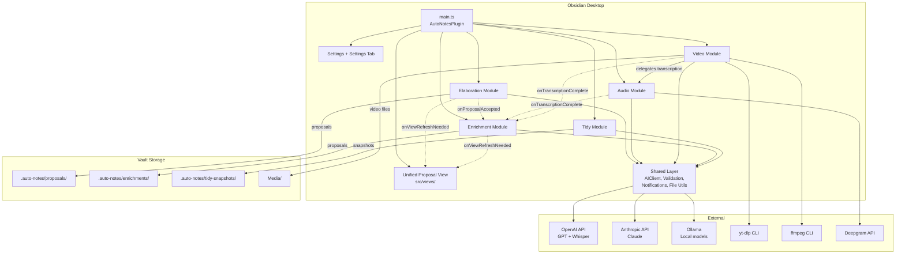

# Architecture Overview

Auto Notes is an Obsidian plugin that provides five AI-powered features: note elaboration, audio transcription, video transcription, note enrichment, and note tidying. Desktop only (requires Node.js APIs for video processing).

---

## System Diagram



---

## Module Responsibilities

| Module | What It Does | Key Files |
|--------|-------------|-----------|
| **main.ts** | Plugin entry point. Loads settings, initializes modules, registers views/commands/ribbons, wires cross-module callbacks | `src/main.ts` |
| **Elaboration** | Detects stub/placeholder notes, generates AI-powered content proposals, manages proposal lifecycle | `src/elaboration/` |
| **Audio** | Transcribes audio files via Whisper/Deepgram APIs, with optional AI post-processing | `src/audio/` |
| **Video** | Downloads video from YouTube/TikTok via yt-dlp, extracts audio, delegates to Audio for transcription | `src/video/` |
| **Enrichment** | Classifies notes with vocabulary-based tags, extracts topics as internal links, suggests external references and frontmatter | `src/enrichment/` |
| **Tidy** | Fixes spelling and formats markdown via AI. No content changes -- cosmetic only | `src/tidy/` |
| **Views** | Unified sidebar combining elaboration + enrichment proposals in one pane | `src/views/` |
| **Shared** | AI client (3 providers), validation/sanitization, notifications, file utilities, frontmatter parsing | `src/shared/` |
| **Settings** | Type definitions, defaults, model options for all modules | `src/settings.ts`, `src/settings-tab.ts` |

---

## Enrichment Architecture (Redesigned)

The enrichment module was redesigned to align with Obsidian conventions. The key insight: **tags are metadata classifiers, topics are links**.

### Before (TagScorer)

Tags were treated as topic labels (`#machine-learning`, `#python`). Scored by vault frequency and folder proximity.

### After (MetadataClassifier + TopicExtractor)

```
Note content
    |
    +---> MetadataClassifier.classify()
    |         Uses user-defined tagVocabulary
    |         Validates against vocabulary (rejects hallucinations)
    |         Output: tags like #draft, #reference, #meeting-notes
    |
    +---> TopicExtractor.extractTopics()
    |         AI identifies 5-15 key concepts
    |         Matched to existing vault notes by title
    |         Output: [[internal link]] candidates
    |
    +---> LinkResolver.findInternalLinks()
    |         Graph hops (1-2 hops in link graph)
    |         Shared tags (2+ tags in common)
    |         Folder proximity (same/sibling folders)
    |         Output: proximity-based link candidates
    |
    +---> LinkResolver.mergeTopicCandidates()
              Topic relevance dominates (base: 0.7)
              Graph proximity adds small bonus (* 0.2)
              Output: final ranked link suggestions
```

### Vault-Wide Scan (4-Phase Flow)

```
Phase 1: Scan     -- collect eligible files, warm VaultAnalyzer caches
Phase 2: Confirm  -- user confirms before expensive AI calls
Phase 3: Generate -- per-file enrichment (cancellable, with rollback)
                     TopicExtractor accumulates unmatched topics
Phase 4: Resolve  -- topics referenced by 2+ notes become new-note suggestions
                     injected into existing proposals
```

Single-note enrichment skips Phase 4 (no cross-note evidence available).

---

## Data Flow

### Elaboration: Detect, Propose, Review, Apply

```
Vault scan or single note scan
    |
PlaceholderDetector checks: word count, TODO markers, empty sections, sparse links
    |
Candidates confirmed via NotificationManager (two-phase for vault scans)
    |
ProposalGenerator gathers linked note context --> AIClient.complete()
    |
sanitizeAIResponse() on AI output
    |
Proposal saved as JSON in .auto-notes/proposals/
    |
User reviews in Unified Proposal View (editable textarea)
    |
Accept: blockquote original content, append sanitized AI additions
Reject: mark status as rejected
    |
If accepted + autoEnrich enabled --> enrichment.enrich(filePath)
```

### Audio Transcription: Record, Transcribe, Post-Process, Insert

```
User selects audio file (modal) or triggers inline transcription
    |
Audio data sent to Whisper API / Deepgram (via fetch with AbortController timeout)
    |
Optional: PostProcessor cleans transcript via AIClient
    |
Result inserted as blockquote below audio embed
    |
If autoEnrich enabled --> enrichment.enrich(filePath)
```

### Video Transcription: URL, Download, Extract, Transcribe

```
User pastes URL --> sanitizeUrl() --> detectPlatform()
    |
AudioExtractor: yt-dlp --dump-json (metadata), yt-dlp -x (audio download)
    |
Optional: download video file to vault (downloadFolder setting)
    |
AudioModule.transcribe(audioBuffer) -- same pipeline as audio
    |
Insert blockquote + optional video embed in note
    |
Cleanup temp audio file from os.tmpdir()
    |
If autoEnrich enabled --> enrichment.enrich(filePath)
```

### Enrichment: Analyze, Score, Propose, Apply

```
Triggered by callback (auto-enrich) or manual command
    |
Parallel enrichment:
  MetadataClassifier.classify()  -- vocabulary-based tag classification
  TopicExtractor.extractTopics() -- AI topics --> internal link candidates
  LinkResolver.findInternalLinks() -- graph hops + shared tags + folder proximity
  PromptBuilder.suggestExternalLinks() -- AI with conservative prompt
  PromptBuilder.suggestFrontmatter() -- AI with allowlisted keys
    |
LinkResolver.mergeTopicCandidates(topicLinks, graphLinks) -- merge and deduplicate
    |
Proposal saved as JSON in .auto-notes/enrichments/
    |
User reviews in Unified Proposal View (per-item checkboxes)
    |
Accept Selected: EnrichmentApplier merges tags, adds sections with markers
Reject: mark status as rejected
```

### Tidy: Snapshot, AI Fix, Apply (immediate)

```
User triggers tidy command on current note
    |
TidyStore saves snapshot of original content (for undo)
    |
parseFrontmatter() separates frontmatter from body
    |
AIClient.complete() with constrained prompt (spelling + formatting only)
    |
sanitizeAIResponse() + stripCodeFences()
    |
serializeFrontmatter(original_frontmatter, tidied_body) --> vault.modify()
    |
Undo: TidyStore.load() --> vault.modify(original) --> TidyStore.remove()
```

---

## Cross-Module Communication

All inter-module communication flows through `main.ts` via simple callback assignments:

```
+--------------+     onProposalAccepted(path)     +--------------+
| Elaboration  | -------------------------------->| Enrichment   |
+--------------+                                  +--------------+
                                                        ^
+--------------+     onTranscriptionComplete(path)      |
|   Audio      | ---------------------------------------+
+--------------+                                        ^
                                                        |
+--------------+     onTranscriptionComplete(path)      |
|   Video      | ---------------------------------------+
+--------------+

+--------------+     onViewRefreshNeeded()         +--------------+
| Elaboration  | --------------------------------->|  Unified     |
| Enrichment   | --------------------------------->|  View        |
+--------------+                                   +--------------+
```

Callbacks are only wired when `enrichment.enabled && enrichment.autoEnrich` is true. Modules declare nullable callback properties; `main.ts` assigns them during initialization. No event bus or pub-sub needed.

---

## Settings Hierarchy

Settings are organized into six groups, each mapping to a module:

```
AutoNotesSettings
+-- ai          --> Provider, API key, model, temperature
+-- elaboration --> Detection thresholds, scan behavior, proposal storage
|   +-- detection --> Word threshold, TODO markers, empty sections, excludes
|   +-- proposal  --> Max per note, preserve frontmatter, include context
+-- audio       --> Transcription provider, API keys, post-processing
|   +-- postProcessing --> Filler removal, structure, key points, custom prompt
+-- video       --> yt-dlp/ffmpeg paths, download folder, embed setting
|   +-- frameExtraction --> (Not implemented) interval, vision model, max frames
+-- enrichment  --> Auto-enrich, max tags/links, tag vocabulary, proximity weights
|   +-- tagVocabulary  --> TagVocabularyEntry[] (category, tags, description)
|   +-- weights        --> Same/sibling/cousin/distant folder weights, decay, minimum
+-- tidy        --> Snapshot folder path
```

Modules access settings via a `getSettings()` closure injected at construction time, ensuring they always read the latest values without event subscriptions.

---

## Proposal Lifecycle

Elaboration and enrichment both use a proposal-based workflow. Tidy does not.

```
                    +----------+
                    | Generated|
                    +----+-----+
                         |
                    +----v-----+
                    | Pending  | <-- stored as JSON in .auto-notes/
                    +----+-----+
                         |
              +----------+----------+
              |                     |
        +-----v-----+        +-----v-----+
        | Accepted  |        | Rejected  |
        +-----+-----+        +-----------+
              |
              | (enrichment only)
        +-----v----------+
        | Partially      |
        | Accepted       |
        +----------------+
```

- **Elaboration proposals**: Accept applies full content (user can edit in textarea first). Original note content is blockquoted for preservation.
- **Enrichment proposals**: Accept Selected allows cherry-picking individual tags, links, refs, and frontmatter items. Sections are wrapped in `%% auto-notes-enrichment-start/end %%` markers for idempotent updates.
- **Tidy**: Immediate apply, undo via stored snapshot. No proposal UI.

---

## Multi-Agent Infrastructure

The project uses specialized AI agents for different concerns, defined in `.claude/agents/`:

| Agent | Role | Key Skills |
|-------|------|------------|
| architect | Enforces module patterns, dependency rules, naming | codebase-architecture, git-workflow |
| security | Audits for vulnerabilities, validates sanitization | security-audit |
| docs-agent | Maintains AGENTS.md files (machine-readable) | docs-agent |
| docs-human | Maintains DECISIONS/STATUS/ARCHITECTURE.md | docs-human |
| elaboration-designer | Designs stub detection and proposal generation | note-elaboration |
| plugin-architect | Obsidian API patterns and plugin lifecycle | obsidian-plugin-dev |
| transcription-engineer | Audio/video pipeline design | media-transcription |

Agents coordinate via:
- **Git workflow**: feature branches, PRs to protected main, bot identity
- **Skills**: shared knowledge files in `.claude/skills/` (git-workflow, tdd, etc.)
- **Worktrees**: parallel work on conflicting files without branch switching

---

## Getting Started for Contributors

1. Clone into Obsidian vault's plugin directory
2. `npm install` then `npm run dev` (watch mode)
3. Module pattern: each feature in `src/<module>/` with `index.ts` exporting the module class
4. Follow the FeatureModule contract: `constructor(plugin, getSettings, notifications)`, `onload()`, `onunload()`
5. Types go in `<module>/types.ts`, tests co-located as `<name>.test.ts`
6. All shared utilities imported from `../shared` (barrel export)
7. Build check: `npm run build` (type-checks + bundles)
8. Tests: `npm test`
9. Git: create a feature branch, push, open PR. See `.claude/skills/git-workflow/SKILL.md` for full protocol.
