# Architecture Overview

**Last updated**: 2026-06-29 · **Version**: 1.0.7

Synapse is an Obsidian plugin that layers AI-powered features over a vault: note elaboration (with image analysis), audio transcription, video transcription, image OCR, note enrichment, summarization, note tidying, semantic organization, recursive deep-dive note generation, title proposals, and in-place wikilink discovery (REM). Two coordination layers tie them together — a **Fire Synapse pipeline** that runs the features in a fixed order over a folder or note, and an **intake** watcher that auto-processes notes dropped into an inbox. It runs on both desktop and mobile (video and media-clipping features are desktop-only).

The codebase has **17 modules under `src/`** (audio, commands, deep-dive, elaboration, enrichment, image, intake, organize, pipeline, rem, shared, summarize, tidy, title, transcription, video, views) plus top-level glue: `main.ts`, `settings.ts`, `settings-tab.ts`, a small pure `onboarding.ts` (first-run welcome, #89), `brand-icons.ts` (Synapse SVG icons), `changelog.ts`/`changelog-modal.ts` (in-app "What's new", #375), and `properties-fold.ts` (auto-fold note Properties, #381).

> **Note**: This plugin was previously named "Auto Notes" and was rebranded to "Synapse" in March 2026. The data folder was renamed from `.auto-notes/` to `.synapse/`, with automatic one-time migration on load.

### How the pieces fit (plain language)

- **Feature modules** do the actual work (transcribe, enrich, summarize…). Each one is self-contained in `src/<feature>/` and exposes its public surface through a single `index.ts` barrel.
- **`shared/`** is the foundation everything stands on — the AI client, validation, checkpoints, callouts, and URL detection. It depends on no feature module.
- **`commands/`** is a developer-level master switch for every command, sitting *above* user settings. It also depends on nothing else in `src/`.
- **`pipeline/`** runs features in order; **`intake/`** decides what to feed the pipeline. Neither imports a feature module directly — `main.ts` injects the features into them. This is what keeps the dependency graph acyclic.
- **`views/`** holds the two sidebars: the **unified proposal view** (review/accept every proposal type) and the **Synapse actions view** (registry-driven, touch-friendly buttons so mobile users reach any command without the palette).
- **Mobile safety**: the plugin ships `isDesktopOnly: false`. Anything that needs Node.js (yt-dlp, ffmpeg, the filesystem) is funneled through one guarded loader (`shared/node-loader.ts`) that refuses to run off-desktop, so the bundle loads cleanly on mobile and desktop-only features degrade gracefully.

---

## System Diagram

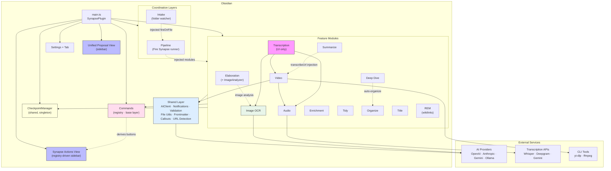

Both `shared/` and `commands/` are **base layers**: every feature may depend on them, but they depend on no feature module. `pipeline/` and `intake/` reach the features only through dependencies injected by `main.ts`, never by importing them — that is what keeps the whole graph acyclic.

---

## Module Map

```
src/
├── main.ts                 # Plugin entry, module orchestration, callback wiring, dependency injection
├── settings.ts             # Type definitions, defaults, model options (type-only imports of ProposalKind + ExclusionRule)
├── settings-tab.ts         # Obsidian settings UI (video section gated behind Platform.isDesktop)
├── onboarding.ts           # Pure first-run welcome logic (#89): planFirstRun, needsApiKey
├── brand-icons.ts          # registerSynapseIcons(): S-Signal mark + per-feature glyphs (before any ribbon/setIcon use)
├── changelog.ts            # parseChangelog/renderChangelog of the build-inlined CHANGELOG.md (#375)
├── changelog-modal.ts      # ChangelogModal — in-app "What's new" (#375)
├── properties-fold.ts      # registerPropertiesAutoFold(): auto-fold note Properties panel on open (#381)
│
├── commands/               # Command registry (base layer; imports nothing in src/)
│   ├── registry.ts         #   COMMAND_REGISTRY source of truth + flow/status/context gates
│   ├── registrar.ts        #   Single wiring point to plugin.addCommand
│   ├── audit.ts            #   Registry <-> handler drift detection
│   └── index.ts            #   Barrel export (listPaletteActions for the actions sidebar)
│
├── pipeline/               # Fire Synapse: ordered multi-phase runner
│   ├── synapse-runner.ts   #   Sequential phase executor (fire / fireOnFile)
│   ├── types.ts            #   SYNAPSE_PIPELINE phase list + scan-fn contract
│   └── index.ts            #   Barrel export
│
├── intake/                 # Inbox watcher: auto-process dropped notes (#111)
│   ├── intake-dispatcher.ts#   Route a note (article / media / general)
│   ├── types.ts            #   Route + IntakeDeps types, processed-flag constants
│   └── index.ts            #   IntakeModule (debounce, idempotency, fireOnFile)
│
├── rem/                    # In-place [[wikilink]] discovery
│   ├── mention-scanner.ts  #   Literal title/alias matches (down-weighted by titleMatchWeight, #380)
│   ├── semantic-matcher.ts #   Always-on AI semantic matches (#380)
│   ├── rem-applier.ts      #   Insert wikilinks into note body
│   ├── rem-store.ts        #   Proposal persistence
│   └── index.ts            #   RemModule orchestrator
│
├── elaboration/            # Stub note detection + AI content proposals (image-aware)
│   ├── detector.ts         #   PlaceholderDetector (short notes, TODOs, empty sections)
│   ├── proposer.ts         #   ProposalGenerator (context gathering + AI generation)
│   ├── image-analyzer.ts   #   Multi-modal image analysis for proposal enrichment
│   ├── proposal-store.ts   #   JSON file persistence
│   └── index.ts            #   ElaborationModule orchestrator
│
├── audio/                  # Audio transcription
│   ├── transcriber.ts      #   Whisper / Deepgram / Gemini / local routing; manual multipart w/ sanitized headers
│   ├── post-processor.ts   #   AI transcript cleanup
│   ├── note-scanner.ts     #   Find audio embeds in note content
│   └── index.ts            #   AudioModule orchestrator
│                           #   NOTE: type-only `import type { AudioExtractor }` from video/ (no runtime cycle)
│
├── video/                  # Video download + transcription
│   ├── audio-extractor.ts  #   yt-dlp + ffmpeg via execFile
│   ├── note-scanner.ts     #   Find video URLs in note content (uses shared/url-detector)
│   └── index.ts            #   VideoModule orchestrator (delegates to Audio)
│                           #   NOTE: url-detector.ts moved to shared/ (decycling, 2026-06-08)
│
├── image/                  # Image OCR via multi-modal AI (vision models)
│   ├── extractor.ts        #   ImageExtractor (base64 + ContentBlock[] -> AI vision)
│   ├── note-scanner.ts     #   Find image embeds (![[*.png]]) in note content
│   ├── types.ts            #   ImageEmbed, OCRResult
│   └── index.ts            #   ImageModule orchestrator (batch + checkpoint)
│
├── transcription/          # Unified transcription UI (issue #20)
│   ├── unified-modal.ts    #   File picker + URL input with duration + time-range
│   ├── note-media-modal.ts #   Selection modal for media in current note
│   ├── time-range-slider.ts#   Dual-handle range slider (pure DOM component)
│   ├── time-range-toast.ts #   Confirmation toast with embedded slider
│   ├── duration-detector.ts#   Media duration via ffprobe (local) / yt-dlp (URL)
│   └── index.ts            #   Barrel export
│
├── enrichment/             # Tags, links, refs, frontmatter
│   ├── metadata-classifier.ts  # AI tag classification against vocabulary
│   ├── topic-extractor.ts      # AI topic extraction -> link candidates
│   ├── link-resolver.ts        # Graph-based link resolution + merge
│   ├── vault-analyzer.ts       # Cached vault tag index + link graph
│   ├── weight-calculator.ts    # Proximity weight scoring (pure function)
│   ├── prompt-builder.ts       # External links + frontmatter suggestions
│   ├── enrichment-applier.ts   # Apply/undo enrichments with markers
│   ├── enrichment-store.ts     # JSON file persistence
│   └── index.ts                # EnrichmentModule orchestrator
│
├── summarize/              # URL + transcription summarization
│   ├── summarizer.ts       #   AI summarization (bullets/paragraph/key-points)
│   ├── content-fetcher.ts  #   HTTP fetch + HTML-to-text + JSON-LD extraction
│   ├── note-scanner.ts     #   Find summarizable targets in notes
│   └── index.ts            #   SummarizeModule orchestrator
│
├── tidy/                   # Spelling + formatting correction
│   ├── tidy-store.ts       #   Snapshot storage for undo
│   └── index.ts            #   TidyModule orchestrator
│
├── organize/               # AI-powered directory structuring
│   ├── content-analyzer.ts #   AI topic extraction for organization
│   ├── directory-matcher.ts#   Match topics to directories
│   ├── organize-store.ts   #   Proposal + snapshot persistence
│   └── index.ts            #   OrganizeModule orchestrator
│
├── deep-dive/              # Recursive topic exploration
│   ├── topic-analyzer.ts   #   AI topic extraction from note content
│   ├── note-generator.ts   #   AI content generation for topics
│   ├── quality-scorer.ts   #   Local heuristic quality scoring
│   ├── syllabus-navigator.ts # Traversal ordering, syllabus index, navigation
│   ├── deep-dive-store.ts  #   Proposal + run persistence
│   └── index.ts            #   DeepDiveModule orchestrator
│
├── title/                  # Note title suggestions
│   ├── title-module.ts     #   Title checking, proposal lifecycle, collision resolution (iterate/merge, #408)
│   ├── title-suggester.ts  #   AI title generation + mismatch detection
│   ├── title-proposal-store.ts # JSON persistence
│   ├── content-key.ts      #   titleContentKey() — input-keyed dedup so a rejected title isn't re-proposed (#408)
│   ├── settings-section.ts #   Settings UI: enabled toggle + duplicate-handling dropdown
│   ├── types.ts            #   TitleProposal, trigger/status types, TitleDuplicateStrategy
│   └── index.ts            #   Re-exports module, types, isUntitled
│
├── shared/                 # Cross-cutting utilities (base layer)
│   ├── ai-client.ts        #   Multi-provider AI (OpenAI, Anthropic, Gemini, Ollama); per-instance LRU response cache + in-flight coalescing (#397); re-exports redactSecrets
│   ├── redact.ts           #   redactSecrets() (strings) + redactError() (raw caught errors) — single source of truth for API-key/token redaction
│   ├── settings-migrations.ts # Version-stamped migration runner (#93): migrateSettings/readSettingsVersion/CURRENT_SETTINGS_VERSION
│   ├── hash-utils.ts       #   hashString/contentKey — dependency-free input-keyed hashing for idempotency (#395)
│   ├── untrusted-content.ts#   wrapUntrusted() — structural prompt-injection fence for fetched external content (#398)
│   ├── review-action.ts    #   reviewAction() — centralized "Review" completion-toast gate (#366)
│   ├── node-loader.ts      #   loadNodeModules/assertDesktop/DesktopOnlyError/shellEnv — the ONE guarded Node-builtin site
│   ├── exclusions.ts       #   Centralized path-exclusion model + glob matcher (#307); tag-exclusion helper
│   ├── credential-validator.ts # validateCredentials() — one minimal authenticated probe per provider (#335)
│   ├── provider-metadata.ts#   Per-provider get-key URL, placeholder, probe spec (#335)
│   ├── credential-field.ts #   Settings decorator: "Get an API key →" link + Test button + status chip (#335)
│   ├── encoding.ts         #   arrayBufferToBase64 / base64EncodedLength (shared by audio/image/elaboration)
│   ├── url-detector.ts     #   YouTube/TikTok/Instagram URL parsing (moved here 2026-06-08)
│   ├── checkpoint-manager.ts #  Checkpoint/resume for long-running operations
│   ├── checkpoint-types.ts #   Checkpoint type definitions
│   ├── id-utils.ts         #   ID generation and validation
│   ├── notifications.ts    #   Centralized notifications: progress, cancellation, action buttons, dispose() teardown
│   │                       #   every error sink routes through redactSecrets; equal-message throttle for one-shot toasts (#396)
│   ├── fire-and-forget.ts  #   fireAndForget() — rejection handling for un-awaited promises; sinks route through redactError
│   ├── update-checker.ts   #   UpdateChecker/isNewerVersion — once/24h GitHub Releases poll, sticky notice (#365)
│   ├── title-detector.ts   #   isUntitled/isGenericTitle predicates (shared by title/ and elaboration/)
│   ├── validation.ts       #   URL, path, AI response sanitization
│   ├── file-utils.ts       #   Vault file operations
│   ├── frontmatter-utils.ts#   YAML frontmatter parsing/serialization
│   ├── callouts.ts         #   Callout type registry + builder
│   ├── diagram-generator.ts#   Mermaid diagram generation
│   ├── slider-helper.ts    #   Settings UI helper for range sliders
│   ├── folder-picker-modal.ts # Modal for folder selection
│   ├── api-utils.ts        #   Retry logic + error handling helpers
│   ├── json-utils.ts       #   Safe JSON parse + record/string-array guards + readJsonFile
│   ├── content-fetcher.ts  #   HTTP fetch + HTML-to-text + JSON-LD recipe extraction
│   ├── tweet-fetcher.ts    #   Tweet/X content fetch (untrusted-wrapped by callers)
│   ├── reddit-fetcher.ts   #   Reddit post fetch + canonical-URL extraction
│   ├── url-classifier.ts   #   Classify a URL (article / media / unknown) for intake routing
│   ├── content-schemas.ts  #   Content-type detection registry (recipe / receipt / lyrics)
│   ├── collapsible-section.ts # Settings UI: collapsible accordion section
│   ├── feature-chip-select.ts # Settings UI: multi-feature chip selector (exclusions)
│   ├── settings-section.ts #   Settings UI: shared per-section context + collapse persistence
│   ├── markdown.d.ts       #   Ambient `declare module '*.md'` so esbuild can inline CHANGELOG.md (#375)
│   └── index.ts            #   Barrel export
│
└── views/                  # UI components
    ├── unified-proposal-view.ts  # Single sidebar for all proposal types + checkpoints
    ├── synapse-actions-view.ts   # Registry-driven action buttons sidebar (mobile-friendly)
    └── types.ts                  # UnifiedItem, UnifiedViewCallbacks
```

---

## Dependency Graph

The graph is **acyclic**. `shared/` and `commands/` form the base layer (bottom); feature modules depend down onto them; the coordination layers (`pipeline/`, `intake/`) sit on top and receive features only by injection from `main.ts`.

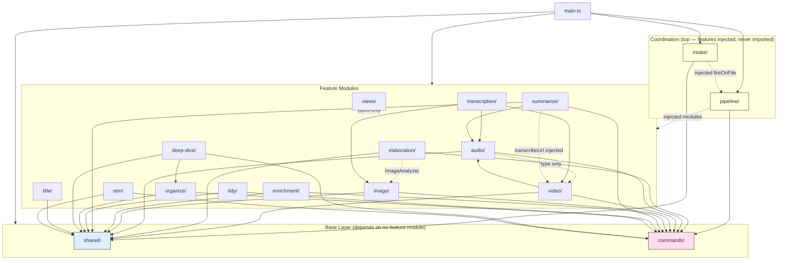

Key constraints:
- **Acyclic graph.** `shared` and `commands` are base layers depending on no feature module. The former `shared ⇄ video` cycle was removed on 2026-06-08 by moving `url-detector.ts` into `shared` — the edge is now one-directional `video → shared`.
- **`settings` → `shared` is one sanctioned edge.** `settings.ts` imports the runtime value `CURRENT_SETTINGS_VERSION` from `shared/settings-migrations.ts` (#93), which depends only on `shared/exclusions.ts` and never on `../settings` — so `settings → settings-migrations → exclusions` stays acyclic. (`settings.ts` also type-only-imports `ProposalKind`, `ExclusionRule`, `TitleDuplicateStrategy`, all erased at compile time.)
- **`commands` imports nothing in `src/`.** `pipeline` imports `commands` (for flow gating) but never the feature modules — `main.ts` injects them via `PipelineModuleMap`.
- **`intake` imports only `obsidian` + `shared`.** All cross-module work routes through an injected `IntakeDeps` (notably `fireOnFile`).
- **Video depends on Audio** — reuses the transcription pipeline (runtime edge `video → audio`).
- **Audio has a type-only back-edge to Video** — `audio/index.ts` does `import type { AudioExtractor } from '../video'` for time-range clipping. The type is erased at compile time, so there is **no runtime cycle**; it is a structural exception flagged for a future cleanup (move `AudioExtractor` to `shared/` or pass a structural interface).
- **Transcription is UI-only** — delegates all work to Audio, Video, and Image via callbacks.
- **Elaboration uses ImageAnalyzer** — analyzes embedded images during proposal generation (dotted line to Image).
- **Summarize receives `video.transcribeUrl`** via constructor injection **only** (no static `summarize → video` import); URL-platform helpers resolve from `shared`; also calls `audio.findAudioEmbeds`.
- **Shared utilities are imported via the `../shared` barrel** — never through a sibling feature module or an internal `shared/` file. Canonical homes (`url-detector`, `redact`, `encoding`) live in `shared/` and re-export elsewhere only for back-compat.
- **Deep Dive reuses Organize** for `auto-organize` nesting mode.
- **Views imports types only** from feature modules (including REM).
- **CheckpointManager is a singleton** — created in `main.ts`, injected into modules with resumable scans (elaboration, enrichment, audio, video, image, summarize, organize, deep-dive, rem). `tidy`, `title`, `transcription`, and `intake` do not use it.

---

## Fire Synapse Pipeline

"Fire Synapse" runs the AI features over a folder (or a single note) in a fixed, deliberate order. The `pipeline/` module owns a `SynapseRunner` that executes each phase sequentially, isolating failures so one bad phase doesn't abort the run.

> This diagram expands subgraph **c (Fire Synapse)** of the master command-pipeline overview in [`README.md` → How it all fits together](README.md#how-it-all-fits-together), which is the canonical birds-eye view.

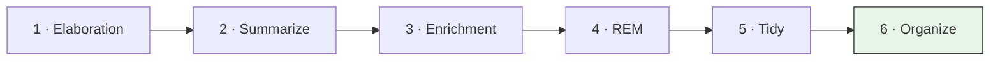

- **Order matters.** Content-generating phases run first; **organize runs last** because it is the content-aware mover — it should only relocate a note after all its content exists.
- **Gating.** A phase runs only if its feature is `enabled` *and* the command registry lists it in the `fire-synapse` flow.
- **Decoupling.** The runner never imports the feature modules. `main.ts` builds a `PipelineModuleMap` (phase key → scan function) and injects it, so the runner stays independent of concrete features.
- **Two entry points.** `fire(folder?)` scans a whole folder; `fireOnFile(file)` scopes every phase to a single note (this is what the intake watcher calls).

---

## Intake: Auto-Processing Inbox (Issue #111)

The `intake/` module turns a watched folder into a hands-off inbox. Drop a note — or a note containing an article/media URL — and Synapse processes it automatically.

> This diagram expands subgraph **d (Intake)** of the master command-pipeline overview in [`README.md` → How it all fits together](README.md#how-it-all-fits-together), which is the canonical birds-eye view.

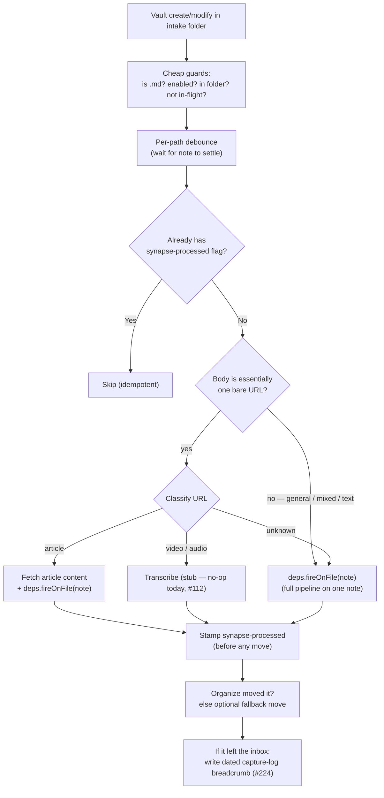

- **Settle-then-process.** A per-path debounce waits until the note stops changing, so notes aren't reprocessed mid-edit.
- **Idempotency.** A `synapse-processed` frontmatter flag is stamped *before* any relocation, so the move's rename echo can't trigger reprocessing.
- **Leaf of the graph.** Intake imports only `obsidian` + `shared`; the pipeline call arrives via an injected `IntakeDeps.fireOnFile`.
- **Stubbed branch.** The media-transcription route (#112) currently no-ops with a notice.

---

## Plugin Lifecycle

```mermaid
sequenceDiagram
    participant O as Obsidian
    participant M as main.ts
    participant Reg as CommandRegistrar
    participant Mod as Feature Modules
    participant Coord as Pipeline + Intake
    participant CK as CheckpointManager

    O->>M: onload()
    M->>M: loadSettings() (version-stamped migrateSettings replay → deep-merge → stamp settingsVersion, #93; v1 excludeFolders→exclusions #307, v2 drop rem.semanticMatching)
    M->>M: registerSynapseIcons() (brand S-Signal mark + feature glyphs, before any ribbon/setIcon use)
    M->>M: migrateDataFolder() (.auto-notes -> .synapse)
    M->>M: addSettingTab()
    M->>M: NotificationManager() (status bar on desktop only)
    M->>CK: new CheckpointManager(app)
    M->>Reg: new CommandRegistrar(plugin)
    M->>Mod: Initialize feature modules<br/>(Audio before Video; Video desktop-only; inject CheckpointManager, registrar, shouldAutoAccept getter)
    M->>M: new UpdateChecker(...) (#365)
    M->>M: registerView(UnifiedProposalView) + registerView(SynapseActionsView)
    M->>M: registerPropertiesAutoFold(plugin, () => settings) (#381)
    M->>M: Wire view refresh + onOpenProposalView + cross-module callbacks<br/>(enrichment, title, organize)
    M->>Mod: Conditional module.onload()<br/>(registers commands via registrar if enabled)
    M->>M: addRibbonIcon x3 (synapse; synapse-transcribe [desktop]; synapse-actions)
    M->>Reg: registrar.register(main commands)
    M->>CK: startupTimeout = checkForIncompleteCheckpoints() (delayed 3s)
    M->>M: updateCheckTimeout = updateChecker.maybeCheck() (delayed 5s, self-gated once/day, #365)
    M->>Coord: Build SynapseRunner (inject PipelineModuleMap)<br/>+ IntakeModule (inject IntakeDeps.fireOnFile)
    M->>Reg: auditCommands(attempted) — warn on drift
    M->>M: runFirstRunOnboarding() (#89, fresh installs only)

    O->>M: onunload()
    M->>M: clearTimeout(startupTimeout); clearTimeout(updateCheckTimeout)
    M->>Mod: module?.onunload() for every module (video may be null)
    M->>M: notifications.dispose() (tear down ellipsis timers + hide notices)
```

---

## Desktop Gating Model

Synapse ships `isDesktopOnly: false` in `manifest.json`, so the **single bundle must load on Obsidian mobile** — which has no `os`, `path`, `fs`, or `child_process`. esbuild marks those Node builtins as `external`, so any *top-level* `require('fs')` would throw on mobile at module-load time, before any platform check could run. The plugin closes that hole structurally:

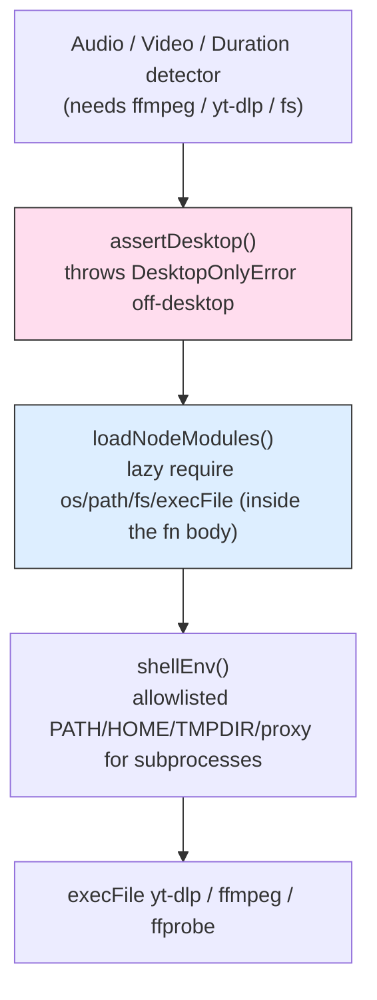

- **One sanctioned site.** `shared/node-loader.ts` is the *only* place Node builtins are required, and it's the only file allowed to disable the `no-var-requires` lint rule. Every desktop-only path routes through it.
- **Explicit assertion, not truthiness.** Code paths call `assertDesktop()` (which throws a descriptive `DesktopOnlyError`) rather than relying on a `this.extractor` being defined.
- **Construction-time gating too.** `main.ts` only builds `VideoModule` and the shared `AudioExtractor` when `Platform.isDesktop`; the `mic` ribbon icon and the settings-tab video section are desktop-only.
- **Graceful degradation.** On mobile, media clipping/duration detection fall back to full-file processing or surface a clear "not available on mobile" message. All non-Node features (elaboration, enrichment, summarize, tidy, organize, deep-dive, title, REM, audio API transcription, image OCR) run on both platforms.

---

## Path Exclusions (#307)

A single `settings.exclusions` list controls which folders each feature may touch, replacing the old per-module `excludeFolders` fields. The model and matcher live in `shared/exclusions.ts`.

```ts
interface ExclusionRule { pattern: string; features: 'all' | FeatureId[] }
// FeatureId is a closed 12-member union with an ALL_FEATURE_IDS exhaustiveness guard.
```

- **First-match-wins.** `findMatchingRule(path, featureId, settings)` walks `exclusions` in order and returns the first rule that applies to the feature *and* matches the path; `isPathExcluded(...)` is the boolean wrapper.
- **Glob forms.** `dir/**` (folder + all descendants), `dir/*` (direct children), a bare token (recursive prefix), or an exact `dir/file.md` path. Patterns are normalized and anchored; `.` is escaped so `.synapse/**` can't over-match.
- **Defaults.** Fresh installs get `[{ pattern: '.synapse/**', features: 'all' }, { pattern: 'templates/**', features: 'all' }]`.
- **One-time migration.** The `excludeFolders → exclusions` fold now runs as **migration v1** of the version-stamped settings framework (#93, below), still guarded so a user who deliberately cleared exclusions to `[]` keeps `[]`.
- **Tags stay per-module.** `excludeTags` remains per feature but routes through a shared `matchesExcludeTag` helper (handles inline + frontmatter tags, case-insensitively).

---

## Settings Migrations (#93)

Settings evolve through a version-stamped, append-only migration chain in `shared/settings-migrations.ts`, replacing the old scattered presence-guarded one-offs.

- **One stamp, ordered replay.** A persisted `settingsVersion` records the schema version of `data.json`. On load, `migrateSettings(raw, from)` clones the raw object once and applies every migration whose `to > from` in ascending order, *before* the deep-merge over `DEFAULT_SETTINGS`. `main.loadSettings()` then stamps `settingsVersion = CURRENT_SETTINGS_VERSION` and saves once on upgrade.
- **Pure & tested.** Each step is a pure `Record<string, unknown> → Record<string, unknown>` function; a drift-guard test asserts `CURRENT_SETTINGS_VERSION` equals the highest migration `to`.
- **Current chain (v2):** `v1` folds legacy `excludeFolders` into `exclusions` (#307); `v2` drops the inert `rem.semanticMatching` flag left by the always-on REM change (#380).
- **Layering.** Lives in `shared/`, imports only `shared/exclusions.ts`, never `../settings` — so the sanctioned `settings → settings-migrations → exclusions` edge stays acyclic.

---

## Synapse Actions Sidebar (#289)

A second sidebar (`SynapseActionsView`, `synapse-actions` view, opened by the `layout-grid` ribbon icon) gives mobile users — where the command palette is hardest to reach — a touch-friendly button for every enabled command.

- **Registry-derived.** Buttons come from `listPaletteActions(registrar.getRegistered())`; no command behavior is re-declared. Each button dispatches the already-registered command via Obsidian's `executeCommandById`, honoring the same editor/check gating as the palette.
- **Context-aware.** Every registry entry carries a `context` (`note` | `vault` | `global`). Per-note buttons disable when no note is active; for `note` commands the opener re-activates the note's markdown leaf first, so opening the panel (which can steal editor focus) never makes a button silently no-op.

---

## Checkpoint/Resume System

Long-running operations (vault scans, batch transcriptions) can be interrupted by plugin reload or Obsidian restart. The checkpoint system preserves progress:

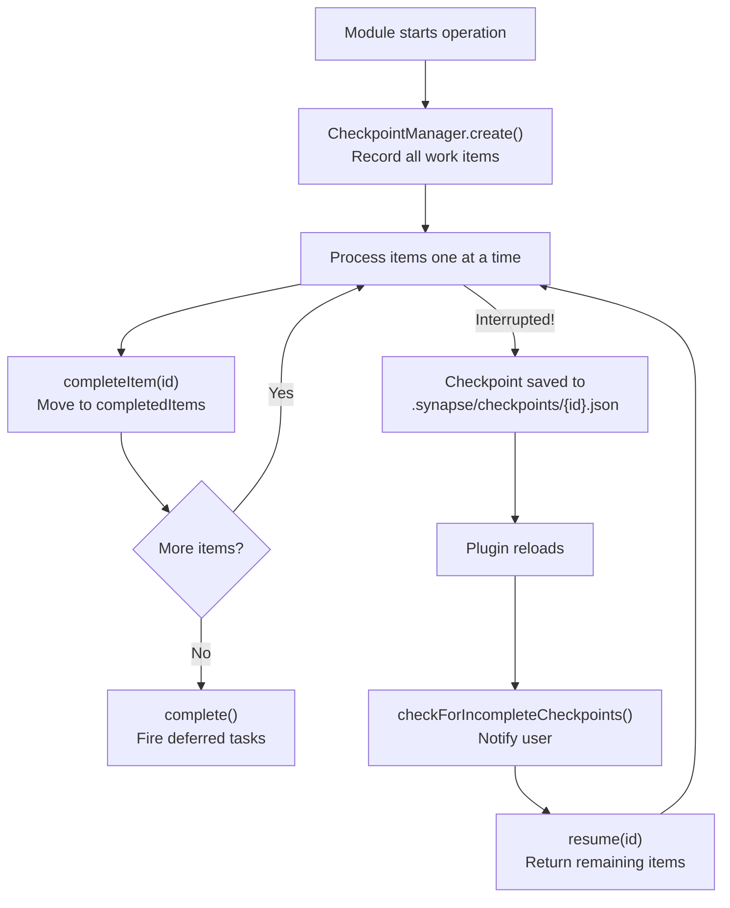

- Checkpoints are stored as JSON in `.synapse/checkpoints/`
- Each module implements `resumeFromCheckpoint(checkpoint)` to continue work
- Users can also discard checkpoints (completed items are kept, remaining items abandoned)
- The unified sidebar shows a banner for any incomplete checkpoints

---

## Transcription Architecture (Issue #20)

The transcription system uses a **UI layer + backend modules** pattern:

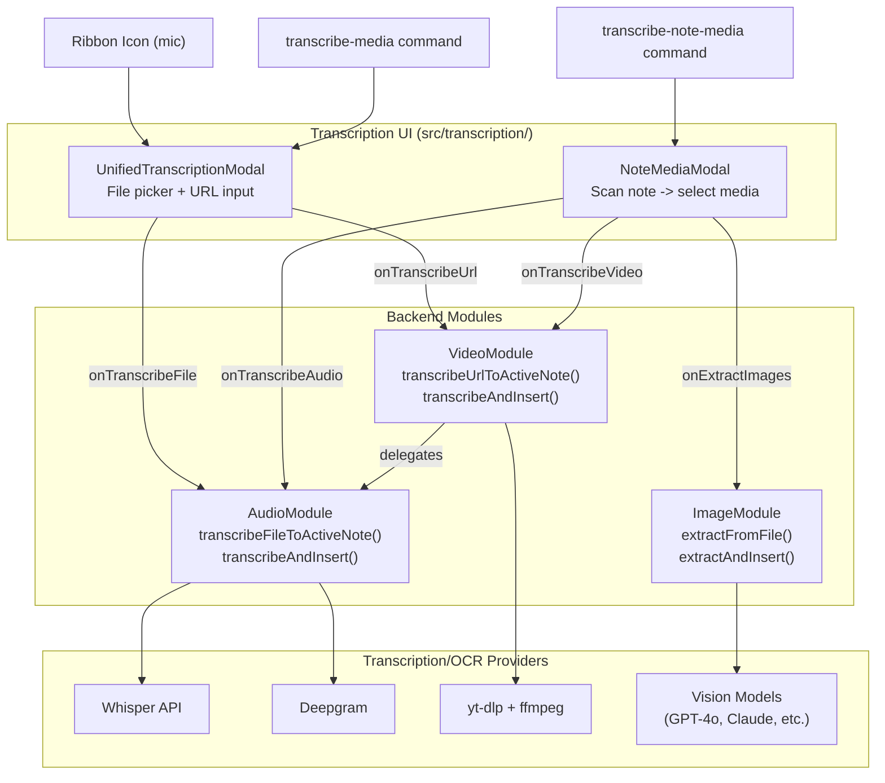

The transcription module replaced 4 modal files across audio/ and video/ with 2 unified modals. The `NoteMediaModal` also handles image OCR extraction. All callbacks are wired in `main.ts`.

### Time-Range Clipping

When a user selects an audio file or enters a video URL, the modal auto-detects media duration via ffprobe (local) or yt-dlp (URLs). If duration >= 10 seconds, a dual-handle `TimeRangeSlider` appears allowing sub-range selection. Clipping uses ffmpeg on the extracted audio (desktop only; mobile falls back to full-file transcription).

```
File/URL selected --> detectDuration() --> duration >= 10s?
  |-- Yes --> Show TimeRangeSlider (dual handles, live timestamps)
  |           User adjusts range --> TimeRange { start, end }
  |           Transcribe button --> clip audio via ffmpeg --> transcribe clip
  |-- No  --> Full file transcription (no slider shown)
```

### Supported Platforms

URL detection (`shared/url-detector.ts`) recognizes:
- **YouTube**: `youtube.com/watch`, `youtu.be`, `youtube.com/shorts`, `music.youtube.com`
- **TikTok**: `tiktok.com/@user/video/id`, `tiktok.com/t/...`, `vm.tiktok.com`, `vt.tiktok.com`
- **Instagram**: `instagram.com/reel/{id}`, `instagram.com/p/{id}` (Reels)

---

## Cross-Module Communication

All inter-module communication flows through `main.ts` via nullable callback assignments. No event bus, no pub-sub.

> This diagram is the wiring-level detail behind the per-note cascade — subgraph **a** of the master command-pipeline overview in [`README.md` → How it all fits together](README.md#how-it-all-fits-together), which is the canonical birds-eye view. The setting names and defaults on the edges below match that diagram.

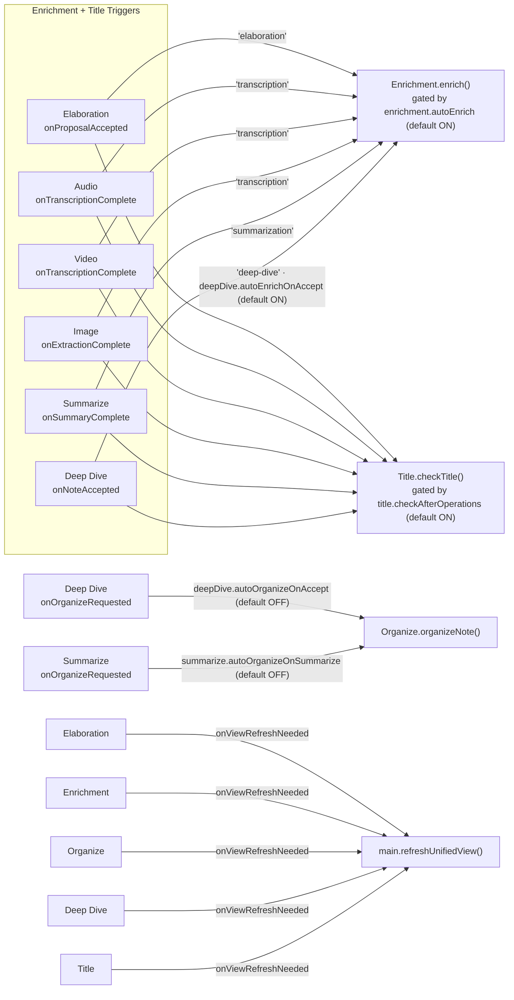

> **Deep Dive caveat.** When global enrichment is on (`enrichment.autoEnrich` ON) but `deepDive.autoEnrichOnAccept` is OFF, accepting a deep-dive note wires *neither* the enrich nor the title callback — so the title check is effectively gated behind `deepDive.autoEnrichOnAccept` too. The standalone title-only fallback (each trigger → `Title.checkTitle()` with no enrich) is wired only when `enrichment.autoEnrich` is OFF.

---

## Proposal System Architecture

Six modules generate proposals that appear in the unified sidebar. Each has a different review workflow:

| Module | Proposal Type | Review UX | Accept Behavior |
|--------|--------------|-----------|-----------------|
| Elaboration | Content additions (image-aware) | Editable textarea | Blockquote original, append additions in callout |
| Enrichment | Tags, links, refs, frontmatter | Per-item checkboxes | Cherry-pick items, apply with markers |
| Organize | New directory suggestion | Directory path + AI reasoning | Create directory, move file |
| Deep Dive | Generated child note | Read-only content preview | Create note at proposed path |
| Title | Rename suggestion (distinct state on collision) | Current vs proposed title + reasoning | Rename file; on filename collision resolve via `iterate`/`merge` (#408) |
| REM | `[[wikilink]]` insertions | Per-match checkboxes | **Rewrites note body** (snapshot kept for undo) |

### Proposal States

```
Generated --> Pending --+--> Accepted
                        +--> Rejected
                        +--> Partially Accepted (enrichment, REM)
```

### Auto-Accept (Issue #228)

Each proposal kind has an `autoAccept.{kind}` setting (all default `false`). When on, a freshly generated proposal is accepted in full as generated, skipping the sidebar. **REM is the cautionary case**: its accept rewrites note prose (inserting wikilinks), whereas the others only add a separate section — so enabling REM auto-accept is a more consequential choice.

Tidy, Summarize, and Image do NOT use proposals — they apply changes immediately (tidy has undo via snapshots; image OCR inserts callouts inline).

### Idempotency & the Review gate

- **Dedup by content key (#395).** Stores record each proposal's `contentKey` (hashed from inputs: note path + content hash + detection/AI settings). Re-scanning an unchanged note skips re-proposing the same item, so "scan twice" no longer duplicates proposals; the per-note `maxProposalsPerNote` cap is now enforced. Editing the note changes the hash and allows a fresh proposal.
- **Centralized Review toast (#366).** A completion toast shows its "Review" button only when something was generated, auto-accept is off for that kind, and the run is not an automatic post-op side effect — decided in one shared `reviewAction()` gate so all six flows behave consistently.

### Deep Dive: Cascade Rejection

Rejecting a parent automatically rejects all descendants:

```
Root Note
  +-- Topic A (rejected)
  |   +-- Subtopic A1 (auto-rejected)
  |   +-- Subtopic A2 (auto-rejected)
  +-- Topic B (pending)
      +-- Subtopic B1 (pending)
```

---

## Deep Dive: Recursive Generation

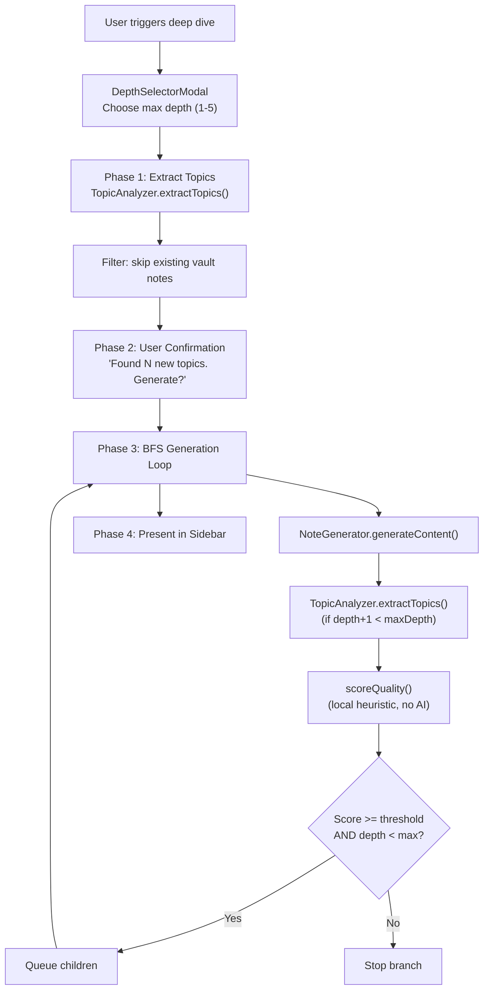

### Quality Scoring (Local, No AI)

```
Score = topicCount x 0.3    min(1.0, childTopics / 3)
      + wordCount  x 0.2    min(1.0, words / 200)
      + generic    x 0.2    penalty for "Introduction", "Overview", etc.
      + overlap    x 0.2    penalty for child topics matching ancestors
      + depthDecay x 0.1    linear decay toward max depth

Below qualityThreshold (default 0.4) -> stop recursion for this branch
```

---

## Enrichment Architecture

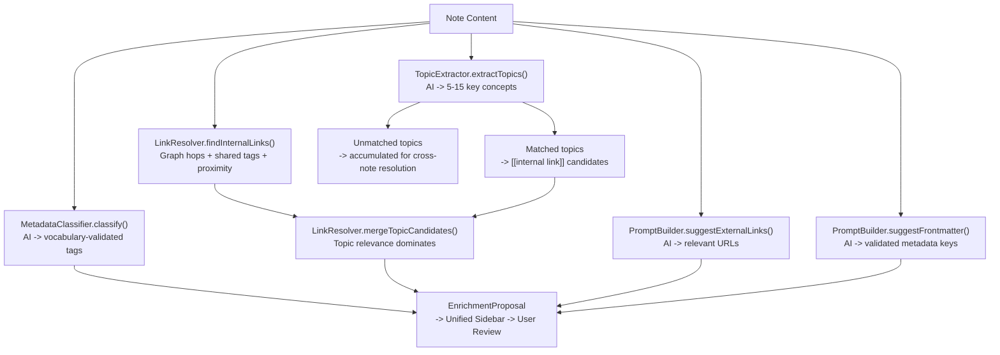

### Vault-Wide Scan (4-Phase)

| Phase | Action | Cost |
|-------|--------|------|
| 1. Scan | Collect eligible files, warm caches | Cheap |
| 2. Confirm | User approval before AI calls | Free (gates cost) |
| 3. Generate | Per-file enrichment, accumulate topics | Expensive (AI calls) |
| 4. Resolve | Topics with 2+ references -> new-note suggestions | Cheap |

---

## Summarize: Content-Aware Templates

The summarize module detects content type and applies specialized templates. Supports recipe pages (via JSON-LD schema data) and receipt images (via OCR keyword scoring):

```
Note with URL --> content-fetcher.ts
  |-- Fetch HTML
  |-- Extract JSON-LD structured data (Recipe, Article, etc.)
  |-- Extract plain text
  |
  v
summarizer.ts
  |-- Detect content type from JSON-LD or heuristics
  |-- Select template (recipe: ingredients + steps; default: bullets/paragraph/key-points)
  |-- AI summarization with template-specific prompt
  |-- Output: structured summary with amalgamated ingredients, step images, etc.
```

---

## Storage Layer

All module data is stored as individual JSON files under `.synapse/`:

```
.synapse/
+-- proposals/                    # Elaboration
|   +-- {id}.json                 #   Proposal with detection reasons + AI content
+-- enrichments/                  # Enrichment
|   +-- {id}.json                 #   Tags, links, refs, frontmatter suggestions
+-- tidy-snapshots/               # Tidy
|   +-- {path-as-filename}.json   #   Original content for undo (one per file)
+-- organize/
|   +-- proposals/{id}.json       # New-directory proposals
|   +-- snapshots/{id}.json       # Move snapshots for undo
|   +-- summaries/{name}.md       # Mermaid move diagrams
+-- deep-dive/
|   +-- {id}.json                 # Individual note proposals
|   +-- runs/{id}.json            # Run metadata (stats, depth breakdown)
+-- title-proposals/              # Title
|   +-- {id}.json                 # Title rename proposals
+-- rem/                          # REM
|   +-- {id}.json                 # Wikilink proposals (+ pre-apply body snapshot for undo)
+-- checkpoints/                  # Checkpoint/resume
|   +-- {id}.json                 # Operation state (completed + remaining items)
+-- temp/                         # Temporary video/audio (auto-cleaned)
```

Design principles:
- One file per proposal/snapshot (no corruption cascade)
- Human-inspectable JSON (debuggable)
- Survives plugin reloads and Obsidian restarts
- `.synapse/` excluded from all module scans by default
- Legacy `.auto-notes/` folder auto-migrated on first load

---

## AI Integration Pattern

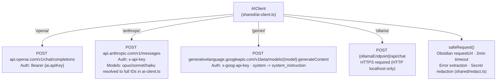

### Caching & Coalescing (#397)

`AIClient.chat()` wraps the raw provider dispatch with idempotency support, keyed by a deterministic `contentKey([messages, provider, model, temperature, maxTokens])` (inputs only):

- **In-flight coalescing** — a concurrent identical request joins the live dispatch promise (in-flight `Map`, entry cleared in `.finally()`) instead of issuing a second network call.
- **Response cache** — a per-instance, bounded LRU of request key → successful response. Participates when `temperature === 0` (deterministic) **or** the user opts in via `ai.cacheResponses`; populated **only on success** (errors are never cached).
- **Bypass** — a `bypassCache` option skips both the cache read and coalescing so a "regenerate" action always re-dispatches.

### Multi-Modal Vision Support

`AIClient.chat()` accepts `ChatMessage[]` where `content` can be `string | ContentBlock[]`:

```
ContentBlock = TextContentBlock { type: 'text', text: string }
             | ImageContentBlock { type: 'image', data: base64, mediaType: string }
```

Provider-specific format conversion:
- **OpenAI**: `image_url` with `data:` URI
- **Anthropic**: `image` source with `base64` type
- **Gemini**: `inline_data` with `mime_type` + base64 `data` (system role routed to `system_instruction`)
- **Ollama**: separate `images` array on the message

Used by: `image/extractor.ts` (OCR), `elaboration/image-analyzer.ts` (image analysis for proposals)

Audio transcription uses provider-specific APIs over Obsidian `requestUrl` (not `AIClient`, not native `fetch`):
- **Whisper**: OpenAI `/v1/audio/transcriptions` — manual `multipart/form-data` via `buildMultipartBody()` (sanitized headers; `requestUrl` has no `FormData`)
- **Deepgram**: `/v1/listen` — raw `ArrayBuffer` body
- **Gemini**: `…:generateContent` — inline base64 audio (≤ 15 MB); instruction in `system_instruction` (prompt-injection hardening)

---

## Callout Types

All AI-generated content uses Obsidian callouts from a shared registry:

| Key | Type String | Usage |
|-----|-------------|-------|
| summary | `synapse-summary` | Inline URL/transcription summaries |
| transcription | `synapse-transcription` | Audio/video transcriptions |
| enrichment | `synapse-enrichment` | Enrichment sections |
| elaboration | `synapse-elaboration` | Elaboration proposals |
| deepDive | `synapse-deep-dive` | Deep dive content |
| nav | `synapse-nav` | Deep dive navigation blocks |
| ocr | `synapse-ocr` | Image OCR extraction results |

---

## Settings Hierarchy

```
SynapseSettings
+-- settingsVersion -> Persisted schema version (#93); drives the migration runner, stamped to CURRENT_SETTINGS_VERSION on save
+-- ai              -> Provider, API key, model, temperature, max tokens,
|                     cacheResponses (#397, opt-in; caching automatic at temperature 0)
+-- elaboration     -> Detection thresholds, scan behavior, proposal storage
|   +-- detection   -> Word threshold, TODO markers, empty sections, exclude tags
|   +-- proposal    -> Max per note, preserve frontmatter, include context
+-- audio           -> Transcription provider, API keys, post-processing, auto-format lyrics (#234)
|   +-- postProcessing -> Filler removal, structure, key points, custom prompt
+-- video           -> yt-dlp/ffmpeg paths, download folder, embed setting
|   +-- frameExtraction -> (Not implemented) interval, vision model, max frames
+-- image           -> Enabled, vision model override, language hint, max image size MB (auto-downscale)
+-- enrichment      -> Auto-enrich, max tags/links, vocabulary, proximity weights, exclude tags
|   +-- tagVocabulary   -> TagVocabularyEntry[] (category, tags, description)
|   +-- weights         -> Same/sibling/cousin/distant folder, decay, minimum
+-- summarize       -> Style (bullets/paragraph/key-points), max length, templates,
|                     exclude tags, auto-organize on summarize,
|                     include note content + combine summaries (#367, both default on)
+-- tidy            -> Snapshot folder path
+-- organize        -> Proposal/snapshot folder paths, confidence threshold, exclude tags
+-- deepDive        -> Max depth, quality threshold, max notes, output folder,
|                     nesting mode, auto-enrich/organize on accept, exclude tags
+-- title           -> Enabled, proposal folder path, check after operations,
|                     duplicateHandling (#408, 'iterate' | 'merge'; default resolution for filename collisions)
+-- rem             -> Enabled, title-match weight (#380, no UI), semantic confidence
|                     threshold, max links per note, proposal folder path
+-- intake          -> Enabled, watched folder, mark-processed, move-when-done,
|                     settle seconds, capture log + capture-log folder
+-- ui              -> collapsedSections (settings accordion state),
|                     autoFoldProperties (#381, default off)
+-- autoAccept      -> Per-kind booleans (elaboration, enrichment, organize,
|                     deep-dive, title, rem) — all default false (#228)
+-- onboarding      -> hasSeenWelcome (first-run welcome gate, #89)
+-- updates         -> enableUpdateNotifications, lastUpdateCheck,
|                     dismissedUpdateVersion (in-app update check, #365)
+-- exclusions      -> ExclusionRule[] — centralized per-path exclusion (#307);
                      replaces all former per-module excludeFolders fields
```

Path exclusion is centralized (#307): the per-module `excludeFolders` fields were removed in favor of one `exclusions` list (see "Path Exclusions" above). Tag exclusion (`excludeTags`) stays per-module. Modules access settings via the `getSettings()` closure -- always reads latest values, no event subscriptions needed.

---

## Security Layers

| Layer | Protection | Location |
|-------|-----------|----------|
| Input validation | `sanitizeUrl()`, `sanitizePath()` | `shared/validation.ts` |
| Output sanitization | `sanitizeAIResponse()` strips scripts, event handlers, dangerous URIs | `shared/validation.ts` |
| Subprocess security | `execFile` with argument arrays (no shell); narrowed allowlist env via `shellEnv()` | `video/audio-extractor.ts`, `transcription/duration-detector.ts`, `shared/node-loader.ts` |
| Desktop gating | `assertDesktop()`/`loadNodeModules()` — Node builtins resolve only on desktop, behind one guarded site; keeps `isDesktopOnly: false` mobile-safe | `shared/node-loader.ts` |
| Temp-path hardening | Vault-derived basenames sanitized before composing temp paths (2026-06-08) | `transcription/duration-detector.ts` |
| Multipart header hardening | Vault-/settings-derived field + file names sanitized (`sanitizeMultipartHeaderValue`: strip CR/LF, replace `"`/`\`) before `Content-Disposition` lines — blocks multipart/header injection (2026-06-11) | `audio/transcriber.ts` |
| API key protection | `redactSecrets()` (strings) + `redactError()` (raw caught errors — Error `.stack`/`.message`) — **single source of truth** scrubbing keys from error messages/console on **every error path**; covers OpenAI/Anthropic `sk-`, `key-`, Deepgram `dg-`, `Bearer`/`Token`, `anthropic-`, and Gemini `AIza`. Password-masked inputs; keys live only in gitignored `data.json` | `shared/redact.ts` (used by `ai-client.ts`, `credential-validator.ts`, all of `notifications.ts`; `redactError` at audio/index, rem/semantic-matcher, elaboration/image-analyzer + proposer, shared/fire-and-forget) |
| Prompt-injection defense | `wrapUntrusted()` fences fetched untrusted content (article/tweet/Reddit, image analysis) in labeled delimiters + data-not-instructions frame + anti-breakout scrub — structural, not lexical (#398); Gemini audio instruction in `system_instruction` | `shared/untrusted-content.ts` (used by `elaboration/proposer.ts`), `audio/transcriber.ts` |
| Frontmatter safety | Key validation regex + forbidden keys blocklist | `enrichment/enrichment-applier.ts` |
| Network security | Ollama HTTPS required (HTTP for localhost only), 2min timeouts | `shared/ai-client.ts` |
| Credential validation | Live key probe is one minimal authenticated GET; result is **ephemeral** (never persisted) and routed through `redactSecrets` so an echoed key can't reach the status chip | `shared/credential-validator.ts`, `shared/provider-metadata.ts` |
| Idempotent updates | `%% synapse-enrichment-start/end %%` markers | `enrichment/enrichment-applier.ts` |
| Prototype pollution | `deepMerge` skips `__proto__`, `constructor`, `prototype` keys | `main.ts` |
| Lifecycle hygiene | `NotificationManager.dispose()` tears down in-flight ellipsis timers + hides notices on unload (no orphaned `setInterval`) | `shared/notifications.ts`, `main.ts:onunload()` |

**Audit status:** The full audit (2026-06-08) found no critical or high vulnerabilities. The 2026-06-11 re-audit added two defense-in-depth hardenings — canonical secret redaction (now covering Gemini `AIza` keys everywhere) and multipart header-injection hardening. The 2026-06-20 audit pass re-verified architecture, security, and Obsidian-guideline compliance as clean; its one fix was a lifecycle leak (in-flight notification ellipsis timers now torn down on unload). The 2026-06-25 audit pass (v1.0.6) brought the per-operation error `console.error` under `redactSecrets`, so the single redaction source now guards **every** error sink in `notifications.ts`. The 2026-06-29 audit pass (v1.0.7) added `redactError()` so raw caught errors logged directly to the console get the same scrub (five direct error sinks routed through it); the idempotency bundle also landed a structural prompt-injection fence (`wrapUntrusted`, #398) for fetched external content. `data.json` (live API keys) is gitignored and never committed.

**Known posture / not-yet-enforced:**
- `ensureWithinVault()` exists in `shared/validation.ts` but is **not yet wired into write paths** — there is no active vault-boundary enforcement on writes today.
- `sanitizeUrl` permits arbitrary hosts (an SSRF surface on user-supplied URLs). This is an **accepted risk**: URLs are author-supplied within the user's own vault.

---

## Getting Started for Contributors

1. Clone into Obsidian vault's plugin directory
2. `npm install` then `npm run dev` (watch mode)
3. Module pattern: each feature in `src/<module>/` with `index.ts` exporting the module class
4. Follow the FeatureModule contract: `constructor(plugin, getSettings, notifications, …)`, `onload()`, `onunload()`. `main.ts` injects the rest — the shared `CheckpointManager` (for resumable scans), the `CommandRegistrar`, and a `() => settings.autoAccept[kind]` getter where applicable — never reach for globals.
5. Types go in `<module>/types.ts`, tests co-located as `<name>.test.ts`
6. All shared utilities imported from `../shared` (barrel export) — never from a sibling feature module or an internal `shared/` file. Where you only need a *type* from a higher layer, use `import type` (erased at compile time, no runtime cycle).
7. Need a Node builtin (`fs`/`path`/`os`/`child_process`)? Go through `loadNodeModules()`/`assertDesktop()` only — never `require` at module top level (keeps the bundle mobile-loadable).
8. Gate vault paths with `isPathExcluded(path, featureId, settings)` and tags with the shared `matchesExcludeTag` helper.
9. Build check: `npm run build` (type-checks + bundles); tests: `npm test`
10. Git: create a feature branch, push, open PR. See `.claude/skills/git-workflow/SKILL.md` for full protocol.
