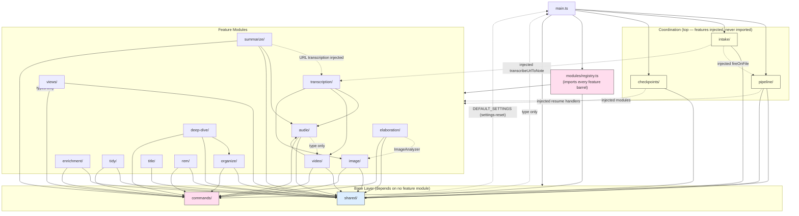
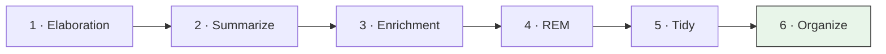
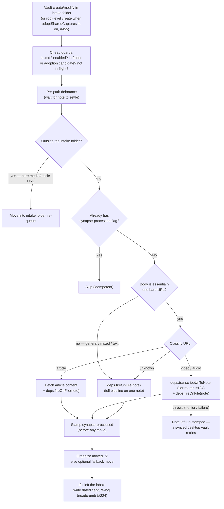
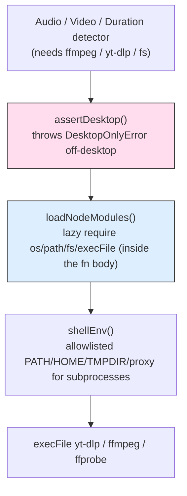
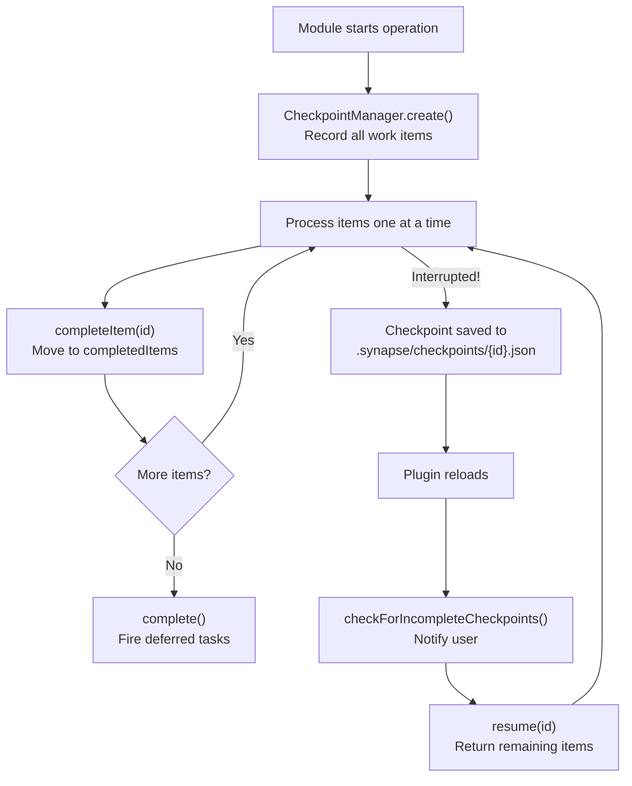
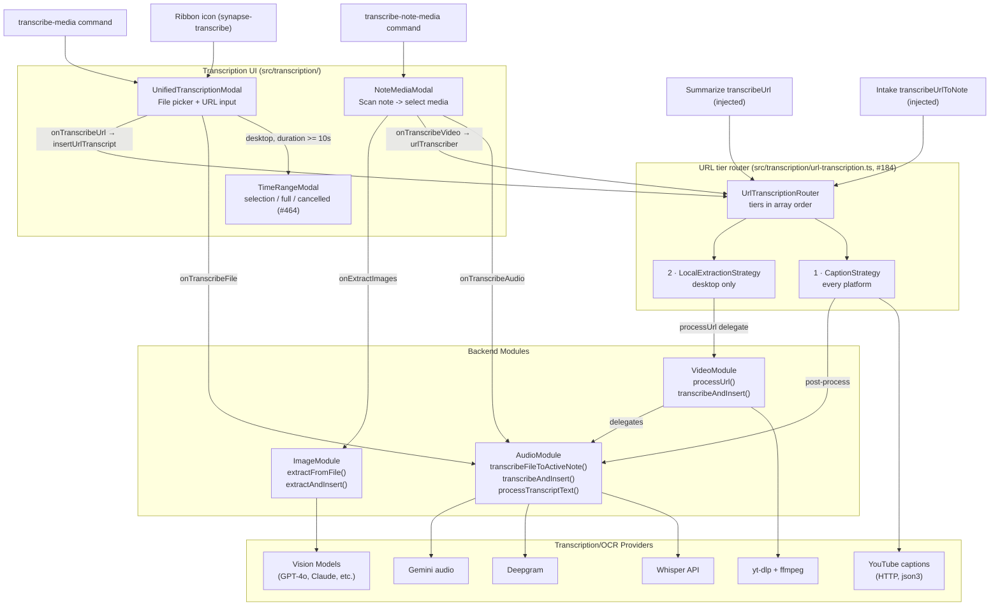
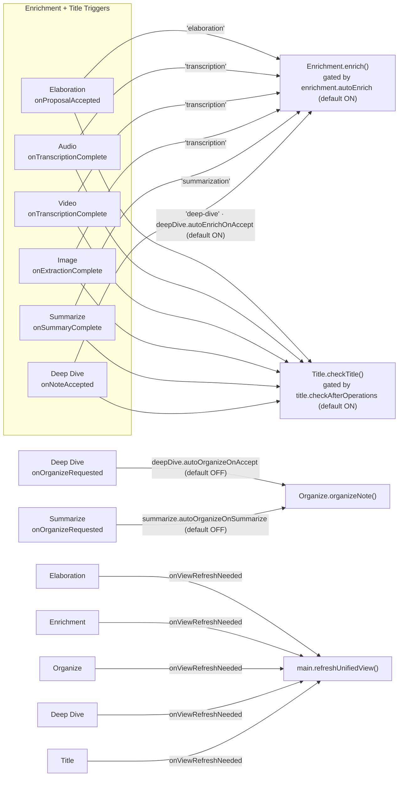
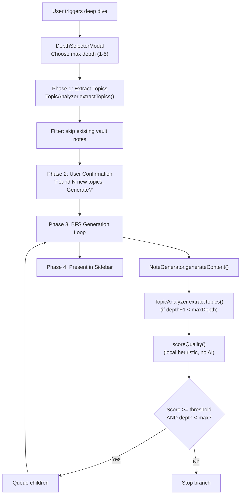
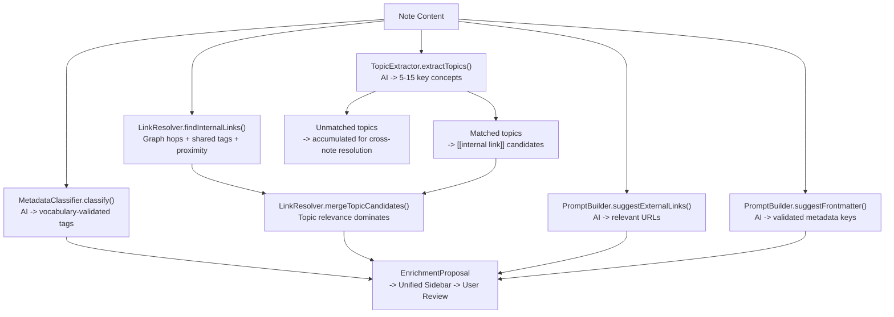
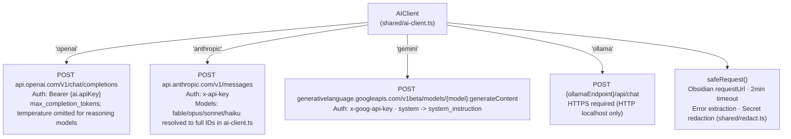

# Architecture Overview

**Last updated**: 2026-09-17 · **Version**: 1.1.0

Synapse is an Obsidian plugin that layers AI-powered features over a vault: note elaboration (with image analysis), audio transcription, video transcription, image OCR, note enrichment, summarization, note tidying, semantic organization, recursive deep-dive note generation, title proposals, and in-place wikilink discovery (REM). Two coordination layers tie them together — a **Fire Synapse pipeline** that runs the features in a fixed order over a folder or note, and an **intake** watcher that auto-processes notes dropped into an inbox. It runs on both desktop and mobile. YouTube URLs transcribe from their captions on every platform (#184); downloading video with yt-dlp/ffmpeg (captionless YouTube, TikTok, Instagram) and time-range clipping are desktop-only.

The codebase has **24 modules under `src/`** (audio, brand-icons, changelog, checkpoints, commands, deep-dive, elaboration, enrichment, image, intake, modules, onboarding, organize, pipeline, properties-fold, rem, settings-ui, shared, summarize, tidy, title, transcription, video, views) plus top-level glue: `main.ts` and `settings.ts`. Five of those are thin folders behind an `index.ts`: `settings-ui/` (Obsidian settings tab), `onboarding/` (pure first-run welcome, #89), `brand-icons/` (Synapse SVG icons), `changelog/` (in-app "What's new", #375), and `properties-fold/` (auto-fold note Properties, #381). Two are lifecycle helpers added in 1.1.0: `modules/` (the feature-module registry, #504) and `checkpoints/` (checkpoint recovery UX, #496).

> **Note**: This plugin was previously named "Auto Notes" and was rebranded to "Synapse" in March 2026. The data folder was renamed from `.auto-notes/` to `.synapse/`, with automatic one-time migration on load.

### How the pieces fit (plain language)

- **Feature modules** do the actual work (transcribe, enrich, summarize…). Each one is self-contained in `src/<feature>/` and exposes its public surface through a single `index.ts` barrel.
- **`modules/registry.ts` is the one list of feature modules** (#504). `main.ts` never names a module in its lifecycle: it builds one `ModuleDeps` bundle (plugin, settings getter, notifications, checkpoint manager, command registrar, note queue), hands it to the registry, and the registry constructs every module in order, calls `onload()` on the enabled ones, and unloads them in reverse. Every module constructor takes `ModuleDeps` first. Adding a module is one registry entry plus an `enabled`-flagged settings section — leaving either out is a compile error.
- **`shared/`** is the foundation everything stands on — the AI client, validation, checkpoints, callouts, URL detection, the transcript cache, and the cache-hit / no-speech helpers. It depends on no feature module.
- **`commands/`** is a developer-level master switch for every command, sitting *above* user settings. It also depends on nothing else in `src/`.
- **`pipeline/`** runs features in order; **`intake/`** decides what to feed the pipeline. Neither imports a feature module directly — `main.ts` injects the features into them. This is what keeps the dependency graph acyclic.
- **`views/`** holds the two sidebars: the **unified proposal view** (review/accept every proposal type) and the **Synapse actions view** (registry-driven, touch-friendly buttons so mobile users reach any command without the palette).
- **`transcription/`** holds the transcription modals and the **URL tier router** (#184): YouTube captions over plain HTTP first, desktop yt-dlp/ffmpeg second. It reaches `audio` and `video` only through callbacks injected by `main.ts`. Every URL path shares one router built over a **persistent transcript cache** (`shared/transcript-cache.ts`, #488), so a URL is transcribed once and reused by the modal, summarize, and intake.
- **`checkpoints/`** owns the checkpoint *recovery* UX (#496) — the delayed startup "interrupted operations" prompt, the `manage-checkpoints` command, and the sidebar's resume/discard buttons. Persistence stays in `shared/checkpoint-manager.ts`; resume reaches a feature module only through an injected handler map.
- **One note, one operation at a time.** A single `NoteOperationQueue` (`shared/note-operation-queue.ts`, #483) is injected into every module that reads a note, calls the AI, and writes it back, so two features never interleave writes on the same note.
- **Cache use is never silent** (#527). When a result came from the transcript cache or the AI response cache, the operation's finish message says so — one shared wording in `shared/cache-notice.ts`, and a single "N of M notes served from cache" line for batches.
- **Mobile safety**: the plugin ships `isDesktopOnly: false`. Anything that needs Node.js (yt-dlp, ffmpeg, the filesystem) is funneled through one guarded loader (`shared/node-loader.ts`) that refuses to run off-desktop, so the bundle loads cleanly on mobile and desktop-only features degrade gracefully.

---

## System Diagram


```mermaid
graph TB
    subgraph Obsidian["Obsidian"]
        Main["main.ts<br/>SynapsePlugin (lifecycle glue)"]
        Registry["modules/registry.ts<br/>(constructs · loads · unloads features)"]
        Settings["Settings + Tab"]
        Sidebar["Unified Proposal View<br/>(sidebar)"]
        Actions["Synapse Actions View<br/>(registry-driven sidebar)"]
        CkptMgr["CheckpointManager<br/>(shared, singleton)"]
        CkptUX["Checkpoint recovery<br/>(checkpoints/)"]
        TCache["TranscriptCache<br/>(shared, .synapse/transcript-cache.json)"]

        subgraph Coord["Coordination Layers"]
            Pipe["Pipeline<br/>(Fire Synapse runner)"]
            Intake["Intake<br/>(folder watcher)"]
        end

        subgraph Features["Feature Modules"]
            Elab["Elaboration<br/>(+ ImageAnalyzer)"]
            Audio["Audio"]
            Video["Video"]
            Image["Image OCR"]
            Trans["Transcription<br/>(modals + URL tier router)"]
            Enrich["Enrichment"]
            Summ["Summarize"]
            Tidy["Tidy"]
            Org["Organize"]
            DD["Deep Dive"]
            Title["Title"]
            Rem["REM<br/>(wikilinks)"]
        end

        Commands["Commands<br/>(registry · base layer)"]
        Shared["Shared Layer<br/>AIClient · NoteOperationQueue · Notifications · Validation<br/>File Utils · Frontmatter · Callouts · URL Detection"]
    end

    subgraph External["External Services"]
        AI["AI Providers<br/>OpenAI · Anthropic · Gemini · Ollama"]
        TransAPI["Transcription APIs<br/>Whisper · Deepgram · Gemini"]
        Caps["YouTube captions<br/>(HTTP · no install)"]
        Tools["CLI Tools<br/>yt-dlp · ffmpeg"]
    end

    Main --> Settings
    Main --> Sidebar
    Main --> Actions
    Main --> CkptMgr
    Main --> CkptUX
    Main --> TCache
    Main --> Commands
    Main --> Coord
    Main --> Registry
    Registry -->|ModuleDeps-first constructors| Features
    CkptUX -.->|injected resume handlers| Features
    Trans --> TCache
    Commands -.->|derives buttons| Actions
    Pipe -.->|injected modules| Features
    Intake -.->|injected fireOnFile| Pipe
    Features --> Shared
    Features --> Commands
    Features --> CkptMgr
    Shared --> AI
    Audio --> TransAPI
    Video --> Tools
    Video --> Audio
    Video --> Shared
    Image --> AI
    Elab -.->|image analysis| Image
    Trans --> Audio
    Trans --> Video
    Trans --> Image
    Trans --> Caps
    Summ -.->|URL transcription injected| Trans
    Intake -.->|injected transcribeUrlToNote| Trans
    DD -.->|auto-organize| Org

    style Trans fill:#f9f,stroke:#333
    style Sidebar fill:#bbf,stroke:#333
    style Actions fill:#bbf,stroke:#333
    style CkptMgr fill:#ffd,stroke:#333
    style CkptUX fill:#ffd,stroke:#333
    style TCache fill:#ffd,stroke:#333
    style Registry fill:#fde,stroke:#333
    style Commands fill:#fde,stroke:#333
    style Shared fill:#def,stroke:#333
    style Image fill:#e8f5e9,stroke:#333
```

Both `shared/` and `commands/` are **base layers**: every feature may depend on them, but they depend on no feature module. `pipeline/`, `intake/`, and `checkpoints/` reach the features only through dependencies injected by `main.ts`, never by importing them. `modules/registry.ts` is the one file (besides the settings tab) that imports every feature barrel — it sits at the top, so the whole graph stays acyclic.

---

## Module Map

```
src/
├── main.ts                 # Plugin entry — lifecycle glue only (295 lines, #496/#504): settings load/save, service construction, registry-driven module lifecycle, view/ribbon/command registration, callback injection
├── settings.ts             # Type definitions, defaults, MODEL_OPTIONS + TRANSCRIPTION_MODEL_OPTIONS (#521); type-only imports of ProposalKind + ExclusionRule
├── settings-ui/            # SynapseSettingTab — declarative SETTINGS_SECTIONS list (#506); cross-feature sections in global-sections.ts
├── onboarding/             # Pure first-run welcome logic (#89): planFirstRun, needsApiKey, runFirstRunOnboarding
├── brand-icons/            # registerSynapseIcons(): S-Signal mark + per-feature glyphs (before any ribbon/setIcon use)
├── changelog/              # parseChangelog/renderChangelog + ChangelogModal over the build-inlined CHANGELOG.md (#375)
├── properties-fold/        # registerPropertiesAutoFold(): auto-fold note Properties panel on open (#381)
│
├── modules/                # Feature-module registry (#504) — the one list of feature modules
│   ├── registry.ts         #   MODULE_FACTORIES (ordered) + constructFeatureModules / loadFeatureModules / unloadFeatureModules
│   └── index.ts            #   Barrel export
│
├── checkpoints/            # Checkpoint recovery UX (#496)
│   ├── checkpoint-recovery.ts # CheckpointRecoveryModule: startup prompt (3 s), manage-checkpoints command, resume/discard
│   ├── types.ts            #   CheckpointResumeHandlers — per-module resume map injected by main.ts
│   └── index.ts            #   Barrel export
│
├── commands/               # Command registry (base layer; imports nothing in src/)
│   ├── registry.ts         #   COMMAND_REGISTRY source of truth + flow/status/context gates
│   ├── registrar.ts        #   Single wiring point to plugin.addCommand
│   ├── audit.ts            #   Registry <-> handler drift detection
│   ├── actions.ts          #   listPaletteActions — buttons for the actions sidebar
│   ├── icons.ts            #   FEATURE_ICONS / resolveActionIcon
│   ├── types.ts            #   CommandDefinition, CommandContext, CommandFlow, CommandStatus, FeatureKey
│   └── index.ts            #   Barrel export
│
├── pipeline/               # Fire Synapse: ordered multi-phase runner
│   ├── synapse-runner.ts   #   Sequential phase executor (fire / fireOnFile)
│   ├── post-op-hooks.ts    #   buildPostOpHook / buildAutoOrganizeHook — the enrich → title-check and auto-organize wiring (#496)
│   ├── types.ts            #   SYNAPSE_PIPELINE phase list + scan-fn contract
│   └── index.ts            #   Barrel export
│
├── intake/                 # Inbox watcher: auto-process dropped notes (#111)
│   ├── intake-dispatcher.ts#   Route a note (article / media / general); bareUrl() reused by adoption
│   ├── settings-section.ts #   Settings accordion incl. adoptSharedCaptures (#455)
│   ├── types.ts            #   Route + IntakeDeps types, processed-flag constants
│   └── index.ts            #   IntakeModule (debounce, idempotency, fireOnFile, transcribeUrlToNote, shared-capture adoption, startup catch-up scan #462)
│
├── rem/                    # In-place [[wikilink]] discovery
│   ├── mention-scanner.ts  #   Literal title/alias matches (down-weighted by titleMatchWeight, #380)
│   ├── semantic-matcher.ts #   Always-on AI semantic matches (#380)
│   ├── rem-applier.ts      #   Insert wikilinks into note body
│   ├── rem-store.ts        #   Proposal persistence
│   └── index.ts            #   RemModule orchestrator
│
├── elaboration/            # Stub note detection + AI content proposals (image-aware)
│   ├── detector.ts         #   PlaceholderDetector (short notes, TODOs, empty sections)
│   ├── proposer.ts         #   ProposalGenerator (context gathering — backlinks > outbound links > tag siblings under a 6000-char budget (#500) — + AI generation)
│   ├── image-analyzer.ts   #   Multi-modal image analysis for proposal enrichment
│   ├── proposal-store.ts   #   JSON file persistence
│   └── index.ts            #   ElaborationModule orchestrator
│
├── audio/                  # Audio transcription
│   ├── transcriber.ts      #   Whisper / Deepgram / Gemini / local routing; manual multipart w/ sanitized headers; no-speech detection (#524)
│   ├── post-processor.ts   #   AI transcript cleanup — single call when it fits ai.maxTokens, otherwise sectioned (#467)
│   ├── transcript-segmenter.ts # Pure splitter: paragraph → line → sentence → word boundaries, word-aligned overlap (#467)
│   ├── transcription-models.ts # Resolve audio.transcriptionModel against the active provider's registry (#521)
│   ├── transcription-credentials.ts # Provider + model dropdowns + key fields rendered inside AI Configuration
│   ├── note-scanner.ts     #   Find audio embeds in note content
│   └── index.ts            #   AudioModule orchestrator
│                           #   NOTE: type-only `import type { AudioExtractor }` from video/ (no runtime cycle)
│
├── video/                  # Video download + transcription
│   ├── audio-extractor.ts  #   yt-dlp + ffmpeg via execFile (`--` before every URL positional, #501)
│   ├── ffmpeg-availability.ts # createFfmpegAvailability — memoized ffmpeg probe (#496)
│   ├── frame-extractor.ts  #   Placeholder — frame extraction is not implemented
│   ├── note-scanner.ts     #   Find video URLs in note content (uses shared/url-detector)
│   ├── settings-section.ts #   Video settings incl. captionsFirst + "Clear transcript cache" (#488)
│   └── index.ts            #   VideoModule orchestrator (delegates to Audio)
│                           #   NOTE: url-detector.ts moved to shared/ (decycling, 2026-06-08)
│
├── image/                  # Image OCR via multi-modal AI (vision models)
│   ├── extractor.ts        #   ImageExtractor (base64 + ContentBlock[] -> AI vision)
│   ├── note-scanner.ts     #   Find image embeds (![[*.png]]) in note content
│   ├── types.ts            #   ImageEmbed, OCRResult
│   └── index.ts            #   ImageModule orchestrator (batch + checkpoint)
│
├── transcription/          # Transcription UI (issue #20) + URL tier router (#184)
│   ├── unified-modal.ts    #   File picker + URL input with duration + time-range prompt
│   ├── note-media-modal.ts #   Selection modal for media in current note
│   ├── time-range-slider.ts#   Dual-handle range slider (pure DOM component)
│   ├── time-range-modal.ts #   TimeRangeModal — what to transcribe; dismiss = cancelled (#464)
│   ├── duration-detector.ts#   Media duration via ffprobe (local) / yt-dlp (URL)
│   ├── url-transcription.ts#   UrlTranscriptionRouter (read-/write-through the transcript store, #488) + strategy contract + NoTranscriptionPathError + buildUrlTranscriptBlock
│   ├── create-url-router.ts#   createUrlTranscriptionRouter — assembles the tiers over the store (#496)
│   ├── caption-strategy.ts #   Tier 1: YouTube captions (every platform); post-process via injected AudioModule callback
│   ├── local-extraction-strategy.ts # Tier 2: desktop yt-dlp/ffmpeg via injected VideoModule.processUrl delegate
│   ├── youtube-captions.ts #   Caption fetch (Innertube ANDROID → watch page), host allowlist + size bounds + escaping (#501), deterministic formatting (#469)
│   ├── insert-url-transcript.ts # insertUrlTranscript (modal) + appendUrlTranscript (intake): route, append, report cache use (queued, #483)
│   ├── note-media-transcription.ts # transcribeNoteMedia — "Transcribe current note" entry point (#496)
│   ├── open-unified-modal.ts #  openUnifiedTranscriptionModal — ribbon/command entry point (#496)
│   └── index.ts            #   Barrel export
│
├── enrichment/             # Tags, links, refs, frontmatter
│   ├── metadata-classifier.ts  # AI tag classification against vocabulary
│   ├── topic-extractor.ts      # AI topic extraction -> link candidates
│   ├── link-resolver.ts        # Graph-based link resolution + merge
│   ├── vault-analyzer.ts       # Cached vault tag index + link graph
│   ├── weight-calculator.ts    # Proximity weight scoring (pure function)
│   ├── prompt-builder.ts       # External links + frontmatter suggestions
│   ├── enrichment-applier.ts   # Apply/undo enrichments with markers
│   ├── enrichment-store.ts     # JSON file persistence
│   └── index.ts                # EnrichmentModule orchestrator
│
├── summarize/              # URL + transcription summarization
│   ├── summarizer.ts       #   AI summarization (bullets/paragraph/key-points)
│   ├── content-fetcher.ts  #   HTTP fetch + HTML-to-text + JSON-LD extraction
│   ├── note-scanner.ts     #   Find summarizable targets in notes
│   └── index.ts            #   SummarizeModule orchestrator
│
├── tidy/                   # Spelling + formatting correction
│   ├── tidy-store.ts       #   Snapshot storage for undo
│   └── index.ts            #   TidyModule orchestrator
│
├── organize/               # AI-powered directory structuring
│   ├── content-analyzer.ts #   AI topic extraction for organization
│   ├── directory-matcher.ts#   Match topics to directories
│   ├── organize-store.ts   #   Proposal + snapshot persistence
│   └── index.ts            #   OrganizeModule orchestrator
│
├── deep-dive/              # Recursive topic exploration
│   ├── topic-analyzer.ts   #   AI topic extraction from note content
│   ├── note-generator.ts   #   AI content generation for topics
│   ├── quality-scorer.ts   #   Local heuristic quality scoring
│   ├── syllabus-navigator.ts # Traversal ordering, syllabus index, navigation
│   ├── deep-dive-store.ts  #   Proposal + run persistence
│   └── index.ts            #   DeepDiveModule orchestrator
│
├── title/                  # Note title suggestions
│   ├── index.ts            #   TitleModule: title checking, proposal lifecycle, collision resolution (iterate/merge, #408)
│   ├── title-suggester.ts  #   AI title generation + mismatch detection
│   ├── title-store.ts      #   JSON persistence
│   ├── content-key.ts      #   titleContentKey() — input-keyed dedup so a rejected title isn't re-proposed (#408)
│   ├── backlink-remediation.ts # Snapshot inbound links before a rename, rewrite them after with display text preserved (#485)
│   ├── settings-section.ts #   Settings UI: enabled toggle + duplicate-handling dropdown
│   ├── types.ts            #   TitleProposal, trigger/status types, TitleDuplicateStrategy
│   └── title-detector.ts   #   Re-exports isUntitled from ../shared (canonical home is shared/)
│
├── shared/                 # Cross-cutting utilities (base layer)
│   ├── ai-client.ts        #   Multi-provider AI (OpenAI, Anthropic, Gemini, Ollama); per-instance LRU response cache + in-flight coalescing (#397); onCacheHit signal (#527); re-exports redactSecrets
│   ├── redact.ts           #   redactSecrets() (strings) + redactError() (raw caught errors) — single source of truth for API-key/token redaction
│   ├── note-operation-queue.ts # NoteOperationQueue — path-keyed FIFO so read → AI → write cycles on one note never interleave (#483)
│   ├── feature-module.ts   #   ModuleDeps + FeatureModule + FeatureSettingsKey — the contract every feature module implements (#504)
│   ├── transcript-cache.ts #   TranscriptCache — persistent media-URL transcript store, LRU-capped at 200 entries / 4M chars (#488)
│   ├── cache-notice.ts     #   CacheUse + withCacheReport — one wording for "served from cache" finish lines (#527)
│   ├── no-speech.ts        #   NoSpeechDetectedError + hasSpeechContent/isWorthPostProcessing — typed no-speech outcome (#524)
│   ├── settings-merge.ts   #   deepMergeSettings — prototype-safe deep merge over DEFAULT_SETTINGS (#496)
│   ├── data-folder-migration.ts # migrateDataFolder — one-time .auto-notes → .synapse rename (#496)
│   ├── settings-migrations.ts # Version-stamped migration runner (#93): migrateSettings/readSettingsVersion/CURRENT_SETTINGS_VERSION (now 3)
│   ├── hash-utils.ts       #   hashString/contentKey — dependency-free input-keyed hashing for idempotency (#395)
│   ├── untrusted-content.ts#   wrapUntrusted() — structural prompt-injection fence for fetched external content (#398)
│   ├── review-action.ts    #   reviewAction() — centralized "Review" completion-toast gate (#366)
│   ├── node-loader.ts      #   loadNodeModules/assertDesktop/DesktopOnlyError/shellEnv — the ONE guarded Node-builtin site
│   ├── exclusions.ts       #   Centralized path-exclusion model + glob matcher (#307); tag-exclusion helper
│   ├── credential-validator.ts # validateCredentials() — one minimal authenticated probe per provider (#335)
│   ├── provider-metadata.ts#   Per-provider get-key URL, placeholder, probe spec (#335)
│   ├── credential-field.ts #   Settings decorator: "Get an API key →" link + Test button + status chip (#335)
│   ├── encoding.ts         #   arrayBufferToBase64 / base64EncodedLength (shared by audio/image/elaboration)
│   ├── url-detector.ts     #   YouTube/TikTok/Instagram URL parsing (moved here 2026-06-08)
│   ├── checkpoint-manager.ts #  Checkpoint/resume for long-running operations
│   ├── checkpoint-types.ts #   Checkpoint type definitions
│   ├── id-utils.ts         #   ID generation and validation
│   ├── notifications.ts    #   Centralized notifications: progress, cancellation, action buttons, dispose() teardown
│   │                       #   every error sink routes through redactSecrets; equal-message throttle for one-shot toasts (#396)
│   ├── fire-and-forget.ts  #   fireAndForget() — rejection handling for un-awaited promises; sinks route through redactError
│   ├── update-checker.ts   #   UpdateChecker/isNewerVersion — once/24h GitHub Releases poll, sticky notice (#365)
│   ├── title-detector.ts   #   isUntitled/isGenericTitle predicates — canonical home; title/ re-exports isUntitled
│   ├── validation.ts       #   URL, path, AI response sanitization
│   ├── file-utils.ts       #   Vault file operations
│   ├── frontmatter-utils.ts#   YAML frontmatter parsing/serialization
│   ├── callouts.ts         #   Callout type registry + builder
│   ├── diagram-generator.ts#   Mermaid diagram generation
│   ├── slider-helper.ts    #   Settings UI helper for range sliders
│   ├── folder-picker-modal.ts # Modal for folder selection
│   ├── open-scan-folder-picker.ts # Unified scan-folder picker; Enter-on-open = vault root (1.0.9)
│   ├── confirm-modal.ts    #   ConfirmModal — settle-once yes/no; dismiss = false (#420)
│   ├── settings-reset.ts   #   Per-section + global reset-to-defaults helpers (1.0.10); the one runtime shared → settings import (DEFAULT_SETTINGS)
│   ├── api-utils.ts        #   Retry logic + error handling helpers
│   ├── json-utils.ts       #   Safe JSON parse + record/string-array guards + readJsonFile
│   ├── content-fetcher.ts  #   HTTP fetch + HTML-to-text + JSON-LD recipe extraction
│   ├── tweet-fetcher.ts    #   Tweet/X content fetch (untrusted-wrapped by callers)
│   ├── reddit-fetcher.ts   #   Reddit post fetch + canonical-URL extraction
│   ├── url-classifier.ts   #   Classify a URL (article / media / unknown) for intake routing
│   ├── content-schemas.ts  #   Content-type detection registry (recipe / receipt / lyrics)
│   ├── collapsible-section.ts # Settings UI: collapsible accordion section
│   ├── feature-chip-select.ts # Settings UI: multi-feature chip selector (exclusions)
│   ├── settings-section.ts #   Settings UI: shared per-section context + collapse persistence (type-only import of SynapsePlugin)
│   ├── markdown.d.ts       #   Ambient `declare module '*.md'` so esbuild can inline CHANGELOG.md (#375)
│   └── index.ts            #   Barrel export
│
└── views/                  # UI components
    ├── unified-proposal-view.ts  # Single sidebar for all proposal types + checkpoints
    ├── synapse-actions-view.ts   # Registry-driven action buttons sidebar (mobile-friendly)
    ├── view-activation.ts        # activateUnifiedView / activateSynapseActionsView / refreshUnifiedView (#496)
    ├── command-runner.ts         # runRegisteredCommand — per-note commands invoke their editorCallback directly (#352)
    ├── proposal-styles.ts        # Semantic color tokens + card/badge class helpers
    ├── types.ts                  # UnifiedItem, UnifiedViewCallbacks
    └── index.ts                  # Barrel export
```

---

## Dependency Graph

The graph is **acyclic**. `shared/` and `commands/` form the base layer (bottom); feature modules depend down onto them; the coordination layers (`pipeline/`, `intake/`, `checkpoints/`) sit on top and receive features only by injection from `main.ts`. `modules/registry.ts` is the single place that imports every feature barrel.


```mermaid
graph TD
    Main["main.ts"]
    Registry["modules/registry.ts<br/>(imports every feature barrel)"]

    subgraph Coordination["Coordination (top — features injected, never imported)"]
        Pipe["pipeline/"]
        Intake["intake/"]
        Ckpts["checkpoints/"]
    end

    subgraph FeatureLayer["Feature Modules"]
        Elab["elaboration/"]
        Audio["audio/"]
        Video["video/"]
        Image["image/"]
        Trans["transcription/"]
        Enrich["enrichment/"]
        Summ["summarize/"]
        Tidy["tidy/"]
        Org["organize/"]
        DD["deep-dive/"]
        Title["title/"]
        Rem["rem/"]
        Views["views/"]
    end

    subgraph BaseLayer["Base Layer (depends on no feature module)"]
        Shared["shared/"]
        Commands["commands/"]
    end

    Main --> Pipe
    Main --> Intake
    Main --> Ckpts
    Main --> Registry
    Main --> BaseLayer
    Registry --> FeatureLayer
    Registry --> Shared

    Pipe --> Commands
    Pipe --> Shared
    Pipe -. injected modules .-> FeatureLayer
    Ckpts --> Shared
    Ckpts -. injected resume handlers .-> FeatureLayer
    Intake --> Shared
    Intake -. injected fireOnFile .-> Pipe

    Video --> Audio
    Audio -. type only .-> Video
    Video --> Shared
    Elab -. ImageAnalyzer .-> Image
    Trans --> Audio
    Trans --> Video
    Trans --> Image
    Summ -. URL transcription injected .-> Trans
    Intake -. injected transcribeUrlToNote .-> Trans
    Summ --> Audio
    DD --> Org

    Elab --> Shared
    Audio --> Shared
    Image --> Shared
    Enrich --> Shared
    Summ --> Shared
    Tidy --> Shared
    Org --> Shared
    DD --> Shared
    Title --> Shared
    Rem --> Shared
    Views -. types only .-> FeatureLayer
    Views --> Shared
    Views --> Commands
    Shared -. type only .-> Main
    Shared -. DEFAULT_SETTINGS (settings-reset) .-> Main

    Elab --> Commands
    Audio --> Commands
    Video --> Commands
    Image --> Commands
    Enrich --> Commands
    Summ --> Commands
    Tidy --> Commands
    Org --> Commands
    DD --> Commands
    Rem --> Commands

    style Shared fill:#def,stroke:#333
    style Commands fill:#fde,stroke:#333
    style Pipe fill:#ffd,stroke:#333
    style Intake fill:#ffd,stroke:#333
    style Ckpts fill:#ffd,stroke:#333
    style Registry fill:#fde,stroke:#333
```

Key constraints:
- **Acyclic graph.** `shared` and `commands` are base layers depending on no feature module. The former `shared ⇄ video` cycle was removed on 2026-06-08 by moving `url-detector.ts` into `shared` — the edge is now one-directional `video → shared`.
- **`settings` → `shared` is one sanctioned edge.** `settings.ts` imports the runtime value `CURRENT_SETTINGS_VERSION` from `shared/settings-migrations.ts` (#93), which depends only on `shared/exclusions.ts` and never on `../settings` — so `settings → settings-migrations → exclusions` stays acyclic. (`settings.ts` also type-only-imports `ProposalKind`, `ExclusionRule`, `TitleDuplicateStrategy`, all erased at compile time.)
- **`shared` → `settings` is the mirror-image sanctioned edge.** `shared/settings-reset.ts:1` imports the runtime value `DEFAULT_SETTINGS` from `settings.ts` (the reset-to-defaults helpers). There is no cycle because `settings.ts` never reaches `settings-reset.ts` — its only path into `shared` is `settings-migrations.ts → exclusions.ts`. Several other `shared/` files import `SynapseSettings`/`AIProvider` as interfaces only (erased).
- **`modules/registry.ts` is the one feature-module list** (#504). It imports every feature barrel and constructs each module with `ModuleDeps` first; per-entry `platform` predicates (video: `Platform.isDesktop`) replace `main.ts` special cases. Disabled modules are still constructed — only their `onload()` is skipped. A test asserts every `src/<feature>/index.ts` module class is constructed by the registry.
- **`commands` imports nothing in `src/`.** `pipeline` imports `commands` (for flow gating) and `shared` but never the feature modules — `main.ts` injects them via `PipelineModuleMap` / `PostOpHookDeps`. `checkpoints` likewise reaches feature modules only through injected `CheckpointResumeHandlers`.
- **`intake` imports only `obsidian` + `shared`.** All cross-module work routes through an injected `IntakeDeps` (notably `fireOnFile`).
- **Video depends on Audio** — reuses the transcription pipeline (runtime edge `video → audio`).
- **Two type-only back-edges, no runtime cycle.** `audio/index.ts` does `import type { AudioExtractor } from '../video'` for time-range clipping, and `shared/settings-section.ts:1` does `import type SynapsePlugin from '../main'`. Both are erased at compile time; the audio one is flagged for a future cleanup (move `AudioExtractor` to `shared/` or pass a structural interface).
- **Transcription owns the URL tier router** (#184) — `CaptionStrategy` runs on every platform; `LocalExtractionStrategy` is appended only when `VideoModule` exists (desktop) and calls it through an injected `processUrl` delegate. Media decoding and AI calls stay in Audio, Video, and Image; the modals reach them via callbacks.
- **Elaboration uses ImageAnalyzer** — analyzes embedded images during proposal generation (dotted line to Image).
- **Summarize and Intake receive URL transcription by injection only** — the registry hands summarize (and `video.urlTranscriber`) a callback that delegates to `UrlTranscriptionRouter.transcribe`, and intake gets `transcribeUrlToNote`; neither has a static import of `video` or `transcription`. URL-platform helpers resolve from `shared`; summarize also calls `audio.findAudioEmbeds`. A router-supported media URL is only ever transcribed, never page-fetched, and a failed transcription inserts no summary (#488).
- **One router, one transcript store** (#488). Every URL path (unified modal, note-media batch, summarize, intake) shares a single `UrlTranscriptionRouter` built over `SynapsePlugin.transcriptCache`. Tier results are written through; later requests for the same canonical URL (+ time range) are served from the store unless `forceRefresh` is set — which also bypasses the AI response cache for post-processing (#527).
- **No speech is a typed outcome** (#524). `NoSpeechDetectedError` (`shared/no-speech.ts`) is thrown at the transcriber seam and re-checked by `AudioModule`, the extraction tier, and the router. Write sites notify and write nothing; the transcript store never receives it; blank text never reaches an AI prompt.
- **Shared utilities are imported via the `../shared` barrel** — never through a sibling feature module or an internal `shared/` file. Canonical homes (`url-detector`, `redact`, `encoding`) live in `shared/` and re-export elsewhere only for back-compat.
- **Deep Dive reuses Organize** for `auto-organize` nesting mode.
- **Views imports feature modules as types only** (including REM); its runtime imports are `fireAndForget` from `shared` and `FEATURE_ICONS` from `commands`.
- **One shared `NoteOperationQueue`** (#483) arrives in every module via `ModuleDeps` and is used by audio, video, image, elaboration, enrichment, title, summarize, tidy, organize, deep-dive, and `transcription/insert-url-transcript`. A public entry point takes the note's slot exactly once and delegates to a queue-free private core; acquiring twice would deadlock.
- **CheckpointManager is a singleton** — created in `main.ts` and delivered through `ModuleDeps`; modules with resumable scans (elaboration, enrichment, audio, video, image, summarize, organize, deep-dive, rem) keep it. `tidy`, `title`, and `intake` receive the bundle but do not use it; `transcription` is not a module.

---

## Fire Synapse Pipeline

"Fire Synapse" runs the AI features over a folder (or a single note) in a fixed, deliberate order. The `pipeline/` module owns a `SynapseRunner` that executes each phase sequentially, isolating failures so one bad phase doesn't abort the run.

> This diagram expands subgraph **c (Fire Synapse)** of the master command-pipeline overview in [`README.md` → How it all fits together](README.md#how-it-all-fits-together), which is the canonical birds-eye view.


```mermaid
graph LR
    Elab["1 · Elaboration"] --> Summ["2 · Summarize"] --> Enrich["3 · Enrichment"] --> Rem["4 · REM"] --> Tidy["5 · Tidy"] --> Org["6 · Organize"]
    style Org fill:#e8f5e9,stroke:#333
```

- **Order matters.** Content-generating phases run first; **organize runs last** because it is the content-aware mover — it should only relocate a note after all its content exists.
- **Gating.** A phase runs only if its feature is `enabled` *and* the command registry lists it in the `fire-synapse` flow.
- **Decoupling.** The runner never imports the feature modules. `main.ts` builds a `PipelineModuleMap` (phase key → scan function) and injects it, so the runner stays independent of concrete features.
- **Two entry points.** `fire(folder?)` scans a whole folder; `fireOnFile(file)` scopes every phase to a single note (this is what the intake watcher calls).
- **Post-op hooks live here too** (`pipeline/post-op-hooks.ts`, #496). `buildPostOpHook(deps, source)` produces the "enrich, then check the title" follow-up each feature fires after it writes; `buildAutoOrganizeHook` produces the optional organize step for deep-dive and summarize. `main.ts` builds them once and assigns them to the modules — the gating rules are in the Cross-Module Communication section below.

---

## Intake: Auto-Processing Inbox (Issue #111)

The `intake/` module turns a watched folder into a hands-off inbox. Drop a note — or a note containing an article/media URL — and Synapse processes it automatically.

> This diagram expands subgraph **d (Intake)** of the master command-pipeline overview in [`README.md` → How it all fits together](README.md#how-it-all-fits-together), which is the canonical birds-eye view.


```mermaid
graph TB
    Event["Vault create/modify in intake folder<br/>(or root-level create when adoptSharedCaptures is on, #455)"] --> Guard["Cheap guards:<br/>is .md? enabled? in folder or adoption candidate? not in-flight?"]
    Guard --> Debounce["Per-path debounce<br/>(wait for note to settle)"]
    Debounce --> Adopt{"Outside the intake folder?"}
    Adopt -->|"yes — bare media/article URL"| Move0["Move into intake folder, re-queue"]
    Adopt -->|no| Idem{"Already has<br/>synapse-processed flag?"}
    Idem -->|Yes| Skip["Skip (idempotent)"]
    Idem -->|No| Bare{"Body is essentially<br/>one bare URL?"}
    Bare -->|"no — general / mixed / text"| Fire["deps.fireOnFile(note)<br/>(full pipeline on one note)"]
    Bare -->|yes| Classify{"Classify URL"}
    Classify -->|article| Article["Fetch article content<br/>+ deps.fireOnFile(note)"]
    Classify -->|"video / audio"| Media["deps.transcribeUrlToNote (tier router, #184)<br/>+ deps.fireOnFile(note)"]
    Classify -->|unknown| Fire
    Article --> Stamp
    Media --> Stamp
    Fire --> Stamp["Stamp synapse-processed<br/>(before any move)"]
    Media -.->|"throws (no tier / failure)"| Retry["Note left un-stamped —<br/>a synced desktop vault retries"]
    Stamp --> Move["Organize moved it?<br/>else optional fallback move"]
    Move --> Log["If it left the inbox:<br/>write dated capture-log breadcrumb (#224)"]
```

- **Settle-then-process.** A per-path debounce waits until the note stops changing, so notes aren't reprocessed mid-edit.
- **Idempotency.** A `synapse-processed` frontmatter flag is stamped *before* any relocation, so the move's rename echo can't trigger reprocessing.
- **Leaf of the graph.** Intake imports only `obsidian` + `shared`; the pipeline and URL transcription arrive via injected `IntakeDeps` (`fireOnFile`, `transcribeUrlToNote`).
- **Media branch.** `transcribeUrlToNote` (`transcription.appendUrlTranscript`, wired in `main.ts:74-78`) runs the URL tier router, appends the transcript block, then the full pipeline runs. It **rethrows on failure** so the note stays un-stamped and retriable — on mobile, a TikTok/Instagram URL has no tier, and a synced desktop vault's watcher finishes it. A **no-speech** result is different: it is final, so the note is stamped rather than re-downloaded on every catch-up (#524).
- **Startup catch-up scan (#462).** Events never fire for notes that synced in while Obsidian was closed or whose earlier run threw. So `onload` arms a one-shot scan 7 s after layout is ready (after the 3 s checkpoint and 5 s update checks): un-stamped notes inside the intake folder are queued oldest-first, at most 10 per session, staggered 2 s apart so a backlog never bursts AI calls. Paths already pending are left alone. A note that keeps failing toasts once per session; repeats only log.
- **Shared-capture adoption (#455, off by default).** Obsidian's mobile share receiver creates notes at the vault root. With `intake.adoptSharedCaptures` on, a newly created root-level note whose body is one bare media/article URL is moved into the intake folder and queued. Prose, multiple URLs, and unknown links are left where the user created them.

---

## Plugin Lifecycle

```mermaid
sequenceDiagram
    participant O as Obsidian
    participant M as main.ts
    participant R as modules/registry.ts
    participant Reg as CommandRegistrar
    participant Mod as Feature Modules
    participant CK as CheckpointManager
    participant CR as checkpoints/ (recovery)

    O->>M: onload()
    M->>M: loadSettings() (version-stamped migrateSettings replay → deepMergeSettings → stamp settingsVersion, #93; v1 excludeFolders→exclusions #307, v2 drop rem.semanticMatching, v3 whisperModel→transcriptionModel #521)
    M->>M: registerSynapseIcons() (brand S-Signal mark + feature glyphs, before any ribbon/setIcon use)
    M->>M: NotificationManager() (status bar on desktop only); migrateDataFolder() (.auto-notes -> .synapse)
    M->>M: addSettingTab()
    M->>CK: new CheckpointManager(app)
    M->>M: new NoteOperationQueue() (#483), new TranscriptCache(app) (#488), new CommandRegistrar(plugin) — one instance each
    M->>R: constructFeatureModules(ModuleDeps, wiring)<br/>(MODULE_FACTORIES order: elaboration, audio, video (desktop only), image, enrichment, summarize, tidy, organize, deepDive, title, rem, intake — every module constructed, disabled ones included)
    R->>Mod: new <Module>(deps, …extras) — wiring.transcribeUrl → video.urlTranscriber + summarize.transcribeUrl; wiring.intake → IntakeDeps
    M->>M: createUrlTranscriptionRouter({ processTranscriptText, extract?, store: transcriptCache }) (#184/#488; extraction tier only when Video exists)
    M->>M: new SynapseRunner(PipelineModuleMap); new UpdateChecker(...) (#365)
    M->>CR: new CheckpointRecoveryModule({ checkpointManager, notifications, registrar, resumeHandlers, refreshView })
    M->>M: registerView(UnifiedProposalView) + registerView(SynapseActionsView)
    M->>M: registerPropertiesAutoFold(plugin, () => settings) (#381)
    M->>Mod: assign onViewRefreshNeeded / onOpenProposalView on the six proposal modules
    M->>R: loadFeatureModules(modules, settings) — onload() per settings.<key>.enabled, registry order (registers commands via registrar)
    M->>Mod: assign post-op hooks (pipeline.buildPostOpHook / buildAutoOrganizeHook)
    M->>M: addRibbonIcon x3 (synapse; synapse-transcribe; synapse-actions — all platforms since #184)
    M->>Reg: registrar.register(review-proposals, transcribe-media, transcribe-note-media, fire)
    M->>CR: checkpoints.onload() — registers manage-checkpoints; arms the 3 s interrupted-operation check
    M->>M: updateCheckTimeout = updateChecker.maybeCheck() (delayed 5s, self-gated once/day, #365)
    M->>Reg: auditCommands(attempted) — warn on drift
    M->>M: runFirstRunOnboarding() (#89, fresh installs only)

    O->>M: onunload()
    M->>M: clearTimeout(updateCheckTimeout)
    M->>CR: checkpoints.onunload() (clears the startup timer)
    M->>R: unloadFeatureModules(modules) — onunload() in reverse registry order
    M->>M: notifications.dispose() (tear down ellipsis timers + hide notices)
```

---

## Desktop Gating Model

Synapse ships `isDesktopOnly: false` in `manifest.json`, so the **single bundle must load on Obsidian mobile** — which has no `os`, `path`, `fs`, or `child_process`. esbuild marks those Node builtins as `external`, so any *top-level* `require('fs')` would throw on mobile at module-load time, before any platform check could run. The plugin closes that hole structurally:


```mermaid
graph TB
    Caller["Audio / Video / Duration detector<br/>(needs ffmpeg / yt-dlp / fs)"]
    Caller --> Guard["assertDesktop()<br/>throws DesktopOnlyError off-desktop"]
    Guard --> Load["loadNodeModules()<br/>lazy require os/path/fs/execFile (inside the fn body)"]
    Load --> Env["shellEnv()<br/>allowlisted PATH/HOME/TMPDIR/proxy for subprocesses"]
    Env --> Tools["execFile yt-dlp / ffmpeg / ffprobe"]

    style Guard fill:#fde,stroke:#333
    style Load fill:#def,stroke:#333
```

- **One sanctioned site.** `shared/node-loader.ts` is the *only* place Node builtins are required, and it's the only file allowed to disable the `no-var-requires` lint rule. Every desktop-only path routes through it.
- **Explicit assertion, not truthiness.** Code paths call `assertDesktop()` (which throws a descriptive `DesktopOnlyError`) rather than relying on a `this.extractor` being defined.
- **Construction-time gating too.** The video registry entry declares `platform: () => Platform.isDesktop` (#504), so `VideoModule` and the `AudioExtractor` exist only on desktop and the slot is `null` elsewhere; the URL router gets its extraction tier only when `VideoModule` exists. The `synapse-transcribe` ribbon, both transcription commands, and the settings-tab video section render on every platform (binary-path rows are hidden on mobile, `video/settings-section.ts:180`).
- **Graceful degradation.** On mobile, YouTube URLs transcribe through the caption tier; any other URL raises a platform-aware `NoTranscriptionPathError`; duration detection returns undefined so the modal skips the time-range step and transcribes the full file. All non-Node features (elaboration, enrichment, summarize, tidy, organize, deep-dive, title, REM, audio API transcription, image OCR) run on both platforms.

---

## Path Exclusions (#307)

A single `settings.exclusions` list controls which folders each feature may touch, replacing the old per-module `excludeFolders` fields. The model and matcher live in `shared/exclusions.ts`.

```ts
interface ExclusionRule { pattern: string; features: 'all' | FeatureId[] }
// FeatureId is a closed 12-member union with an ALL_FEATURE_IDS exhaustiveness guard.
```

- **First-match-wins.** `findMatchingRule(path, featureId, settings)` walks `exclusions` in order and returns the first rule that applies to the feature *and* matches the path; `isPathExcluded(...)` is the boolean wrapper.
- **Glob forms.** `dir/**` (folder + all descendants), `dir/*` (direct children), a bare token (recursive prefix), or an exact `dir/file.md` path. Patterns are normalized and anchored; `.` is escaped so `.synapse/**` can't over-match.
- **Defaults.** Fresh installs get `[{ pattern: '.synapse/**', features: 'all' }, { pattern: 'templates/**', features: 'all' }]`.
- **One-time migration.** The `excludeFolders → exclusions` fold now runs as **migration v1** of the version-stamped settings framework (#93, below), still guarded so a user who deliberately cleared exclusions to `[]` keeps `[]`.
- **Tags stay per-module.** `excludeTags` remains per feature but routes through a shared `matchesExcludeTag` helper (handles inline + frontmatter tags, case-insensitively).

---

## Settings Migrations (#93)

Settings evolve through a version-stamped, append-only migration chain in `shared/settings-migrations.ts`, replacing the old scattered presence-guarded one-offs.

- **One stamp, ordered replay.** A persisted `settingsVersion` records the schema version of `data.json`. On load, `migrateSettings(raw, from)` clones the raw object once and applies every migration whose `to > from` in ascending order, *before* the deep-merge over `DEFAULT_SETTINGS`. `main.loadSettings()` then stamps `settingsVersion = CURRENT_SETTINGS_VERSION` and saves once on upgrade.
- **Pure & tested.** Each step is a pure `Record<string, unknown> → Record<string, unknown>` function; a drift-guard test asserts `CURRENT_SETTINGS_VERSION` equals the highest migration `to`.
- **Current chain (v3):** `v1` folds legacy `excludeFolders` into `exclusions` (#307); `v2` drops the inert `rem.semanticMatching` flag left by the always-on REM change (#380); `v3` renames the Whisper-only `audio.whisperModel` to the provider-agnostic `audio.transcriptionModel` (#521), carrying the user's value across and never overwriting an existing `transcriptionModel`.
- **Layering.** Lives in `shared/`, imports only `shared/exclusions.ts`, never `../settings` — so the sanctioned `settings → settings-migrations → exclusions` edge stays acyclic.

---

## Synapse Actions Sidebar (#289)

A second sidebar (`SynapseActionsView`, `synapse-actions` view, opened by the `synapse-actions` ribbon icon) gives mobile users — where the command palette is hardest to reach — a touch-friendly button for every enabled command.

- **Registry-derived.** Buttons come from `listPaletteActions(registrar.getRegistered())`; no command behavior is re-declared. Vault and global buttons dispatch the already-registered command via Obsidian's `executeCommandById`.
- **Per-note buttons run on the first click (#352).** The sidebar holds focus, so there is no active editor and `executeCommandById` silently no-ops `editorCallback` commands. `views/command-runner.ts` therefore looks up the registered command and invokes its `editorCallback(view.editor, view)` directly, using the `MarkdownView` whose file is the active markdown note — no leaf re-activation, no focus change, so the panel is not torn down mid-click. A note command falls back to `executeCommandById` only when no `editorCallback` or no matching view exists.
- **Context-aware.** Every registry entry carries a `context` (`note` | `vault` | `global`). Per-note buttons disable when no note is active.

---

## Checkpoint/Resume System

Long-running operations (vault scans, batch transcriptions) can be interrupted by plugin reload or Obsidian restart. The checkpoint system preserves progress:


```mermaid
graph TB
    Start["Module starts operation"] --> Create["CheckpointManager.create()<br/>Record all work items"]
    Create --> Work["Process items one at a time"]
    Work --> Complete["completeItem(id)<br/>Move to completedItems"]
    Complete --> More{More items?}
    More -->|Yes| Work
    More -->|No| Finish["complete()<br/>Fire deferred tasks"]

    Work -->|"Interrupted!"| Persist["Checkpoint saved to<br/>.synapse/checkpoints/{id}.json"]
    Persist --> Reload["Plugin reloads"]
    Reload --> Detect["checkForIncompleteCheckpoints()<br/>Notify user"]
    Detect --> Resume["resume(id)<br/>Return remaining items"]
    Resume --> Work
```

- Checkpoints are stored as JSON in `.synapse/checkpoints/`
- Each module implements `resumeFromCheckpoint(checkpoint)` to continue work
- Users can also discard checkpoints (completed items are kept, remaining items abandoned)
- The unified sidebar shows a banner for any incomplete checkpoints
- **Recovery UX is its own module** (`checkpoints/`, #496): `CheckpointRecoveryModule` arms the 3 s startup "interrupted operations" prompt, registers `manage-checkpoints`, and backs the sidebar's Resume/Discard buttons. It reaches a feature module only through an injected `CheckpointResumeHandlers` map (on mobile the `video` entry reports "not available on mobile" instead).

---

## Transcription Architecture (Issue #20, #184)

The transcription system is a **UI layer + URL tier router + backend modules**:


```mermaid
graph TB
    subgraph UI["Transcription UI (src/transcription/)"]
        UM["UnifiedTranscriptionModal<br/>File picker + URL input"]
        NM["NoteMediaModal<br/>Scan note -> select media"]
        TRM["TimeRangeModal<br/>selection / full / cancelled (#464)"]
    end

    subgraph Router["URL tier router (src/transcription/url-transcription.ts, #184)"]
        R["UrlTranscriptionRouter<br/>tiers in array order"]
        C["1 · CaptionStrategy<br/>every platform"]
        L["2 · LocalExtractionStrategy<br/>desktop only"]
    end

    subgraph Backend["Backend Modules"]
        Audio["AudioModule<br/>transcribeFileToActiveNote()<br/>transcribeAndInsert()<br/>processTranscriptText()"]
        Video["VideoModule<br/>processUrl()<br/>transcribeAndInsert()"]
        Image["ImageModule<br/>extractFromFile()<br/>extractAndInsert()"]
    end

    subgraph Providers["Transcription/OCR Providers"]
        Caps["YouTube captions<br/>(HTTP, json3)"]
        Whisper["Whisper API"]
        Deepgram["Deepgram"]
        Gemini["Gemini audio"]
        YtDlp["yt-dlp + ffmpeg"]
        Vision["Vision Models<br/>(GPT-4o, Claude, etc.)"]
    end

    Ribbon["Ribbon icon (synapse-transcribe)"] --> UM
    Cmd1["transcribe-media command"] --> UM
    Cmd2["transcribe-note-media command"] --> NM
    UM -->|desktop, duration >= 10s| TRM

    UM -->|onTranscribeFile| Audio
    UM -->|onTranscribeUrl → insertUrlTranscript| R
    NM -->|onTranscribeAudio| Audio
    NM -->|onTranscribeVideo → urlTranscriber| R
    NM -->|onExtractImages| Image
    Summ["Summarize transcribeUrl (injected)"] --> R
    Intake["Intake transcribeUrlToNote (injected)"] --> R

    R --> C
    R --> L
    C --> Caps
    C -->|post-process| Audio
    L -->|processUrl delegate| Video

    Audio --> Whisper
    Audio --> Deepgram
    Audio --> Gemini
    Video --> YtDlp
    Video -->|delegates| Audio
    Image --> Vision
```

The two modals replaced four modal files across audio/ and video/; `NoteMediaModal` also handles image OCR. All callbacks and the router are wired in `main.ts`.

### URL Tier Router (#184)

Every URL transcription path — the unified modal, "Transcribe media" in a note, summarize, and intake — goes through one `UrlTranscriptionRouter`. Its unit of exchange is a **transcript**, not extracted audio, which is why the caption tier fits.

| Tier | Runs when | What it does | On miss |
|------|-----------|--------------|---------|
| 1 · `captions` | No time range set, `video.captionsFirst` on (default), URL is YouTube | Fetches the caption track over HTTP (Innertube ANDROID client first, watch page fallback), cleans json3, formats speaker turns / linked chapter headings / pause paragraphs deterministically (#469), then post-processes plain ASR through `AudioModule.processTranscriptText` | Returns `null` → next tier |
| 2 · `local-extraction` | Desktop and `isSupportedUrl(url)` | Delegates to `VideoModule.processUrl` (yt-dlp download → ffmpeg → Whisper/Deepgram/Gemini) | Real failures throw, so the `DependencyMissingError` onboarding notice (#382) still fires |
| 3 · `server-extraction` | *Planned* — `video.serverEndpoint` set | POSTs the URL to a user-operated, self-hosted extraction service and hands the audio to `AudioModule.transcribe` ([ADR 001](docs/adr/001-self-hosted-extractor-tier.md), #181) | Not shipped |

- **Contract.** `canHandle` is a cheap gate (no network). `transcribe` returns `null` to fall through and throws only on real failures. When every tier declines, the router throws a platform-aware `NoTranscriptionPathError`.
- **A time range forces extraction.** Captions cannot be clipped, so a set `timeRange` makes the caption tier decline and desktop clipping is unchanged.
- **Mobile.** Only the caption tier exists, so YouTube works and TikTok/Instagram raise `NoTranscriptionPathError` until the self-hosted extractor (#181) ships.
- **Caption fetch is hardened (#501).** Track URLs must be `https:` on `youtube.com`/`googlevideo.com` (or a subdomain) with no embedded credentials — anything else drops the track. Player JSON is capped at 8 MiB and the json3 track body at 16 MiB before parsing. Chapter titles and cue text are escaped at the render boundary so a crafted caption cannot inject a wikilink, embed, image beacon, or HTML tag into the note.
- **Guard rails.** Strongly structured caption output skips AI post-processing entirely; long plain transcripts are post-processed in sections (below) rather than skipped.

### Transcript Cache (#488)

Every routed transcription is written to `.synapse/transcript-cache.json` and read back before any tier runs, so a URL is transcribed once — whether the first request came from the modal, "Transcribe current note", summarize, or intake.

- **Key.** Canonical media URL (`youtu.be`, shorts, and `m.youtube.com` collapse onto one watch URL; TikTok/Instagram share params stripped) plus `#t=start-end` for clipped requests.
- **Bounded.** LRU-capped at 200 entries / 4M characters; never throws (a corrupt file is an empty store, a failed write only warns). "Clear transcript cache" lives in the Video settings section on every platform.
- **Fresh on demand.** The "Fetch a fresh transcript" toggle in the Transcribe media dialog sets `forceRefresh`, which bypasses the store, overwrites the entry, and — since #527 — also bypasses the AI response cache for the transcript's post-processing.
- **Media URLs are transcribe-only.** Summarize never page-fetches a router-supported media URL; when every tier fails, the router's actionable message is shown and no summary callout is inserted.

### Sectioned Post-Processing (#467)

A transcript that fits `ai.maxTokens` runs in one call, byte-for-byte the same prompt as before. A longer one is split by `audio/transcript-segmenter.ts` and cleaned section by section:

- **Budget.** A section body is 60% of `ai.maxTokens` at 4 chars/token, leaving headroom for a rewrite that grows.
- **Boundaries.** Paragraph first, then line, sentence, word; a hard cut only for a whitespace-free run. A line is never split unless it alone exceeds the budget, so speaker lines, timestamps, and headings stay intact.
- **Overlap.** Each section carries the word-aligned tail (10% of the budget) of the previous raw section as a "Preceding context" block the model is told not to repeat; a verbatim repeat is trimmed on rejoin.
- **Fallback.** A section whose call throws, comes back empty, or hits the token cap keeps its raw slice; the rest still run, and one notice reports "kept k of n sections raw". Key points, when enabled, are one extra pass over the rejoined text.

### No Speech (#524)

"No speech" is a typed outcome, not an empty string that flows into a prompt. `NoSpeechDetectedError` (`shared/no-speech.ts`) is thrown at the transcriber seam for a blank or annotation-only (`[Music]`, `♪`) result from any provider; Whisper `whisper-1` additionally treats a transcript whose every segment has `no_speech_prob ≥ 0.8` as hallucinated over silence, and Gemini is asked for an explicit `[NO_SPEECH]` sentinel. Write sites (audio single/batch/combined, video batch, URL insert, intake append, summarize) notify "No speech detected in <subject> — nothing to transcribe" and write nothing; the transcript store never receives it; post-processing makes zero AI calls for text with fewer than 10 letters/digits.

### Time-Range Clipping (#464)

On desktop, when a user selects an audio file or enters a URL, the modal detects duration via ffprobe (local) or yt-dlp (URLs). If the duration is at least 10 seconds — or unknown — a `TimeRangeModal` asks what to transcribe. Clipping uses ffmpeg on the extracted audio; on mobile the modal skips this step and transcribes the full file.

```
File/URL selected --> detectDuration() --> duration known and < 10s?
  |-- Yes --> Full file transcription (no prompt)
  |-- No  --> TimeRangeModal.openAndChoose()
              |-- known duration   --> TimeRangeSlider (dual handles, live timestamps)
              |-- unknown duration --> manual start/end inputs (HH:MM:SS or MM:SS)
              "Transcribe selection" --> { kind: 'selection', range }  (untouched full range --> 'full')
              "Full file"           --> { kind: 'full' }
              Escape / click-away   --> { kind: 'cancelled' } --> nothing happens
```

The choice is a first-class modal because it blocks the operation: dismissing it **cancels** rather than silently transcribing the whole file (the old toast did the latter).

### Supported Platforms

URL detection (`shared/url-detector.ts`) recognizes:
- **YouTube**: `youtube.com/watch`, `youtu.be`, `youtube.com/shorts`, `music.youtube.com`
- **TikTok**: `tiktok.com/@user/video/id`, `tiktok.com/t/...`, `vm.tiktok.com`, `vt.tiktok.com`
- **Instagram**: `instagram.com/reel/{id}`, `instagram.com/p/{id}` (Reels)

---

## Cross-Module Communication

All inter-module communication flows through nullable callback assignments made in `main.ts`. No event bus, no pub-sub. The hook functions themselves are built by `pipeline/post-op-hooks.ts` (`buildPostOpHook`, `buildAutoOrganizeHook`, #496) from an injected `PostOpHookDeps` (`enrichment.enrich`, `title.checkTitle`, `organize.organizeNote`); the URL-transcription and intake callbacks are attached by `modules/registry.ts` at construction (#504).

> This diagram is the wiring-level detail behind the per-note cascade — subgraph **a** of the master command-pipeline overview in [`README.md` → How it all fits together](README.md#how-it-all-fits-together), which is the canonical birds-eye view. The setting names and defaults on the edges below match that diagram.


```mermaid
graph LR
    subgraph Triggers["Enrichment + Title Triggers"]
        Elab["Elaboration<br/>onProposalAccepted"]
        Audio["Audio<br/>onTranscriptionComplete"]
        Video["Video<br/>onTranscriptionComplete"]
        Img["Image<br/>onExtractionComplete"]
        Summ["Summarize<br/>onSummaryComplete"]
        DDa["Deep Dive<br/>onNoteAccepted"]
    end

    Enrich["Enrichment.enrich()<br/>gated by enrichment.autoEnrich (default ON)"]
    TitleChk["Title.checkTitle()<br/>gated by title.checkAfterOperations (default ON)"]

    Elab -->|"'elaboration'"| Enrich
    Audio -->|"'transcription'"| Enrich
    Video -->|"'transcription'"| Enrich
    Img -->|"'transcription'"| Enrich
    Summ -->|"'summarization'"| Enrich
    DDa -->|"'deep-dive' · deepDive.autoEnrichOnAccept (default ON)"| Enrich

    Elab --> TitleChk
    Audio --> TitleChk
    Video --> TitleChk
    Img --> TitleChk
    Summ --> TitleChk
    DDa --> TitleChk

    DD2["Deep Dive<br/>onOrganizeRequested"] -->|"deepDive.autoOrganizeOnAccept (default OFF)"| Org["Organize.organizeNote()"]
    Summ2["Summarize<br/>onOrganizeRequested"] -->|"summarize.autoOrganizeOnSummarize (default OFF)"| Org

    ElabR["Elaboration"] & EnrichR["Enrichment"] & OrgR["Organize"] & DDR["Deep Dive"] & TitleR["Title"] -->|onViewRefreshNeeded| Refresh["main.refreshUnifiedView()"]
```

> **Deep Dive caveat.** When global enrichment is on (`enrichment.autoEnrich` ON) but `deepDive.autoEnrichOnAccept` is OFF, accepting a deep-dive note wires *neither* the enrich nor the title callback — so the title check is effectively gated behind `deepDive.autoEnrichOnAccept` too. The standalone title-only fallback (each trigger → `Title.checkTitle()` with no enrich) is wired only when `enrichment.autoEnrich` is OFF.

---

## Per-Note Operation Queue (#483)

Every feature that reads a note, calls the AI, and writes the result back goes through one shared `NoteOperationQueue` (`shared/note-operation-queue.ts`). Before it existed, "Transcribe current note" followed by "Elaborate current note" let elaboration read the note before the transcript landed — producing a hallucinated expansion, a duplicate callout, and a stale title check.

- **Path-keyed FIFO.** Operations on the same note run in submission order; different notes run independently. A failing operation releases its slot and cannot poison the chain.
- **Acquire once.** Public entry points (`transcribeAndInsert`, `scanNote`, `enrich`, `acceptProposal`, …) take the slot and delegate to a queue-free private core. Nesting would self-deadlock, so writes to *other* notes made while holding a key (title backlink remediation, merge targets, deep-dive syllabus, organize summaries) stay unqueued.
- **Post-op chains line up behind.** The automatic enrichment and title checks fired from inside a slot are never awaited, so they simply enqueue behind the primary write and read what it produced.
- **Visible only when it matters.** User-invoked work passes `onWait`, which updates its operation toast to "Waiting for another Synapse operation on <note>"; automatic follow-ups wait silently.
- **Unqueued by design.** REM accept/undo and intake stamp/move/breadcrumb write inside atomic `vault.process` callbacks that re-derive from fresh content.

---

## Proposal System Architecture

Six modules generate proposals that appear in the unified sidebar. Each has a different review workflow:

| Module | Proposal Type | Review UX | Accept Behavior |
|--------|--------------|-----------|-----------------|
| Elaboration | Content additions (image-aware) | Editable textarea | Blockquote original, append additions in callout |
| Enrichment | Tags, links, refs, frontmatter | Per-item checkboxes | Cherry-pick items, apply with markers |
| Organize | New directory suggestion | Directory path + AI reasoning | Create directory, move file |
| Deep Dive | Generated child note | Read-only content preview | Create note at proposed path |
| Title | Rename suggestion (distinct state on collision) | Current vs proposed title + reasoning | Rename file; on filename collision resolve via `iterate`/`merge` (#408); inbound links rewritten with display text preserved (#485) |
| REM | `[[wikilink]]` insertions | Per-match checkboxes | **Rewrites note body** (snapshot kept for undo) |

### Proposal States

```
Generated --> Pending --+--> Accepted
                        +--> Rejected
                        +--> Partially Accepted (enrichment, REM)
```

### Auto-Accept (Issue #228)

Each proposal kind has an `autoAccept.{kind}` setting (all default `false`). When on, a freshly generated proposal is accepted in full as generated, skipping the sidebar. **REM is the cautionary case**: its accept rewrites note prose (inserting wikilinks), whereas the others only add a separate section — so enabling REM auto-accept is a more consequential choice.

Tidy, Summarize, and Image do NOT use proposals — they apply changes immediately (tidy has undo via snapshots; image OCR inserts callouts inline).

### Idempotency & the Review gate

- **Dedup by content key (#395).** Stores record each proposal's `contentKey` (hashed from inputs: note path + content hash + detection/AI settings). Re-scanning an unchanged note skips re-proposing the same item, so "scan twice" no longer duplicates proposals; the per-note `maxProposalsPerNote` cap is now enforced. Editing the note changes the hash and allows a fresh proposal.
- **Centralized Review toast (#366).** A completion toast shows its "Review" button only when something was generated, auto-accept is off for that kind, and the run is not an automatic post-op side effect — decided in one shared `reviewAction()` gate so all six flows behave consistently.

### Deep Dive: Cascade Rejection

Rejecting a parent automatically rejects all descendants:

```
Root Note
  +-- Topic A (rejected)
  |   +-- Subtopic A1 (auto-rejected)
  |   +-- Subtopic A2 (auto-rejected)
  +-- Topic B (pending)
      +-- Subtopic B1 (pending)
```

---

## Deep Dive: Recursive Generation


```mermaid
graph TB
    Start["User triggers deep dive"] --> Depth["DepthSelectorModal<br/>Choose max depth (1-5)"]
    Depth --> Phase1["Phase 1: Extract Topics<br/>TopicAnalyzer.extractTopics()"]
    Phase1 --> Filter["Filter: skip existing vault notes"]
    Filter --> Phase2["Phase 2: User Confirmation<br/>'Found N new topics. Generate?'"]
    Phase2 --> BFS["Phase 3: BFS Generation Loop"]

    BFS --> Gen["NoteGenerator.generateContent()"]
    Gen --> Extract["TopicAnalyzer.extractTopics()<br/>(if depth+1 < maxDepth)"]
    Extract --> Score["scoreQuality()<br/>(local heuristic, no AI)"]
    Score --> Decision{Score >= threshold<br/>AND depth < max?}
    Decision -->|Yes| Queue["Queue children"]
    Queue --> BFS
    Decision -->|No| Stop["Stop branch"]

    BFS --> Phase4["Phase 4: Present in Sidebar"]
```

### Quality Scoring (Local, No AI)

```
Score = topicCount x 0.3    min(1.0, childTopics / 3)
      + wordCount  x 0.2    min(1.0, words / 200)
      + generic    x 0.2    penalty for "Introduction", "Overview", etc.
      + overlap    x 0.2    penalty for child topics matching ancestors
      + depthDecay x 0.1    linear decay toward max depth

Below qualityThreshold (default 0.4) -> stop recursion for this branch
```

---

## Enrichment Architecture


```mermaid
graph TB
    Note["Note Content"] --> MC["MetadataClassifier.classify()<br/>AI -> vocabulary-validated tags"]
    Note --> TE["TopicExtractor.extractTopics()<br/>AI -> 5-15 key concepts"]
    Note --> LR["LinkResolver.findInternalLinks()<br/>Graph hops + shared tags + proximity"]
    Note --> PB1["PromptBuilder.suggestExternalLinks()<br/>AI -> relevant URLs"]
    Note --> PB2["PromptBuilder.suggestFrontmatter()<br/>AI -> validated metadata keys"]

    TE --> Matched["Matched topics<br/>-> [[internal link]] candidates"]
    TE --> Unmatched["Unmatched topics<br/>-> accumulated for cross-note resolution"]

    LR --> Merge["LinkResolver.mergeTopicCandidates()<br/>Topic relevance dominates"]
    Matched --> Merge

    MC & Merge & PB1 & PB2 --> Proposal["EnrichmentProposal<br/>-> Unified Sidebar -> User Review"]
```

### Vault-Wide Scan (4-Phase)

| Phase | Action | Cost |
|-------|--------|------|
| 1. Scan | Collect eligible files, warm caches | Cheap |
| 2. Confirm | User approval before AI calls | Free (gates cost) |
| 3. Generate | Per-file enrichment, accumulate topics | Expensive (AI calls) |
| 4. Resolve | Topics with 2+ references -> new-note suggestions | Cheap |

---

## Summarize: Content-Aware Templates

The summarize module detects content type and applies specialized templates. Supports recipe pages (via JSON-LD schema data) and receipt images (via OCR keyword scoring):

```
Note with URL --> content-fetcher.ts
  |-- Fetch HTML
  |-- Extract JSON-LD structured data (Recipe, Article, etc.)
  |-- Extract plain text
  |
  v
summarizer.ts
  |-- Detect content type from JSON-LD or heuristics
  |-- Select template (recipe: ingredients + steps; default: bullets/paragraph/key-points)
  |-- AI summarization with template-specific prompt
  |-- Output: structured summary with amalgamated ingredients, step images, etc.
```

---

## Storage Layer

All module data is stored as individual JSON files under `.synapse/`:

```
.synapse/
+-- proposals/                    # Elaboration
|   +-- {id}.json                 #   Proposal with detection reasons + AI content
+-- enrichments/                  # Enrichment
|   +-- {id}.json                 #   Tags, links, refs, frontmatter suggestions
+-- tidy-snapshots/               # Tidy
|   +-- {path-as-filename}.json   #   Original content for undo (one per file)
+-- organize/
|   +-- proposals/{id}.json       # New-directory proposals
|   +-- snapshots/{id}.json       # Move snapshots for undo
|   +-- summaries/{name}.md       # Mermaid move diagrams
+-- deep-dive/
|   +-- {id}.json                 # Individual note proposals
|   +-- runs/{id}.json            # Run metadata (stats, depth breakdown)
+-- title-proposals/              # Title
|   +-- {id}.json                 # Title rename proposals
+-- rem/                          # REM
|   +-- {id}.json                 # Wikilink proposals (+ pre-apply body snapshot for undo)
+-- checkpoints/                  # Checkpoint/resume
|   +-- {id}.json                 # Operation state (completed + remaining items)
+-- transcript-cache.json         # Media-URL transcript store (#488): { version: 1, entries } keyed by canonical URL (+ time range); LRU 200 entries / 4M chars
+-- temp/                         # Temporary video/audio (auto-cleaned)
```

Design principles:
- One file per proposal/snapshot (no corruption cascade)
- Human-inspectable JSON (debuggable)
- Survives plugin reloads and Obsidian restarts
- `.synapse/` excluded from all module scans by default
- Legacy `.auto-notes/` folder auto-migrated on first load

---

## AI Integration Pattern


```mermaid
graph TB
    AIC["AIClient<br/>(shared/ai-client.ts)"]

    AIC -->|"'openai'"| OAI["POST api.openai.com/v1/chat/completions<br/>Auth: Bearer {ai.apiKey}<br/>max_completion_tokens; temperature omitted for reasoning models"]
    AIC -->|"'anthropic'"| ANT["POST api.anthropic.com/v1/messages<br/>Auth: x-api-key<br/>Models: fable/opus/sonnet/haiku resolved to full IDs in ai-client.ts"]
    AIC -->|"'gemini'"| GEM["POST generativelanguage.googleapis.com/v1beta/models/{model}:generateContent<br/>Auth: x-goog-api-key · system -> system_instruction"]
    AIC -->|"'ollama'"| OLL["POST {ollamaEndpoint}/api/chat<br/>HTTPS required (HTTP localhost only)"]

    AIC --> Safe["safeRequest()<br/>Obsidian requestUrl · 2min timeout<br/>Error extraction · Secret redaction (shared/redact.ts)"]
```

### Caching & Coalescing (#397)

`AIClient.chat()` wraps the raw provider dispatch with idempotency support, keyed by a deterministic `contentKey([messages, provider, model, temperature, maxTokens])` (inputs only):

- **In-flight coalescing** — a concurrent identical request joins the live dispatch promise (in-flight `Map`, entry cleared in `.finally()`) instead of issuing a second network call.
- **Response cache** — a per-instance, bounded LRU of request key → successful response. Participates when `temperature === 0` (deterministic) **or** the user opts in via `ai.cacheResponses`; populated **only on success** (errors are never cached).
- **Bypass** — a `bypassCache` option skips both the cache read and coalescing so a "regenerate" action always re-dispatches.
- **Replay signal** (#527) — `AIRequestOptions.onCacheHit` fires only when a stored response is replayed: never on a dispatch, a bypass, an uncacheable request, or a coalesced in-flight join. Modules pass `trackAiCache(use)` and finish their toast through `withCacheReport(message, uses, unit)` so any cached input is named.

### Request Shape by Provider (#308/#519)

- **OpenAI** sends `max_completion_tokens` (never the deprecated `max_tokens`) and omits `temperature` for reasoning models — an inverted allowlist of the models that still accept sampling (`gpt-4o`, `gpt-4o-mini`); unknown IDs fail safe by omitting. This is what fixed the "Unsupported parameter: 'max_tokens'" error on o3/o3-mini/o4-mini.
- **Anthropic** aliases resolve to bare current-generation IDs; `temperature` is sent only where the model accepts it; no `thinking` parameter is sent; a `stop_reason: "refusal"` is surfaced as a safety refusal rather than a generic error.
- **Default model** for new installs is `gpt-5.6-sol` (existing vaults keep their saved selection).

### Multi-Modal Vision Support

`AIClient.chat()` accepts `ChatMessage[]` where `content` can be `string | ContentBlock[]`:

```
ContentBlock = TextContentBlock { type: 'text', text: string }
             | ImageContentBlock { type: 'image', data: base64, mediaType: string }
```

Provider-specific format conversion:
- **OpenAI**: `image_url` with `data:` URI
- **Anthropic**: `image` source with `base64` type
- **Gemini**: `inline_data` with `mime_type` + base64 `data` (system role routed to `system_instruction`)
- **Ollama**: separate `images` array on the message

Used by: `image/extractor.ts` (OCR), `elaboration/image-analyzer.ts` (image analysis for proposals)

Audio transcription uses provider-specific APIs over Obsidian `requestUrl` (not `AIClient`, not native `fetch`). The model comes from `audio.transcriptionModel`, resolved against the per-provider `TRANSCRIPTION_MODEL_OPTIONS` registry in `settings.ts` (#521) — dropdown values, not free text; the first entry is the fallback when the saved model is not in the active provider's list:
- **Whisper**: OpenAI `/v1/audio/transcriptions` — manual `multipart/form-data` via `buildMultipartBody()` (sanitized headers; `requestUrl` has no `FormData`). Registry lists `whisper-1` (default — the only OpenAI model that returns segment timestamps; retires 2027-02-26) and `gpt-transcribe`; `response_format` is `verbose_json` for `whisper-1`, plain `json` otherwise
- **Deepgram**: `/v1/listen` — raw `ArrayBuffer` body; sends an explicit `model` query parameter (default `nova-3-general`) instead of riding the vendor default
- **Gemini**: `…:generateContent` — inline base64 audio (≤ 15 MB); instruction in `system_instruction` (prompt-injection hardening); asks for a `[NO_SPEECH]` sentinel on silent media (#524)

---

## Callout Types

All AI-generated content uses Obsidian callouts from a shared registry:

| Key | Type String | Usage |
|-----|-------------|-------|
| summary | `synapse-summary` | Inline URL/transcription summaries |
| transcription | `synapse-transcription` | Audio/video transcriptions |
| enrichment | `synapse-enrichment` | Enrichment sections |
| elaboration | `synapse-elaboration` | Elaboration proposals |
| deepDive | `synapse-deep-dive` | Deep dive content |
| nav | `synapse-nav` | Deep dive navigation blocks |
| ocr | `synapse-ocr` | Image OCR extraction results |

---

## Settings Hierarchy

```
SynapseSettings
+-- settingsVersion -> Persisted schema version (#93); drives the migration runner, stamped to CURRENT_SETTINGS_VERSION (3) on save
+-- ai              -> Provider, API key, model (default gpt-5.6-sol), temperature, max tokens,
|                     cacheResponses (#397, opt-in; caching automatic at temperature 0)
+-- elaboration     -> Detection thresholds, scan behavior, proposal storage
|   +-- detection   -> Word threshold, TODO markers, empty sections, exclude tags
|   +-- proposal    -> Max per note, preserve frontmatter, include context,
|                     includeBacklinkContext (#500, default on: backlink excerpts + tag siblings in the prompt)
+-- audio           -> Transcription provider + transcriptionModel (#521, per-provider registry), API keys, language, post-processing, auto-format lyrics (#234)
|   +-- postProcessing -> Filler removal (off by default since #468), structure, key points, custom prompt
+-- video           -> yt-dlp/ffmpeg paths, download folder, embed setting,
|                     captionsFirst (#184, default on: prefer YouTube captions over download)
|   +-- frameExtraction -> (Not implemented) interval, vision model, max frames
+-- image           -> Enabled, vision model override, language hint, max image size MB (auto-downscale)
+-- enrichment      -> Auto-enrich, max tags/links, vocabulary, proximity weights, exclude tags
|   +-- tagVocabulary   -> TagVocabularyEntry[] (category, tags, description)
|   +-- weights         -> Same/sibling/cousin/distant folder, decay, minimum
+-- summarize       -> Style (bullets/paragraph/key-points), max length, templates,
|                     exclude tags, auto-organize on summarize,
|                     include note content + combine summaries (#367, both default on)
+-- tidy            -> Snapshot folder path
+-- organize        -> Proposal/snapshot folder paths, confidence threshold, exclude tags
+-- deepDive        -> Max depth, quality threshold, max notes, output folder,
|                     nesting mode, auto-enrich/organize on accept, exclude tags
+-- title           -> Enabled, proposal folder path, check after operations,
|                     duplicateHandling (#408, 'iterate' | 'merge'; default resolution for filename collisions)
+-- rem             -> Enabled, title-match weight (#380, no UI), semantic confidence
|                     threshold, max links per note, proposal folder path
+-- intake          -> Enabled, watched folder, mark-processed, move-when-done,
|                     settle seconds, capture log + capture-log folder,
|                     adoptSharedCaptures (#455, default off)
+-- ui              -> collapsedSections (settings accordion state),
|                     autoFoldProperties (#381, default off)
+-- autoAccept      -> Per-kind booleans (elaboration, enrichment, organize,
|                     deep-dive, title, rem) — all default false (#228)
+-- onboarding      -> hasSeenWelcome (first-run welcome gate, #89)
+-- updates         -> enableUpdateNotifications, lastUpdateCheck,
|                     dismissedUpdateVersion (in-app update check, #365)
+-- exclusions      -> ExclusionRule[] — centralized per-path exclusion (#307);
                      replaces all former per-module excludeFolders fields
```

Path exclusion is centralized (#307): the per-module `excludeFolders` fields were removed in favor of one `exclusions` list (see "Path Exclusions" above). Tag exclusion (`excludeTags`) stays per-module. Modules access settings via the `getSettings()` closure -- always reads latest values, no event subscriptions needed.

---

## Security Layers

| Layer | Protection | Location |
|-------|-----------|----------|
| Input validation | `sanitizeUrl()`, `sanitizePath()` | `shared/validation.ts` |
| Output sanitization | `sanitizeAIResponse()` strips scripts, event handlers, dangerous URIs | `shared/validation.ts` |
| Subprocess security | `execFile` with argument arrays (no shell); narrowed allowlist env via `shellEnv()` | `video/audio-extractor.ts`, `transcription/duration-detector.ts`, `shared/node-loader.ts` |
| Desktop gating | `assertDesktop()`/`loadNodeModules()` — Node builtins resolve only on desktop, behind one guarded site; keeps `isDesktopOnly: false` mobile-safe | `shared/node-loader.ts` |
| Temp-path hardening | Vault-derived basenames sanitized before composing temp paths (2026-06-08) | `transcription/duration-detector.ts` |
| Multipart header hardening | Vault-/settings-derived field + file names sanitized (`sanitizeMultipartHeaderValue`: strip CR/LF, replace `"`/`\`) before `Content-Disposition` lines — blocks multipart/header injection (2026-06-11) | `audio/transcriber.ts` |
| API key protection | `redactSecrets()` (strings) + `redactError()` (raw caught errors — Error `.stack`/`.message`) — **single source of truth** scrubbing keys from error messages/console on **every error path**; covers OpenAI/Anthropic `sk-`, `key-`, Deepgram `dg-`, `Bearer`/`Token`, `anthropic-`, and Gemini `AIza`. Password-masked inputs; keys live only in gitignored `data.json` | `shared/redact.ts` (used by `ai-client.ts`, `credential-validator.ts`, all of `notifications.ts`; `redactError` at audio/index, rem/semantic-matcher, elaboration/image-analyzer + proposer, image/preprocess, shared/fire-and-forget, the clipboard-copy catches in `notifications.ts` + `video/settings-section.ts`, `main.ts` lifecycle paths, and `update-checker.ts`; `redactSecrets` also at the credential Test chip `credential-field.ts` and the `update-checker.ts` fetch-fail log) |
| Redaction enforcement (lint) | Custom type-aware ESLint rule `synapse/no-unredacted-console` (#418): every value reaching a `console.*` sink must be **statically string-like** — i.e. already rendered through `redactError`/`redactSecrets`, which return `string`. Flags `String()`/`JSON.stringify()` of non-strings and direct `.message`/`.stack` access as bypasses; fails closed if type info is unavailable; scoped to shipped `src` (tests/mocks excluded). Runs in CI via `npm run lint` | `scripts/eslint-rules/no-unredacted-console.mjs`, `eslint.config.mjs` |
| Prompt-injection defense | `wrapUntrusted()` fences fetched untrusted content (article/tweet/Reddit, image analysis) in labeled delimiters + data-not-instructions frame + anti-breakout scrub — structural, not lexical (#398); Gemini audio instruction in `system_instruction` | `shared/untrusted-content.ts` (used by `elaboration/proposer.ts`), `audio/transcriber.ts` |
| Caption fetch hardening | YouTube caption URLs pass `sanitizeUrl` and go over Obsidian `requestUrl` with a 30 s per-request timeout. Since #501: caption tracks fetch only over `https:` from `youtube.com`/`googlevideo.com` with no embedded credentials; player JSON is bounded at 8 MiB and the track body at 16 MiB before `JSON.parse`; chapter titles and cue text are markdown-escaped at the render boundary; the video title is control-char-stripped and length-bounded. Any fetch/parse failure logs via `redactError` and falls through to the next tier | `transcription/youtube-captions.ts` |
| yt-dlp argv hardening | Every yt-dlp invocation ends its option list with `--` before the URL positional; `dumpJson()` re-runs `sanitizeUrl()` at its own boundary (#501) | `video/audio-extractor.ts` |
| Related-notes fencing | Elaboration's backlink/outbound/tag context block is wrapped via `wrapUntrusted(_, 'related notes')`, so a linking note cannot forge a closing fence or smuggle instructions (#500) | `elaboration/proposer.ts` |
| Frontmatter safety | Key validation regex + forbidden keys blocklist | `enrichment/enrichment-applier.ts` |
| Network security | Ollama HTTPS required (HTTP for localhost only), 2min timeouts | `shared/ai-client.ts` |
| Credential validation | Live key probe is one minimal authenticated GET; result is **ephemeral** (never persisted) and routed through `redactSecrets` so an echoed key can't reach the status chip | `shared/credential-validator.ts`, `shared/provider-metadata.ts` |
| Idempotent updates | `%% synapse-enrichment-start/end %%` markers | `enrichment/enrichment-applier.ts` |
| Prototype pollution | `deepMerge` skips `__proto__`, `constructor`, `prototype` keys | `main.ts` |
| Lifecycle hygiene | `NotificationManager.dispose()` tears down in-flight ellipsis timers + hides notices on unload (no orphaned `setInterval`) | `shared/notifications.ts`, `main.ts:onunload()` |

**Audit status:** The full audit (2026-06-08) found no critical or high vulnerabilities. The 2026-06-11 re-audit added two defense-in-depth hardenings — canonical secret redaction (now covering Gemini `AIza` keys everywhere) and multipart header-injection hardening. The 2026-06-20 audit pass re-verified architecture, security, and Obsidian-guideline compliance as clean; its one fix was a lifecycle leak (in-flight notification ellipsis timers now torn down on unload). The 2026-06-25 audit pass (v1.0.6) brought the per-operation error `console.error` under `redactSecrets`, so the single redaction source now guards **every** error sink in `notifications.ts`. The 2026-06-29 audit pass (v1.0.7) added `redactError()` so raw caught errors logged directly to the console get the same scrub (five direct error sinks routed through it); the idempotency bundle also landed a structural prompt-injection fence (`wrapUntrusted`, #398) for fetched external content. The 2026-07-02 audit pass (v1.0.10) completed the `redactError` rollout — the **remaining** direct error-log call sites (`main.ts` lifecycle paths, the update checker, the credential Test chip, the image-downscale fallback, and the two clipboard-copy catches) now route through the scrub — and rerouted the `title` module's back-compat re-export of `isUntitled` through the `../shared` barrel instead of the internal `shared/title-detector` file (barrel-import rule; the canonical home has been `shared/` since #387). The 2026-07-03 audit pass (v1.0.11) re-verified architecture and security as clean and made the redaction contract **regression-proof**: the custom `synapse/no-unredacted-console` lint rule (#418) now fails CI on any console sink that isn't statically string-like. Separately, the v1.0.11 store automated-review findings were triaged into a reviewer-facing `docs/automated-review-notes.md` (#454) — its one code fix replaced summarize's deprecated `querySelectorAll` usage with Obsidian's typed `containerEl.findAll()`. The 2026-09-14 audit pass (v1.0.13) re-verified architecture and security as clean with no source changes since 2026-08-17. The 1.1.0 cycle (2026-09-14/15) added the caption-path and yt-dlp argv hardening (#501) and fenced elaboration's related-notes context (#500); the 2026-09-17 docs pass re-verified the graph as acyclic after the `main.ts` refactor family (#496/#504). `data.json` (live API keys) is gitignored and never committed.

**Known posture / not-yet-enforced:**
- `ensureWithinVault()` exists in `shared/validation.ts` but is **not yet wired into write paths** — there is no active vault-boundary enforcement on writes today.
- `sanitizeUrl` permits arbitrary hosts (an SSRF surface on user-supplied URLs). This is an **accepted risk**: URLs are author-supplied within the user's own vault.

---

## Getting Started for Contributors

1. Clone into Obsidian vault's plugin directory
2. `npm install` then `npm run dev` (watch mode)
3. Module pattern: each feature in `src/<module>/` with `index.ts` exporting the module class
4. Follow the `FeatureModule` contract (`shared/feature-module.ts`, #504): `constructor(deps: ModuleDeps, …moduleSpecificExtras)`, `onload()`, `onunload()`. `ModuleDeps` carries `plugin`, `getSettings`, `notifications`, `checkpointManager`, `registrar`, and `noteQueue`; extras (auto-accept getter, `AudioExtractor`, transcribe callbacks, `IntakeDeps`) follow positionally. Never reach for globals.
   - **Registering it**: add one entry to `MODULE_FACTORIES` in `modules/registry.ts` and an `enabled`-flagged section in `settings.ts`. `FeatureModules` is mapped over the settings keys, so a section without a registry entry is a compile error, and `registry.test.ts` fails if a `*Module` class is not constructed by the registry.
   - **Finish messages**: any operation that calls the AI passes `trackAiCache(use)` as its request options and finishes its toast through `withCacheReport(message, uses, unit)` (#527), so a cached transcript or AI response is always reported.
5. Types go in `<module>/types.ts`, tests co-located as `<name>.test.ts`
6. All shared utilities imported from `../shared` (barrel export) — never from a sibling feature module or an internal `shared/` file. Where you only need a *type* from a higher layer, use `import type` (erased at compile time, no runtime cycle).
7. Need a Node builtin (`fs`/`path`/`os`/`child_process`)? Go through `loadNodeModules()`/`assertDesktop()` only — never `require` at module top level (keeps the bundle mobile-loadable).
8. Gate vault paths with `isPathExcluded(path, featureId, settings)` and tags with the shared `matchesExcludeTag` helper.
9. Any read → AI → write on a note runs inside `noteQueue.run(path, …)` — acquire once at the public entry point, never inside a private core or while holding another note's slot (#483).
10. Build check: `npm run build` (type-checks + bundles); tests: `npm test`; lint: `npm run lint` (Obsidian store-review rules + the redaction console-sink gate, #418)
11. Git: create a feature branch, push, open PR. See `.claude/skills/git-workflow/SKILL.md` for full protocol.
