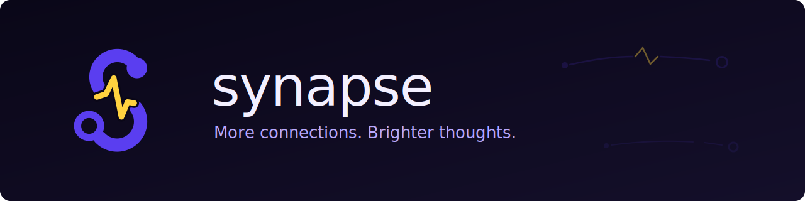
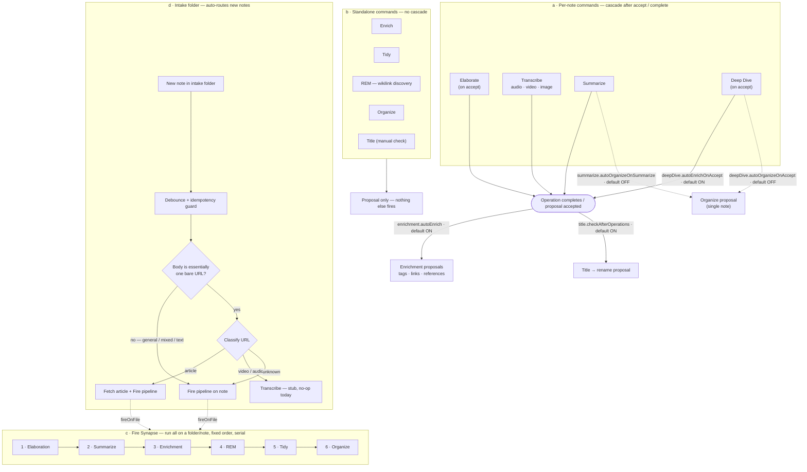

<p align="center">
  
</p>

# Synapse

Automatically elaborate, transcribe, enrich, summarize, organize, and connect your notes with AI in [Obsidian](https://obsidian.md).

## Overview

Synapse is an Obsidian plugin that uses AI to help you build, maintain, and connect your knowledge base. It detects incomplete or stub notes and proposes content expansions, transcribes audio and video media into searchable text, enriches notes with tags, internal links, and references, summarizes content, corrects formatting, organizes your vault directory structure, and recursively explores topics into interlinked knowledge trees.

Every AI-generated change goes through a proposal review system. You see what the plugin wants to do, accept or reject each suggestion, and undo any change with built-in checkpoint support. Nothing is written to your vault without your approval.

**Supported AI providers**: OpenAI, Anthropic, Google Gemini, and Ollama (local).

## Features

### Elaboration
Scans your vault for stub notes (short content, TODO markers, empty sections) and generates AI-powered content proposals. Proposals appear in a sidebar where you can edit and accept them.

### Audio Transcription
Transcribes audio files embedded in your notes using OpenAI Whisper API, Deepgram, or a local Whisper installation. Includes AI post-processing to remove filler words, add structure, and extract key points.

### Video Transcription
Transcribes YouTube, TikTok, and Instagram videos. YouTube videos are transcribed caption-first: the caption track is fetched over plain HTTP -- free, near-instant, no external tools -- and works **on mobile** as well as desktop. Videos without captions, plus TikTok and Instagram, fall back to the desktop pipeline, which downloads the video with yt-dlp, extracts the audio with ffmpeg, and feeds it through the audio transcription pipeline. Share a video link into the intake folder on your phone and a synced desktop vault will even finish the ones mobile can't (see [docs/intake-folder.md](docs/intake-folder.md)).

### Enrichment
Analyzes note content to suggest metadata tags (from a configurable vocabulary), internal links to related notes, topic links, and external references. Uses proximity-weighted scoring to find the most relevant connections in your vault. Runs automatically after elaboration, transcription, or summarization when configured.

### Summarize
Summarizes URLs, transcriptions, and audio embeds found in notes. Supports bullet points, paragraph, and key-points styles. Can also create standalone summary notes from enrichment links.

### Tidy
Corrects spelling and formatting errors via AI without changing content meaning. Creates a snapshot before each change so you can undo instantly.

### Organize
AI-powered semantic directory structuring. Analyzes note content and suggests where each note should live in your vault. Proposes new directories when existing ones do not fit, with configurable confidence thresholds.

### Deep Dive
Recursively explores a note's topics into a tree of interlinked child notes. Uses breadth-first generation with local quality scoring to decide when to stop branching. Configurable depth, quality threshold, and output folder structure (nested, flat, or AI-organized).

### Shared Infrastructure

- **Unified Proposal View** -- a sidebar panel where you review and accept/reject proposals from all modules in one place.
- **Checkpoint/Undo System** -- every vault-wide operation creates checkpoints so you can resume interrupted operations or roll back changes.
- **Notification Manager** -- centralized notifications with status bar integration on desktop.

## How it all fits together

Synapse has many commands, and several of them quietly trigger *other* steps once they finish. This master diagram is the **canonical birds-eye view** of every chain: what cascades after a single-note command, what runs standalone, what **Fire Synapse** runs over a folder, and how the **intake** folder auto-routes new notes.

**How to read it**

- **Solid labeled edge** = a follow-on step that is **on by default**.
- **Dotted labeled edge** = a follow-on step that is **off by default**.
- Every conditional edge names the exact setting that gates it and its default, so you can answer "does this *also* fire X?" at a glance.
- Diamonds are routing decisions.



**Per-note cascade defaults at a glance**

| When you… | Also fires by default | Gated by | Default |
|---|---|---|---|
| Elaborate, Transcribe, Summarize, or accept a Deep Dive note | Enrichment proposals | `enrichment.autoEnrich` | On |
| …any of the above | Title → rename proposal | `title.checkAfterOperations` | On |
| Accept a Deep Dive note | Its enrich + title cascade | `deepDive.autoEnrichOnAccept` | On |
| Summarize | Organize the note | `summarize.autoOrganizeOnSummarize` | Off |
| Accept a Deep Dive note | Organize the note | `deepDive.autoOrganizeOnAccept` | Off |

**Standalone commands** — Enrich, Tidy, REM, Organize, and a manual Title check — produce their own proposals and trigger nothing else.

> This overview is the **single source of truth** for the command flow. For module-level detail — the exact callback wiring, the fallback path when enrichment is disabled but title checks stay on, and intake internals — see [`ARCHITECTURE.md`](ARCHITECTURE.md), whose **Fire Synapse Pipeline**, **Intake** and **Cross-Module Communication** diagrams expand the subgraphs above.

## Privacy and network use

Synapse runs inside your vault. It contacts a remote service only when you configure one and then trigger a feature that needs it. Every request goes through Obsidian's `requestUrl` API, and every request is one you set up (your provider and API key) or started yourself (running a command).

Synapse ships with **no telemetry, no analytics, and no auto-update or update-check traffic of its own** -- it never contacts a server on its own, and nothing about how you use it is collected or sent anywhere. If you never set an API key and never enable a cloud provider, Synapse sends nothing out.

### Remote services

These are the only services Synapse contacts, what each one is used for, and what is sent:

| Service | Used for | What is sent | Account |
|---------|----------|--------------|---------|
| OpenAI -- `api.openai.com` | AI provider; Whisper audio transcription | The note content you act on, or the audio you transcribe | API key required |
| Anthropic -- `api.anthropic.com` | AI provider | The note content you act on | API key required |
| Google Gemini -- `generativelanguage.googleapis.com` | AI provider; audio transcription | The note content you act on, or the audio you transcribe | API key required |
| Deepgram -- `api.deepgram.com` | Audio transcription | The audio you transcribe | API key required |
| Twitter / X -- `publish.twitter.com` (fxtwitter, vxtwitter as fallbacks) | Tweet context during enrichment and summarize | The tweet URL found in your note | None |
| Web pages -- any `http(s)` URL in your notes | Article context during elaboration, enrichment, and summarize | A request to that URL, to read the page | None |
| YouTube -- `www.youtube.com` | Caption-first video transcription | The video ID of the YouTube URL you transcribe, to fetch its caption track | None |
| YouTube / TikTok and others -- via `yt-dlp` (desktop) | Video transcription (extraction fallback) | The video URL you transcribe | None |

### What this means for you

- **Cloud AI and transcription require an account.** OpenAI, Anthropic, Google Gemini, and Deepgram each need an API key you supply in **Settings > Synapse**. The note content or audio you act on is sent to the one provider you selected so it can do the work, and to no one else.
- **Two paths stay offline.** Selected as your AI provider, **Ollama** sends note content only to the local endpoint you set (default `http://localhost:11434`) -- no account, no key, nothing leaving your machine. For transcription, the **local Whisper** option is designed to run entirely on-device for the same reason. Use these if you want Synapse to work without sending anything out.
- **Content you link is fetched from third-party sites.** When a note references a tweet or a web page and you run elaboration, enrichment, or summarize, Synapse requests that URL to read its content -- from Twitter/X (falling back to the fxtwitter and vxtwitter mirrors) or from the site itself. To avoid this, don't run those features on notes whose links you would rather not request, or turn the feature off in settings.
- **YouTube captions are fetched over plain HTTP.** Caption-first transcription requests the video's public watch page and caption track from `www.youtube.com` (no account, no download). Only when captions are unavailable — or for other platforms — does the flow fall to the desktop extraction pipeline below.
- **Video transcription downloads the video (extraction fallback).** On desktop, the fallback invokes `yt-dlp` to download the source from YouTube, TikTok, or another platform, then extracts and transcribes the audio locally.
- **Audio and video transcription use privileged desktop access.** To work with `yt-dlp`, `ffmpeg`, and `ffprobe`, the desktop build reaches outside the vault in two ways, both gated to desktop only (mobile never runs this code):
  - **Direct filesystem access.** Synapse writes scratch files -- downloaded media, extracted audio, clipped or concatenated segments -- to your operating system's temp directory (`os.tmpdir()`), never inside your vault. These temp files are removed when the operation finishes, on both success and failure. The finished video, if you opt to keep it, is the only artifact saved into the vault (in your configured download folder).
  - **Local shell execution.** Synapse runs the external tools as child processes with `execFile` and an explicit argument array -- never a shell command string -- so there is no shell interpolation of URLs, paths, or titles. URLs and file paths are sanitized first (`sanitizeUrl` / `sanitizePath`), the subprocess inherits a narrowed environment (essentially just an augmented `PATH` plus `HOME`), and the binaries that run are exactly the `yt-dlp path` and `ffmpeg path` you set in settings.
- **The clipboard is written, never read.** Synapse copies text to the clipboard in exactly two places -- a redacted error string when you dismiss an error toast, and an install command in the video settings -- and never reads clipboard contents.

Synapse proposes, you decide -- and that holds for the network too: nothing is requested until you ask for it.

For the reviewer-facing counterpart to this section -- the desktop-only Node usage declaration, the wontfix rationale for the `node-loader` require pattern and the `:has()` toast selectors, and the rebuttals for the automated review's false positives -- see [`docs/automated-review-notes.md`](docs/automated-review-notes.md).

## FAQ

### Can I use my Claude Pro/Max plan (or ChatGPT Plus / Gemini Advanced) instead of an API key?

No. A consumer subscription pays for the provider's own chat app -- it is not API access, which every provider authorizes and bills separately. Synapse talks to each provider's API, so it needs an API key, not a subscription login.

- **Anthropic (Claude Pro/Max)** -- third-party use of subscription tokens is prohibited by the Consumer Terms of Service (updated 2026-02-19) and enforced with account suspensions. The `sk-ant-oat01-…` setup token works only in Claude Code and is rejected by the Messages API.
- **OpenAI (ChatGPT Plus/Pro)** -- "Sign in with ChatGPT" is identity only; the subscription includes no API access. API usage is metered separately.
- **Google (Gemini Advanced / AI Pro)** -- a consumer chat product with no API access; the Gemini API bills separately through AI Studio or Vertex.

Reverse-engineering subscription credentials is both blocked technically and a Terms violation that risks *your* account -- so Synapse won't do it.

**What does work -- and answers the cost concern:**

- A provider **API key** (OpenAI, Anthropic, or Google Gemini) -- pay-as-you-go, for only what you use.
- **Ollama** -- fully local and free, already a first-class provider. Set **Settings > Synapse > AI provider** to **Ollama** (default endpoint `http://localhost:11434`, no key, nothing leaves your machine).

This is the billing-model counterpart to the auth decision recorded in [`DECISIONS.md`](DECISIONS.md), which chose guided API-key onboarding over a one-click OAuth "connect" button for the same provider-policy reasons.

## Installation

Synapse is available in the Obsidian Community Plugin directory.

1. In Obsidian, open **Settings > Community plugins** and select **Browse**.
2. Search for **Synapse** and select **Install**.
3. Select **Enable**.

New versions are delivered automatically through Obsidian as they are published -- there is no manual update step.

### Install via BRAT (beta builds)

To track pre-release builds ahead of the store:

1. Install the [BRAT plugin](https://github.com/TfTHacker/obsidian42-brat) from the Obsidian Community Plugin directory.
2. In BRAT settings, click **Add Beta Plugin**.
3. Enter `dustinkeeton/obsidian-synapse` and click **Add Plugin**.
4. Enable **Synapse** in **Settings > Community plugins**.

BRAT will automatically check for updates and notify you when new versions are available.

### Install from source

To run an unreleased build, or for development:

1. Clone the repository:
   ```sh
   git clone https://github.com/dustinkeeton/obsidian-synapse.git
   cd obsidian-synapse
   ```

2. Install dependencies and build:
   ```sh
   npm install
   npm run build
   ```

3. Copy the built plugin into your vault:
   ```sh
   mkdir -p /path/to/your/vault/.obsidian/plugins/synapse
   cp main.js manifest.json styles.css /path/to/your/vault/.obsidian/plugins/synapse/
   ```

4. Open Obsidian, go to **Settings > Community plugins**, and enable **Synapse**.

### External tools (optional)

For video transcription, you need these tools installed and available on your PATH:

- [yt-dlp](https://github.com/yt-dlp/yt-dlp) -- downloads video from YouTube, TikTok, and other platforms
- [ffmpeg](https://ffmpeg.org/) -- extracts audio from video files

Use the command **Synapse: Check dependencies** to verify these are available.

### Verifying releases

Release assets are signed with [GitHub artifact attestations](https://docs.github.com/actions/security-guides/using-artifact-attestations-to-establish-provenance-for-builds), letting you cryptographically confirm they were built from this repository. After downloading a release, verify an asset with the [GitHub CLI](https://cli.github.com/):

```sh
gh attestation verify main.js --repo dustinkeeton/obsidian-synapse
```

Repeat for `manifest.json` and `styles.css` as needed.

## Configuration

Open **Settings > Synapse** to configure the plugin. All features can be individually enabled or disabled.

### AI Configuration

| Setting | Description | Default |
|---------|-------------|---------|
| AI provider | OpenAI, Anthropic, Google Gemini, or Ollama (local) | OpenAI |
| API key | Your API key for the selected provider | -- |
| Ollama endpoint | URL for local Ollama server (shown when Ollama selected) | `http://localhost:11434` |
| Model | AI model for the selected provider | GPT-4o |
| Temperature | Controls randomness (0 = deterministic, 1 = creative) | 0.7 |

Each API-key field carries a **Get an API key →** link to the right provider's console and a
**Test** button that makes a minimal authenticated request and reports **✓ Connected** or
**✗ Invalid key** inline -- so you can confirm a key works before running a feature, instead of
discovering a typo later. The same helpers appear on the per-provider transcription key fields, and
Ollama's endpoint gets a reachability **Test**. Keys are still entered manually: a one-click OAuth
"connect" flow isn't offered because the major providers don't support third-party API access that
way (see DECISIONS.md).

### Elaboration

| Setting | Description | Default |
|---------|-------------|---------|
| Enable elaboration | Toggle stub note detection and proposal generation | On |
| Minimum word threshold | Notes with fewer words are considered stubs | 50 |
| Detect TODO markers | Flag notes containing TODO, TBD, FIXME, PLACEHOLDER | On |
| Detect empty sections | Flag notes with headings but no content | On |
| Excluded tags | Notes carrying these tags are skipped | `no-elaborate` |

### Audio Transcription

| Setting | Description | Default |
|---------|-------------|---------|
| Enable audio | Toggle audio transcription | On |
| Transcription provider | Whisper API, Deepgram, or Local Whisper (desktop only) | Whisper API |
| Post-processing | Clean up transcriptions with AI | On |
| Remove filler words | Strip filler words from transcripts | On |

### Video Transcription

| Setting | Description | Default |
|---------|-------------|---------|
| Enable video | Toggle video transcription | On |
| Prefer YouTube captions | Transcribe YouTube from its captions when available (free, works on mobile); off = always download + transcribe | On |
| yt-dlp path (desktop) | Path to yt-dlp binary | `yt-dlp` |
| ffmpeg path (desktop) | Path to ffmpeg binary | `ffmpeg` |
| Download folder (desktop) | Where to save downloaded video files | `Media` |
| Embed in note (desktop) | Add an embed link to the downloaded video | On |

### Enrichment

| Setting | Description | Default |
|---------|-------------|---------|
| Enable enrichment | Toggle tag, link, and reference suggestions | On |
| Auto-enrich | Automatically enrich after elaboration or transcription | On |
| Max metadata tags | Maximum tags to suggest per note | 5 |
| Max topic links | Maximum AI-extracted topic links | 10 |
| Max internal links | Maximum related note links | 15 |
| Max external references | Maximum external URLs | 3 |
| Internal link threshold | Minimum relevance score (0-1) | 0.3 |
| Suggest new notes | Suggest links to notes that do not exist yet | On |
| Tag vocabulary | Configurable categories (Status, Type, Source) with allowed tags | 3 categories |

### Summarize

| Setting | Description | Default |
|---------|-------------|---------|
| Enable summarize | Toggle URL and transcription summarization | On |
| Summary style | Bullet points, paragraph, or key points | Bullets |
| Max content length | Maximum characters sent to AI | 4000 |
| Custom prompt | Override the default summarization prompt | -- |
| Auto-organize | Trigger organize after summarization | Off |

### Tidy

| Setting | Description | Default |
|---------|-------------|---------|
| Enable tidy | Toggle spelling and formatting correction | On |

### Organize

| Setting | Description | Default |
|---------|-------------|---------|
| Enable organize | Toggle AI-powered directory structuring | On |
| Confidence threshold | Minimum confidence to propose a new folder (0.5-1.0) | 0.9 |

### Deep Dive

| Setting | Description | Default |
|---------|-------------|---------|
| Enable deep dive | Toggle recursive topic exploration | On |
| Max depth | Maximum levels of recursion (1-5) | 3 |
| Quality threshold | Minimum quality to continue recursing (0.1-0.9) | 0.4 |
| Max notes per run | Maximum notes generated per deep dive (10-100) | 50 |
| Output folder | Where to create new notes | `Deep Dives` |
| Nesting mode | Nested, flat, or auto-organize | Nested |
| Auto-enrich on accept | Trigger enrichment when a note is accepted | On |
| Auto-organize on accept | Trigger organize when a note is accepted | Off |

### Exclusions

A single, cross-cutting list controls which vault paths Synapse may touch. Each rule names a path pattern and the features it blocks, so you can hide a folder from everything or from just a few flows. Path exclusions live here for every feature; tag exclusions (`Excluded tags`) stay per-feature.

By default, `.synapse/**` (the plugin's own data folder) and `templates/**` are excluded from **all** features — including audio/video transcription, OCR, the intake watcher, and title checks, none of which had folder exclusions before. Existing vaults are migrated automatically on upgrade: folders you had excluded from every module broaden to all features, while a folder you scoped to a single feature stays scoped to it.

| Pattern form | Matches | Example |
|--------------|---------|---------|
| `folder/**` | The folder and everything beneath it (not the folder note itself) | `Archive/**` |
| `folder/*` | Direct children only (not nested subfolders) | `Inbox/*` |
| `path/to/note.md` | One exact note | `Journal/2026-06-14.md` |
| `name` (typed by hand) | The folder and all descendants (recursive prefix) | `templates` |

Patterns are vault-relative and **case-sensitive**, and metacharacters such as `.` are matched literally (so `.synapse/**` never matches `Xsynapse/...`). Add a folder with the picker (saved in canonical `folder/**` form) or type an exact path / `folder/*` pattern directly, choosing the scope up front. Each rule shows the features it blocks as a row of chips: pick **All features**, or add individual flows from the "+ Add feature" dropdown. Remove a chip (`✕`) to narrow the rule; a rule with no chips is inactive and blocks nothing.

When a batch or vault-wide scan hits an excluded note it skips silently; an explicitly invoked single-note command refuses with a notice naming the rule that matched.

## Development

### Prerequisites
- Node.js
- npm

### Setup

```sh
git clone https://github.com/dustinkeeton/obsidian-synapse.git
cd obsidian-synapse
npm install
```

### Scripts

| Command | Description |
|---------|-------------|
| `npm run dev` | Start esbuild in watch mode |
| `npm run build` | Type-check and build for production |
| `npm test` | Run tests (Vitest) |
| `npm run test:watch` | Run tests in watch mode |
| `npm run test:coverage` | Run tests with coverage report |

### Project Structure

The plugin is organized into 8 feature modules plus a shared utilities layer. Each module follows a consistent contract with `onload()` and `onunload()` lifecycle methods.

```
src/
  main.ts              Plugin entry point and module orchestration
  settings.ts          Settings interfaces and defaults
  settings-tab.ts      Settings UI
  elaboration/         Stub note detection and proposal generation
  audio/               Audio transcription
  video/               Video download and transcription (desktop only)
  transcription/       Unified transcription UI modals
  summarize/           Note summarization
  enrichment/          Tags, links, and references
  deep-dive/           Recursive topic exploration
  organize/            Semantic directory structuring
  tidy/                Spelling and formatting cleanup
  shared/              AI client, file utils, notifications, checkpoints
  views/               Unified proposal review sidebar
```

Build output is a single `main.js` bundle produced by esbuild.

### Testing in Obsidian

For development, symlink or copy the built plugin into your vault:

```sh
# From your vault's plugin directory:
ln -s /path/to/obsidian-synapse .obsidian/plugins/synapse
```

Then run `npm run dev` to rebuild automatically on changes. Reload Obsidian (Cmd+R / Ctrl+R) to pick up changes.

## Support

Synapse is free and open source. If it has earned a place in your workflow,
you can support continued development:

[](https://github.com/sponsors/dustinkeeton)
[](https://www.buymeacoffee.com/dustinkeeton)

## License

[AGPL-3.0](LICENSE)
