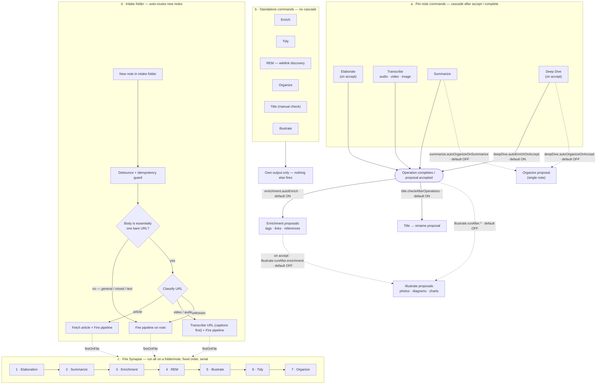

<p align="center">
  
</p>

# Synapse

Automatically elaborate, transcribe, enrich, summarize, organize, and connect your notes with AI in [Obsidian](https://obsidian.md).

## Overview

Synapse is an Obsidian plugin that uses AI to help you build, maintain, and connect your knowledge base. It detects incomplete or stub notes and proposes content expansions, transcribes audio, video, and images (OCR) into searchable text, enriches notes with tags, internal links, and references, summarizes content, corrects formatting, organizes your vault directory structure, proposes better titles, links plain-text mentions to the notes they name (REM), illustrates notes with openly licensed photos, and recursively explores topics into interlinked knowledge trees. **Fire Synapse** runs the whole set over a folder in one pass, and an **intake folder** processes new notes as they arrive.

Most AI-generated changes go through a proposal review system: you see what Synapse wants to do and accept or reject each suggestion. A few actions write as soon as you run them -- transcription, OCR, summaries, and tidy insert their output directly -- and **auto-accept** switches (off by default for every proposal type) let you skip review for the types you trust. Interrupted vault scans resume from checkpoints, and a whole organize run can be moved back with one command.

**Supported AI providers**: OpenAI, Anthropic, Google Gemini, and Ollama (local).

## Features

### Elaboration
Scans your vault for stub notes (short content, TODO markers, empty sections) and proposes a full rewrite of the note body. Proposals appear in a sidebar where you can review them; accepting replaces the body in place and keeps your frontmatter byte for byte. If the note changed after the proposal was made, you are asked before anything is replaced.

### Audio Transcription
Transcribes audio files embedded in your notes using the OpenAI Whisper API, Deepgram, or Google Gemini. Includes AI post-processing to remove filler words, add structure, and extract key points.

### Video Transcription
Transcribes YouTube, TikTok, and Instagram videos. YouTube videos are transcribed caption-first: the caption track is fetched over plain HTTP -- free, near-instant, no external tools -- and works **on mobile** as well as desktop. Videos without captions, plus TikTok and Instagram, fall back to the desktop pipeline, which downloads the video with yt-dlp, extracts the audio with ffmpeg, and feeds it through the audio transcription pipeline. Share a video link into the intake folder on your phone and a synced desktop vault will even finish the ones mobile can't (see [docs/intake-folder.md](docs/intake-folder.md)).

### Image OCR
Extracts text from images embedded in your notes using your AI provider's vision model, and inserts it into the note. Oversized images are downscaled before they are sent. Runs through **Transcribe current note** alongside audio and video.

### Enrichment
Analyzes note content to suggest metadata tags (from a configurable vocabulary), internal links to related notes, topic links, and external references. Uses proximity-weighted scoring to find the most relevant connections in your vault. Runs automatically after elaboration, transcription, or summarization when configured.

### Summarize
Summarizes URLs, transcriptions, and audio embeds found in notes. Supports bullet points, paragraph, and key-points styles. Can also create standalone summary notes from enrichment links.

### Tidy
Corrects spelling and formatting errors via AI without changing content meaning. Writes the corrections directly and keeps a snapshot of the note as it was before.

### Organize
AI-powered semantic directory structuring. Analyzes note content and proposes where each note should live in your vault. Every move is a proposal unless you turn on organize auto-accept, and a new folder is proposed only above a configurable confidence threshold. **Undo last organize run** moves every note from the most recent run back where it was.

### Deep Dive
Recursively explores a note's topics into a tree of interlinked child notes. Uses breadth-first generation with local quality scoring to decide when to stop branching. Configurable depth, quality threshold, and output folder structure (nested, flat, or AI-organized).

### Title
Spots notes still named "Untitled" or whose title no longer matches their content, and proposes a better name. Runs after other operations finish; accepting renames the note and handles a name that is already taken.

### REM (link discovery)
Finds plain-text mentions of other notes' titles and aliases, plus semantically related phrases, and proposes turning them into `[[wikilinks]]` in place.

### Illustrate
Proposes visuals for the spots in a note that would benefit from one: an openly licensed photo from Wikimedia Commons or Openverse (no API key needed), and -- with **Propose Mermaid diagrams and charts** on -- a Mermaid diagram or a chart built only from numbers already in the note. Each proposal shows the image, its license, and attribution before you accept. Off by default, because search terms leave the vault.

### Fire Synapse
Runs every enabled feature over a folder in a fixed order: elaboration, summarize, enrichment, REM, illustrate, tidy, organize. Use the **Run all features on a folder** command.

### Intake folder
Watches a folder (default `Inbox`) and runs Fire Synapse on each new note once it settles. A note that is just a video or audio link is transcribed first; an article link is fetched first. See [docs/intake-folder.md](docs/intake-folder.md) for the mobile capture workflow.

### System 1 decisions (opt-in)
Tag, frontmatter, folder, and link choices can go to TypeSafe's Jev decision model first. Jev picks among options your vault already has and reports a calibrated confidence; below the threshold, your AI provider decides as usual. Off by default, because note text is sent to TypeSafe.

### Shared Infrastructure

- **Unified Proposal View** -- a sidebar panel where you review and accept/reject proposals from all modules in one place.
- **Synapse actions sidebar** -- touch-friendly buttons for every command, so mobile users can reach them without the command palette.
- **Checkpoints** -- every vault-wide scan saves checkpoints, so an interrupted scan can be resumed (or discarded) from **Manage interrupted operations**.
- **Notification Manager** -- centralized notifications with status bar integration on desktop.

## How it all fits together

Synapse has many commands, and several of them quietly trigger *other* steps once they finish. This master diagram is the **canonical birds-eye view** of every chain: what cascades after a single-note command, what runs standalone, what **Fire Synapse** runs over a folder, and how the **intake** folder auto-routes new notes.

**How to read it**

- **Solid labeled edge** = a follow-on step that is **on by default**.
- **Dotted labeled edge** = a follow-on step that is **off by default**.
- Every conditional edge names the exact setting that gates it and its default, so you can answer "does this *also* fire X?" at a glance.
- Diamonds are routing decisions.


```mermaid
flowchart TD
    subgraph perNote["a · Per-note commands — cascade after accept / complete"]
        EL["Elaborate<br/>(on accept)"]
        TR["Transcribe<br/>audio · video · image"]
        SU["Summarize"]
        DD["Deep Dive<br/>(on accept)"]
    end

    EL --> OP
    TR --> OP
    SU --> OP
    DD -->|"deepDive.autoEnrichOnAccept · default ON"| OP
    OP(["Operation completes / proposal accepted"])

    OP -->|"enrichment.autoEnrich · default ON"| ENp["Enrichment proposals<br/>tags · links · references"]
    OP -->|"title.checkAfterOperations · default ON"| TTp["Title → rename proposal"]

    SU -.->|"summarize.autoOrganizeOnSummarize · default OFF"| ORGp["Organize proposal<br/>(single note)"]
    DD -.->|"deepDive.autoOrganizeOnAccept · default OFF"| ORGp

    OP -.->|"illustrate.runAfter.* · default OFF"| ILp["Illustrate proposals<br/>photos · diagrams · charts"]
    ENp -.->|"on accept · illustrate.runAfter.enrichment · default OFF"| ILp

    subgraph standalone["b · Standalone commands — no cascade"]
        SA1["Enrich"]
        SA2["Tidy"]
        SA3["REM — wikilink discovery"]
        SA4["Organize"]
        SA5["Title (manual check)"]
        SA6["Illustrate"]
    end
    standalone --> SAp["Own output only — nothing else fires"]

    subgraph fire["c · Fire Synapse — run all on a folder/note, fixed order, serial"]
        F1["1 · Elaboration"] --> F2["2 · Summarize"] --> F3["3 · Enrichment"] --> F4["4 · REM"] --> F5["5 · Illustrate"] --> F6["6 · Tidy"] --> F7["7 · Organize"]
    end

    subgraph intake["d · Intake folder — auto-routes new notes"]
        IN["New note in intake folder"] --> IG["Debounce + idempotency guard"]
        IG --> IU{"Body is essentially<br/>one bare URL?"}
        IU -->|"no — general / mixed / text"| FT["Fire pipeline on note"]
        IU -->|yes| IC{"Classify URL"}
        IC -->|article| FA["Fetch article + Fire pipeline"]
        IC -->|"video / audio"| VS["Transcribe URL (captions first) + Fire pipeline"]
        IC -->|unknown| FT
    end

    FA -.->|fireOnFile| fire
    VS -.->|fireOnFile| fire
    FT -.->|fireOnFile| fire
```

**Per-note cascade defaults at a glance**

| When you… | Also fires by default | Gated by | Default |
|---|---|---|---|
| Elaborate, Transcribe, Summarize, or accept a Deep Dive note | Enrichment proposals | `enrichment.autoEnrich` | On |
| …any of the above | Title → rename proposal | `title.checkAfterOperations` | On |
| Accept a Deep Dive note | Its enrich + title cascade | `deepDive.autoEnrichOnAccept` | On |
| Summarize | Organize the note | `summarize.autoOrganizeOnSummarize` | Off |
| Accept a Deep Dive note | Organize the note | `deepDive.autoOrganizeOnAccept` | Off |
| Elaborate, Transcribe, Summarize, or accept a Deep Dive note | Illustrate proposals | `illustrate.runAfter.*` (one switch per action; needs `illustrate.enabled`) | Off |
| Accept enrichment proposals | Illustrate proposals | `illustrate.runAfter.enrichment` (needs `illustrate.enabled`) | Off |

**Standalone commands** — Enrich, Tidy, REM, Organize, Illustrate, and a manual Title check — produce their own output and trigger nothing else. The one exception: accepting enrichment can start Illustrate when **Run after other actions → Enrichment accepted** is on.

> This overview is the **single source of truth** for the command flow. For module-level detail — the exact callback wiring, the fallback path when enrichment is disabled but title checks stay on, and intake internals — see [`ARCHITECTURE.md`](ARCHITECTURE.md), whose **Fire Synapse Pipeline**, **Intake** and **Cross-Module Communication** diagrams expand the subgraphs above.

## Privacy and network use

Synapse runs inside your vault. With one exception -- the optional update check described below -- it contacts a remote service only when you configure one and then trigger a feature that needs it. Every request goes through Obsidian's `requestUrl` API.

Synapse ships with **no telemetry and no analytics** -- nothing about how you use it is collected or sent anywhere, and it never updates itself. The only request it makes on its own is an **update check**: at most once a day, a few seconds after the plugin loads, it asks this repository's public GitHub Releases API for the latest version number so it can show a "newer version available" notice that links to Community plugins. That request carries no vault content. Turn it off with **Settings > Synapse > Notify me about Synapse updates**. With that toggle off, no API key set, and no cloud provider enabled, Synapse sends nothing out.

### Remote services

These are the only services Synapse contacts, what each one is used for, and what is sent:

| Service | Used for | What is sent | Account |
|---------|----------|--------------|---------|
| OpenAI -- `api.openai.com` | AI provider; Whisper audio transcription | The note content you act on, or the audio you transcribe | API key required |
| Anthropic -- `api.anthropic.com` | AI provider | The note content you act on | API key required |
| Google Gemini -- `generativelanguage.googleapis.com` | AI provider; audio transcription | The note content you act on, or the audio you transcribe | API key required |
| Deepgram -- `api.deepgram.com` | Audio transcription | The audio you transcribe | API key required |
| TypeSafe -- `api.typesafe.ai` | System 1 decisions (off by default): tag and frontmatter choices, folder placement, REM link scoring | The note text you act on, plus the options it chooses among -- existing tags and frontmatter values, folder names with a few of their note titles, or note titles | API key required |
| GitHub -- `api.github.com` | Update-available notice (on by default; toggle in settings) | A request for this repository's latest release tag; no vault content | None |
| Twitter / X -- `publish.twitter.com` (fxtwitter, vxtwitter as fallbacks) | Tweet context during enrichment and summarize | The tweet URL found in your note | None |
| Reddit -- `www.reddit.com` | Post context during elaboration and summarize | The Reddit post URL found in your note, to read its public Atom feed (post body and top comments) | None |
| Web pages -- any `http(s)` URL in your notes | Article context during elaboration, enrichment, summarize, and intake; image sources for Illustrate when **Fetch linked pages for images** is on (off by default) | A request to that URL, to read the page | None |
| Wikimedia Commons -- `commons.wikimedia.org` | Illustrate: openly licensed photo search | A short search query the AI proposes for the note's topic (never the note text); the image you accept is then downloaded from the URL the provider (or source page) returned | None |
| Openverse -- `api.openverse.org` | Illustrate: openly licensed photo search | Same as Wikimedia Commons | None |
| YouTube -- `www.youtube.com` | Caption-first video transcription | The video ID of the YouTube URL you transcribe, to fetch its player data (Innertube `youtubei/v1/player`) and then its caption track from `youtube.com` or `googlevideo.com` | None |
| YouTube / TikTok and others -- via `yt-dlp` (desktop) | Video transcription (extraction fallback) | The video URL you transcribe | None |

### What this means for you

- **Cloud AI and transcription require an account.** OpenAI, Anthropic, Google Gemini, and Deepgram each need an API key you supply in **Settings > Synapse**. The note content or audio you act on is sent to the one provider you selected so it can do the work, and to no one else.
- **Ollama stays offline.** Selected as your AI provider, **Ollama** sends note content only to the local endpoint you set (default `http://localhost:11434`) -- no account, no key, nothing leaving your machine. Use it if you want Synapse to work without sending anything out. Transcription has no on-device option yet: a local Whisper backend is planned but not available.
- **System 1 decisions send note text to TypeSafe.** The **System 1 decisions** toggle under **Settings > Synapse > AI configuration** is off by default. Turned on, the note you act on and the options it chooses among go to TypeSafe's Jev model. Exclusion rules still apply, and Jev can only pick options your vault already has.
- **Content you link is fetched from third-party sites.** When a note references a tweet or a web page and you run elaboration, enrichment, or summarize, Synapse requests that URL to read its content -- from Twitter/X (falling back to the fxtwitter and vxtwitter mirrors), from Reddit (the post's public Atom feed), or from the site itself. To avoid this, don't run those features on notes whose links you would rather not request, or turn the feature off in settings.
- **Illustrate searches open-license image libraries.** Illustrate is off by default. When you run it, Synapse sends a short search query -- proposed by the AI for the note's topic, never the note text -- to Wikimedia Commons and Openverse (both on once Illustrate is enabled), and downloads only the image you accept into your vault. With **Fetch linked pages for images** on (off by default), it also requests pages your note links to, looking for images. Disable either provider under **Settings > Synapse > Illustrate** to stop contacting it.
- **YouTube captions are fetched over plain HTTP.** Caption-first transcription requests the video's public watch page and caption track from `www.youtube.com` (no account, no download). Only when captions are unavailable — or for other platforms — does the flow fall to the desktop extraction pipeline below.
- **Video transcription downloads the video (extraction fallback).** On desktop, the fallback invokes `yt-dlp` to download the source from YouTube, TikTok, or another platform, then extracts and transcribes the audio locally.
- **Audio and video transcription use privileged desktop access.** To work with `yt-dlp`, `ffmpeg`, and `ffprobe`, the desktop build reaches outside the vault in two ways, both gated to desktop only (mobile never runs this code):
  - **Direct filesystem access.** Synapse writes scratch files -- downloaded media, extracted audio, clipped or concatenated segments -- to your operating system's temp directory (`os.tmpdir()`), never inside your vault. These temp files are removed when the operation finishes, on both success and failure. The finished video, if you opt to keep it, is the only artifact saved into the vault (in your configured download folder).
  - **Local shell execution.** Synapse runs the external tools as child processes with `execFile` and an explicit argument array -- never a shell command string -- so there is no shell interpolation of URLs, paths, or titles. URLs and file paths are sanitized first (`sanitizeUrl` / `sanitizePath`), the subprocess inherits a narrowed environment (essentially just an augmented `PATH` plus `HOME`), and the binaries that run are exactly the `yt-dlp path` and `ffmpeg path` you set in settings.
- **The clipboard is written, never read.** Synapse copies text to the clipboard in exactly two places -- a redacted error string when you dismiss an error toast, and an install command in the video settings -- and never reads clipboard contents.

Synapse proposes, you decide -- and that holds for the network too: apart from the once-a-day update check you can switch off, nothing is requested until you ask for it.

For the reviewer-facing counterpart to this section -- the desktop-only Node usage declaration, the wontfix rationale for the `node-loader` require pattern and the `:has()` toast selectors, and the rebuttals for the automated review's false positives -- see [`docs/automated-review-notes.md`](docs/automated-review-notes.md).

## FAQ

### Can I use my Claude Pro/Max plan (or ChatGPT Plus / Gemini Advanced) instead of an API key?

No. A consumer subscription pays for the provider's own chat app -- it is not API access, which every provider authorizes and bills separately. Synapse talks to each provider's API, so it needs an API key, not a subscription login.

- **Anthropic (Claude Pro/Max)** -- third-party use of subscription tokens is prohibited by the Consumer Terms of Service (updated 2026-02-19) and enforced with account suspensions. The `sk-ant-oat01-…` setup token works only in Claude Code and is rejected by the Messages API.
- **OpenAI (ChatGPT Plus/Pro)** -- "Sign in with ChatGPT" is identity only; the subscription includes no API access. API usage is metered separately.
- **Google (Gemini Advanced / AI Pro)** -- a consumer chat product with no API access; the Gemini API bills separately through AI Studio or Vertex.

Reverse-engineering subscription credentials is both blocked technically and a Terms violation that risks *your* account -- so Synapse won't do it.

**What does work -- and answers the cost concern:**

- A provider **API key** (OpenAI, Anthropic, or Google Gemini) -- pay-as-you-go, for only what you use.
- **Ollama** -- fully local and free, already a first-class provider. Set **Settings > Synapse > AI provider** to **Ollama** (default endpoint `http://localhost:11434`, no key, nothing leaves your machine).

This is the billing-model counterpart to the auth decision recorded in [`DECISIONS.md`](DECISIONS.md), which chose guided API-key onboarding over a one-click OAuth "connect" button for the same provider-policy reasons.

## Installation

Synapse is available in the Obsidian Community Plugin directory.

1. In Obsidian, open **Settings > Community plugins** and select **Browse**.
2. Search for **Synapse** and select **Install**.
3. Select **Enable**.

New versions are delivered automatically through Obsidian as they are published -- there is no manual update step.

### Install via BRAT (beta builds)

To track pre-release builds ahead of the store:

1. Install the [BRAT plugin](https://github.com/TfTHacker/obsidian42-brat) from the Obsidian Community Plugin directory.
2. In BRAT settings, click **Add Beta Plugin**.
3. Enter `dustinkeeton/obsidian-synapse` and click **Add Plugin**.
4. Enable **Synapse** in **Settings > Community plugins**.

BRAT will automatically check for updates and notify you when new versions are available.

### Install from source

To run an unreleased build, or for development:

1. Clone the repository:
   ```sh
   git clone https://github.com/dustinkeeton/obsidian-synapse.git
   cd obsidian-synapse
   ```

2. Install dependencies and build:
   ```sh
   npm install
   npm run build
   ```

3. Copy the built plugin into your vault:
   ```sh
   mkdir -p /path/to/your/vault/.obsidian/plugins/synapse
   cp main.js manifest.json styles.css /path/to/your/vault/.obsidian/plugins/synapse/
   ```

4. Open Obsidian, go to **Settings > Community plugins**, and enable **Synapse**.

### External tools (optional)

For video transcription, you need these tools installed and available on your PATH:

- [yt-dlp](https://github.com/yt-dlp/yt-dlp) -- downloads video from YouTube, TikTok, and other platforms
- [ffmpeg](https://ffmpeg.org/) -- extracts audio from video files

Use the command **Synapse: Check external tool availability** to verify these are available.

### Verifying releases

Release assets are signed with [GitHub artifact attestations](https://docs.github.com/actions/security-guides/using-artifact-attestations-to-establish-provenance-for-builds), letting you cryptographically confirm they were built from this repository. After downloading a release, verify an asset with the [GitHub CLI](https://cli.github.com/):

```sh
gh attestation verify main.js --repo dustinkeeton/obsidian-synapse
```

Repeat for `manifest.json` and `styles.css` as needed.

## Configuration

Open **Settings > Synapse** to configure the plugin. All features can be individually enabled or disabled.

### AI Configuration

| Setting | Description | Default |
|---------|-------------|---------|
| AI provider | OpenAI, Anthropic, Google Gemini, or Ollama (local) | OpenAI |
| API key | Your API key for the selected provider | -- |
| Ollama endpoint | URL for local Ollama server (shown when Ollama selected) | `http://localhost:11434` |
| Model | AI model for the selected provider | GPT-5.6 Sol |
| Temperature | Controls randomness (0 = deterministic, 1 = creative) | 0.7 |
| Max tokens | Maximum tokens in AI responses (256-8192) | 2048 |
| Cache identical AI responses | Reuse the previous result for an identical request at any temperature (always on at temperature 0); "Regenerate" bypasses it | Off |
| Voice | How elaboration, deep dive, and summaries write: Neutral (third person, never writes as you), Match the note (mirrors the note's register without speaking for you), First person (writes as you, opt-in), or Custom (your own instruction). Quoted or transcribed material always keeps its original wording | Neutral |

Each API-key field carries a **Get an API key →** link to the right provider's console and a
**Test** button that makes a minimal authenticated request and reports **✓ Connected** or
**✗ Invalid key** inline -- so you can confirm a key works before running a feature, instead of
discovering a typo later. The same helpers appear on the per-provider transcription key fields, and
Ollama's endpoint gets a reachability **Test**. Keys are still entered manually: a one-click OAuth
"connect" flow isn't offered because the major providers don't support third-party API access that
way (see DECISIONS.md).

**System 1 decisions** (same section; the last three rows appear once the toggle is on):

| Setting | Description | Default |
|---------|-------------|---------|
| System 1 decisions | Route tag, frontmatter, folder, and link choices through TypeSafe Jev first; your AI provider decides when Jev is unsure. Sends note text to TypeSafe | Off |
| TypeSafe API key | Required for System 1 decisions | -- |
| Decision model | Jev model used for decisions | Jev (latest) |
| Confidence floor | Minimum confidence to act on a Jev answer where the feature has no threshold of its own (Organize and REM use theirs) | 0.6 |

### Auto-accept proposals

One toggle per proposal type -- Elaboration, Enrichment, Organize, Deep dive, Title, REM, Illustrate. When on, new proposals of that type are applied as generated, without review. All are **off** by default; Organize, Title, and REM carry a caution because they move, rename, or rewrite notes.

### Elaboration

| Setting | Description | Default |
|---------|-------------|---------|
| Enable elaboration | Toggle stub note detection and proposal generation | On |
| Minimum word threshold | Notes with fewer words are considered stubs | 50 |
| Detect TODO markers | Flag notes containing TODO, TBD, FIXME, PLACEHOLDER | On |
| Detect empty sections | Flag notes with headings but no content | On |
| Include backlinks and tags as context | Give the prompt excerpts from notes linking to the stub and titles of notes sharing its tags | On |
| Excluded tags | Notes carrying these tags are skipped | `no-elaborate` |

### Intake folder

| Setting | Description | Default |
|---------|-------------|---------|
| Enable intake | Watch the intake folder and run enabled Synapse features on new notes | On |
| Intake folder | Folder to watch | `Inbox` |
| Settle window (seconds) | Wait until a note has been quiet this long before processing it | 5 |
| Adopt shared captures | Move new root-level notes that are a single video, audio, or article link into the intake folder | Off |
| Mark processed in frontmatter | Stamp `synapse-processed: true` so a note is not reprocessed | On |
| Move when done (fallback) | Where to move a note that organize leaves in the intake folder; blank keeps it there | -- |
| Capture log | Leave a dated breadcrumb linking to a note's new home when it is organized out of the intake folder | On |
| Capture log folder | Subfolder of the intake folder for breadcrumbs | `_captured` |

### Image

| Setting | Description | Default |
|---------|-------------|---------|
| Enable image | Toggle OCR and image analysis on images referenced in notes | On |
| Max image size (MB) | Larger images are downscaled before they are sent | 5 |

### Audio Transcription

| Setting | Description | Default |
|---------|-------------|---------|
| Enable audio | Toggle audio transcription | On |
| Transcription provider | OpenAI Whisper API, Deepgram, or Google Gemini | OpenAI Whisper API |
| Transcription model | Model used by the selected transcription provider | Whisper v1 |
| Language | Audio language; empty auto-detects | Auto-detect |
| Auto-format song lyrics | Format song transcripts into verse/chorus structure | On |
| Post-processing | Clean up transcriptions with AI | On |
| Remove filler words | Strip filler words from transcripts (best for voice memos; alters quoted speech) | Off |

### Video Transcription

| Setting | Description | Default |
|---------|-------------|---------|
| Enable video | Toggle video transcription | On |
| Prefer YouTube captions | Transcribe YouTube from its captions when available (free, works on mobile); off = always download + transcribe | On |
| yt-dlp path (desktop) | Path to yt-dlp binary | `yt-dlp` |
| ffmpeg path (desktop) | Path to ffmpeg binary | `ffmpeg` |
| Download folder (desktop) | Where to save downloaded video files | `Media` |
| Embed in note (desktop) | Add an embed link to the downloaded video | On |

### Enrichment

| Setting | Description | Default |
|---------|-------------|---------|
| Enable enrichment | Toggle tag, link, and reference suggestions | On |
| Auto-enrich | Automatically enrich after elaboration or transcription | On |
| Max metadata tags | Maximum tags to suggest per note | 5 |
| Max topic links | Maximum AI-extracted topic links | 10 |
| Max internal links | Maximum related note links | 15 |
| Max external references | Maximum external URLs | 3 |
| Internal link threshold | Minimum relevance score (0-1) | 0.3 |
| Suggest new notes | Suggest links to notes that do not exist yet | On |
| Tag vocabulary | Configurable categories (Status, Type, Source) with allowed tags | 3 categories |

### Summarize

| Setting | Description | Default |
|---------|-------------|---------|
| Enable summarize | Toggle URL and transcription summarization | On |
| Summary style | Bullet points, paragraph, or key points | Bullets |
| Max content length | Maximum characters sent to AI | 4000 |
| Summarize note content | Also summarize the note's own prose, not just the URLs, transcriptions, and audio it references | On |
| Combine into one summary | One combined summary of every item instead of one per item | On |
| Auto-detect content templates | Detect content types (e.g. recipes) and use a specialized summary format | On |
| Custom prompt | Override the default summarization prompt | -- |
| Excluded tags | Notes carrying these tags are skipped | `no-summarize` |
| Auto-organize | Trigger organize after summarization | Off |

### Tidy

| Setting | Description | Default |
|---------|-------------|---------|
| Enable tidy | Toggle spelling and formatting correction | On |

### Organize

| Setting | Description | Default |
|---------|-------------|---------|
| Enable organize | Toggle AI-powered directory structuring | On |
| New folder confidence threshold | Confidence required before Synapse proposes a new folder, whichever lane decides (0.5-1.0) | 0.9 |

### Deep Dive

| Setting | Description | Default |
|---------|-------------|---------|
| Enable deep dive | Toggle recursive topic exploration | On |
| Max depth | Maximum levels of recursion (1-5) | 3 |
| Quality threshold | Minimum quality to continue recursing (0.1-0.9) | 0.4 |
| Max notes per run | Maximum notes generated per deep dive (10-100) | 50 |
| Output folder | Where to create new notes | `Deep Dives` |
| Nesting mode | Nested, flat, or auto-organize | Nested |
| Auto-enrich on accept | Trigger enrichment when a note is accepted | On |
| Auto-organize on accept | Trigger organize when a note is accepted | Off |

### Title

| Setting | Description | Default |
|---------|-------------|---------|
| Enable title | Propose better names for untitled or mismatched notes | On |
| Duplicate handling | What auto-accept does when the proposed name is taken: add a suffix, or merge into the existing note. The proposal card always lets you choose | Add suffix |

### REM (link discovery)

| Setting | Description | Default |
|---------|-------------|---------|
| Enable REM | Toggle wikilink discovery | On |
| Confidence threshold | Minimum relevance (0-1) a semantic link needs before it is proposed; literal title matches are not gated | 0.5 |
| Max links per note | Maximum link candidates suggested per scanned note | 20 |

### Illustrate

| Setting | Description | Default |
|---------|-------------|---------|
| Enable illustrate | Toggle visual proposals (search terms leave the vault) | Off |
| Wikimedia Commons / Openverse | Which photo libraries to search; no API key needed | On / On |
| Propose Mermaid diagrams and charts | Also propose AI-written Mermaid diagrams and charts from the note's own numbers | Off |
| Max visuals per note | Upper bound on proposed visuals for one note | 3 |
| Download photos into the vault | Store accepted photos in the attachment folder; off embeds the remote URL | On |
| Allowed licenses | Only photos under a checked license are proposed | CC0, Public domain, CC BY, CC BY-SA |
| Run after other actions | Also propose visuals when elaboration, transcription/OCR, summarize, enrichment, or a deep dive note finishes | All off |
| Fetch linked pages for images | When a chained run has few source images, fetch pages the note links to and use their images | Off |
| Max linked pages per note | Upper bound on linked pages fetched for one chained run | 3 |
| Excluded tags | Notes carrying these tags are never illustrated | `no-illustrate` |

### Exclusions

A single, cross-cutting list controls which vault paths Synapse may touch. Each rule names a path pattern and the features it blocks, so you can hide a folder from everything or from just a few flows. Path exclusions live here for every feature; tag exclusions (`Excluded tags`) stay per-feature.

By default, `.synapse/**` (the plugin's own data folder) and `templates/**` are excluded from **all** features — including audio/video transcription, OCR, the intake watcher, and title checks, none of which had folder exclusions before. Existing vaults are migrated automatically on upgrade: folders you had excluded from every module broaden to all features, while a folder you scoped to a single feature stays scoped to it.

| Pattern form | Matches | Example |
|--------------|---------|---------|
| `folder/**` | The folder and everything beneath it (not the folder note itself) | `Archive/**` |
| `folder/*` | Direct children only (not nested subfolders) | `Inbox/*` |
| `path/to/note.md` | One exact note | `Journal/2026-06-14.md` |
| `name` (typed by hand) | The folder and all descendants (recursive prefix) | `templates` |

Patterns are vault-relative and **case-sensitive**, and metacharacters such as `.` are matched literally (so `.synapse/**` never matches `Xsynapse/...`). Add a folder with the picker (saved in canonical `folder/**` form) or type an exact path / `folder/*` pattern directly, choosing the scope up front. Each rule shows the features it blocks as a row of chips: pick **All features**, or add individual flows from the "+ Add feature" dropdown. Remove a chip (`✕`) to narrow the rule; a rule with no chips is inactive and blocks nothing.

When a batch or vault-wide scan hits an excluded note it skips silently; an explicitly invoked single-note command refuses with a notice naming the rule that matched.

### General

| Setting | Description | Default |
|---------|-------------|---------|
| Auto-fold properties | Collapse the Properties (frontmatter) panel when a note opens | Off |
| Notify me about Synapse updates | Show a notice when a newer version is available; checked at most once a day | On |

### About

Shows the installed version and license, a **What's new** button, links to support development, and **Reset all settings** -- which clears every setting, including API keys, and keeps your notes and proposals.

## Development

### Prerequisites
- Node.js
- npm

### Setup

```sh
git clone https://github.com/dustinkeeton/obsidian-synapse.git
cd obsidian-synapse
npm install
```

### Scripts

| Command | Description |
|---------|-------------|
| `npm run dev` | Start esbuild in watch mode |
| `npm run build` | Type-check and build for production |
| `npm run lint` | Lint `src/` (ESLint) |
| `npm test` | Run tests (Vitest) |
| `npm run test:watch` | Run tests in watch mode |
| `npm run test:coverage` | Run tests with coverage report |

### Project Structure

The plugin is organized into feature modules, two coordination layers (Fire Synapse and intake), and a shared base layer -- 25 folders under `src/`. Every feature module is listed once in `modules/registry.ts` and follows the same `onload()` / `onunload()` contract.

```text
src/
  main.ts              Plugin entry point and lifecycle glue
  settings.ts          Settings interfaces and defaults
  modules/             Feature-module registry (construct, load, unload)

  # Feature modules
  elaboration/         Stub note detection and rewrite proposals
  audio/               Audio transcription
  video/               Video download and transcription (download desktop only)
  image/               Image OCR via vision models
  transcription/       Transcription modals and the caption-first URL router
  enrichment/          Tags, links, and references
  summarize/           Note summarization
  tidy/                Spelling and formatting cleanup
  organize/            Semantic directory structuring
  deep-dive/           Recursive topic exploration
  title/               Title proposals and renames
  rem/                 In-place wikilink discovery
  illustrate/          Licensed photos, Mermaid diagrams, and charts

  # Coordination and UI
  pipeline/            Fire Synapse runner and post-operation hooks
  intake/              Intake folder watcher
  checkpoints/         Resume or discard interrupted scans
  views/               Proposal review sidebar and actions sidebar
  settings-ui/         Settings tab
  commands/            Command registry

  # Small helpers
  onboarding/          First-run welcome
  changelog/           In-app "What's new"
  properties-fold/     Auto-fold note Properties
  brand-icons/         Synapse icons

  shared/              AI client, file utils, notifications, checkpoint storage
```

Build output is a single `main.js` bundle produced by esbuild.

### Testing in Obsidian

For development, symlink or copy the built plugin into your vault:

```sh
# From your vault's plugin directory:
ln -s /path/to/obsidian-synapse .obsidian/plugins/synapse
```

Then run `npm run dev` to rebuild automatically on changes. Reload Obsidian (Cmd+R / Ctrl+R) to pick up changes.

## Support

Synapse is free and open source. If it has earned a place in your workflow,
you can support continued development:

[](https://github.com/sponsors/dustinkeeton)
[](https://www.buymeacoffee.com/dustinkeeton)

## License

[AGPL-3.0](LICENSE)
